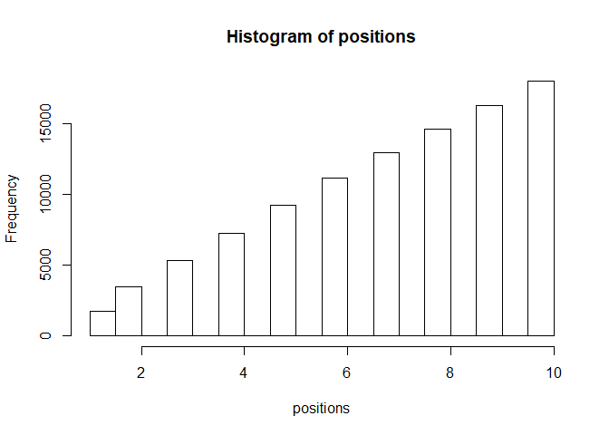
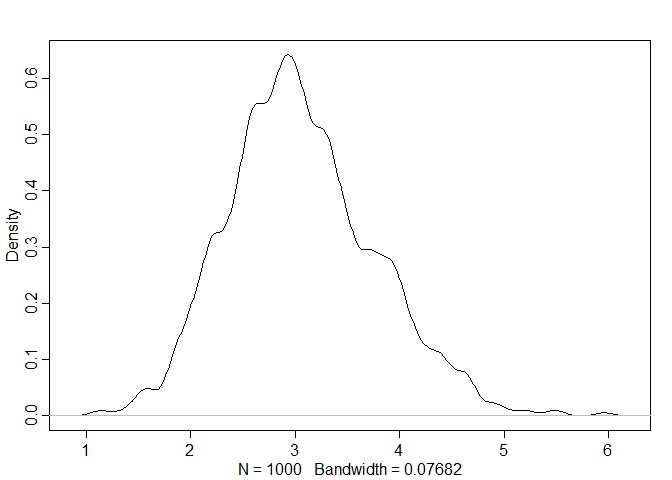

```r
library(rethinking)
```

```
## Loading required package: rstan
```

```
## Warning: package 'rstan' was built under R version 3.5.3
```

```
## Loading required package: ggplot2
```

```
## Loading required package: StanHeaders
```

```
## Warning: package 'StanHeaders' was built under R version 3.5.3
```

```
## rstan (Version 2.18.2, GitRev: 2e1f913d3ca3)
```

```
## For execution on a local, multicore CPU with excess RAM we recommend calling
## options(mc.cores = parallel::detectCores()).
## To avoid recompilation of unchanged Stan programs, we recommend calling
## rstan_options(auto_write = TRUE)
```

```
## For improved execution time, we recommend calling
## Sys.setenv(LOCAL_CPPFLAGS = '-march=native')
## although this causes Stan to throw an error on a few processors.
```

```
## Loading required package: parallel
```

```
## rethinking (Version 1.88)
```


# 9 Markov Chain Monte Carlo

## 9.1. Good King Markov and His island kingdom


```r
## R code 9.1
num_weeks <- 1e5
positions <- rep(0,num_weeks)
current <- 10
for ( i in 1:num_weeks ) {
    # record current position
    positions[i] <- current

    # flip coin to generate proposal
    proposal <- current + sample( c(-1,1) , size=1 )
    # now make sure he loops around the archipelago
    if ( proposal < 1 ) proposal <- 10
    if ( proposal > 10 ) proposal <- 1

    # move?
    prob_move <- proposal/current
    current <- ifelse( runif(1) < prob_move , proposal , current )
}
hist(positions)
```

<!-- -->

## 9.2. Metropolis, Gibbs, and Sadness
### 9.2.1. Gibbs sampling.
### 9.2.2. High-dimensional sadness.


```r
## R code 9.2
D <- 10
T <- 1e3
Y <- rmvnorm(T,rep(0,D),diag(D))
rad_dist <- function( Y ) sqrt( sum(Y^2) )
Rd <- sapply( 1:T , function(i) rad_dist( Y[i,] ) )
dens( Rd )
```

<!-- -->


## 9.6. Summary

## 9.7. Practice
### Easy.
#### 8E1. Which of the following is a requirement of the simple Metropolis algorithm?
#### (1) The parameters must be discrete.
> No. The parameter values can take on a continuous range of values as usual

#### (2) The likelihood function must be Gaussian.
> No.

#### (3) The proposal distribution must be symmetric.
> Yes. The Metropolis algorithm works whenever the probability of proposing a jump to B from A is equal to the probability of proposing A from B, when the proposal distribution is symmetric.

#### 8E2. Gibbs sampling is more efficient than the Metropolis algorithm. How does it achieve this extra efficiency? Are there any limitations to the Gibbs sampling strategy?
>  The improvement arises from adaptive proposals in which the distribution of proposed parameter values adjusts itself intelligently, depending upon the parameter values at the moment.
