This csv has measurements of tomato internodes and petioles from wildtype (Moneymaker) and various phytochrome mutant lines.  Measurements were made at 3 time points, 21, 28, and 35 days after germination under two treatments, simulated sun and simulated shade.

for today let's focus on day 35.  Also let's focus on total stem length.  So: first


```r
phyE <- read.csv("figure4phyE.csv")
head(phyE)
```

```
##   genotype treatment flat day   epi  int1  int2  int3  pet1  pet2  pet3  pet4
## 1 phyB1/B2     shade    1  21 24.03  3.18  0.00  0.00 14.11  4.88  0.00  0.00
## 2 phyB1/B2     shade    1  28 47.37 21.67 11.27  3.13 31.05 26.81 11.10  2.61
## 3 phyB1/B2     shade    1  35 58.83 40.60 72.29 52.70 42.15 49.60 49.58 30.49
## 4 phyB1/B2     shade    1  21 29.85  2.39  2.41  0.00 14.44 11.55  0.00  0.00
## 5 phyB1/B2     shade    1  28 59.69  3.36 25.52  6.62 35.10 29.15 20.05  9.39
## 6 phyB1/B2     shade    1  35 69.55  4.91 56.64 35.52 49.81 34.65 47.58 40.54
```

```r
summary(phyE)
```

```
##        genotype  treatment        flat            day          epi       
##  Moneymaker:36   shade:144   Min.   :1.000   Min.   :21   Min.   : 2.73  
##  phyB1     :36   sun  :120   1st Qu.:2.000   1st Qu.:21   1st Qu.:11.42  
##  phyB1/B2  :36               Median :3.000   Median :28   Median :24.59  
##  phyB2     :36               Mean   :3.455   Mean   :28   Mean   :28.00  
##  phyEami3  :63               3rd Qu.:5.000   3rd Qu.:35   3rd Qu.:37.48  
##  phyEami7  :57               Max.   :6.000   Max.   :35   Max.   :87.74  
##       int1             int2             int3             pet1      
##  Min.   : 0.240   Min.   :  0.00   Min.   : 0.000   Min.   : 6.23  
##  1st Qu.: 2.748   1st Qu.:  0.00   1st Qu.: 0.000   1st Qu.:15.19  
##  Median :14.635   Median :  7.58   Median : 2.755   Median :38.78  
##  Mean   :18.643   Mean   : 16.03   Mean   : 9.289   Mean   :37.97  
##  3rd Qu.:30.532   3rd Qu.: 25.41   3rd Qu.:15.880   3rd Qu.:52.47  
##  Max.   :71.270   Max.   :104.74   Max.   :56.700   Max.   :91.87  
##       pet2             pet3            pet4       
##  Min.   : 0.000   Min.   : 0.00   Min.   : 0.000  
##  1st Qu.: 5.577   1st Qu.: 0.00   1st Qu.: 0.000  
##  Median :28.250   Median :13.19   Median : 3.455  
##  Mean   :32.788   Mean   :24.59   Mean   :13.569  
##  3rd Qu.:53.197   3rd Qu.:48.82   3rd Qu.:27.302  
##  Max.   :96.230   Max.   :98.57   Max.   :72.120
```

```r
str(phyE)
```

```
## 'data.frame':	264 obs. of  12 variables:
##  $ genotype : Factor w/ 6 levels "Moneymaker","phyB1",..: 3 3 3 3 3 3 3 3 3 3 ...
##  $ treatment: Factor w/ 2 levels "shade","sun": 1 1 1 1 1 1 1 1 1 1 ...
##  $ flat     : int  1 1 1 1 1 1 2 2 2 3 ...
##  $ day      : int  21 28 35 21 28 35 21 28 35 21 ...
##  $ epi      : num  24 47.4 58.8 29.9 59.7 ...
##  $ int1     : num  3.18 21.67 40.6 2.39 3.36 ...
##  $ int2     : num  0 11.27 72.29 2.41 25.52 ...
##  $ int3     : num  0 3.13 52.7 0 6.62 ...
##  $ pet1     : num  14.1 31.1 42.1 14.4 35.1 ...
##  $ pet2     : num  4.88 26.81 49.6 11.55 29.15 ...
##  $ pet3     : num  0 11.1 49.6 0 20.1 ...
##  $ pet4     : num  0 2.61 30.49 0 9.39 ...
```

### Q1)

#### a) subset the data for day 35


```r
newphyE <- subset(phyE, day == 35)
head(newphyE)
```

```
##    genotype treatment flat day   epi  int1   int2  int3  pet1  pet2  pet3  pet4
## 3  phyB1/B2     shade    1  35 58.83 40.60  72.29 52.70 42.15 49.60 49.58 30.49
## 6  phyB1/B2     shade    1  35 69.55  4.91  56.64 35.52 49.81 34.65 47.58 40.54
## 9  phyB1/B2     shade    2  35 70.22 62.61  59.66 31.25 46.28 56.79 47.93 28.40
## 12 phyB1/B2     shade    3  35 54.60 38.64  67.62 35.19 39.11 66.57 68.85 53.21
## 15 phyB1/B2     shade    3  35 58.16 55.31 104.74 39.97 44.85 65.33 60.64 43.54
## 18 phyB1/B2     shade    5  35 59.88 58.67  74.77 33.33 36.40 39.28 50.71 33.98
```

```r
summary(newphyE)
```

```
##        genotype  treatment       flat            day          epi       
##  Moneymaker:12   shade:48   Min.   :1.000   Min.   :35   Min.   :10.94  
##  phyB1     :12   sun  :40   1st Qu.:2.000   1st Qu.:35   1st Qu.:29.08  
##  phyB1/B2  :12              Median :3.000   Median :35   Median :37.36  
##  phyB2     :12              Mean   :3.455   Mean   :35   Mean   :41.40  
##  phyEami3  :21              3rd Qu.:5.000   3rd Qu.:35   3rd Qu.:50.62  
##  phyEami7  :19              Max.   :6.000   Max.   :35   Max.   :87.74  
##       int1            int2             int3            pet1      
##  Min.   : 3.02   Min.   : 10.75   Min.   : 8.79   Min.   :32.52  
##  1st Qu.:28.01   1st Qu.: 23.95   1st Qu.:15.98   1st Qu.:51.14  
##  Median :35.12   Median : 36.20   Median :24.72   Median :60.62  
##  Mean   :36.50   Mean   : 38.50   Mean   :24.85   Mean   :60.26  
##  3rd Qu.:45.85   3rd Qu.: 48.99   3rd Qu.:31.67   3rd Qu.:68.91  
##  Max.   :71.27   Max.   :104.74   Max.   :56.70   Max.   :91.87  
##       pet2            pet3            pet4      
##  Min.   : 0.00   Min.   :18.52   Min.   :10.83  
##  1st Qu.:53.29   1st Qu.:49.33   1st Qu.:27.41  
##  Median :65.34   Median :58.30   Median :34.99  
##  Mean   :65.52   Mean   :60.12   Mean   :36.29  
##  3rd Qu.:79.04   3rd Qu.:71.24   3rd Qu.:43.87  
##  Max.   :96.23   Max.   :98.57   Max.   :72.12
```

```r
str(newphyE)
```

```
## 'data.frame':	88 obs. of  12 variables:
##  $ genotype : Factor w/ 6 levels "Moneymaker","phyB1",..: 3 3 3 3 3 3 3 3 3 3 ...
##  $ treatment: Factor w/ 2 levels "shade","sun": 1 1 1 1 1 1 2 2 2 2 ...
##  $ flat     : int  1 1 2 3 3 5 1 1 2 3 ...
##  $ day      : int  35 35 35 35 35 35 35 35 35 35 ...
##  $ epi      : num  58.8 69.5 70.2 54.6 58.2 ...
##  $ int1     : num  40.6 4.91 62.61 38.64 55.31 ...
##  $ int2     : num  72.3 56.6 59.7 67.6 104.7 ...
##  $ int3     : num  52.7 35.5 31.2 35.2 40 ...
##  $ pet1     : num  42.1 49.8 46.3 39.1 44.9 ...
##  $ pet2     : num  49.6 34.6 56.8 66.6 65.3 ...
##  $ pet3     : num  49.6 47.6 47.9 68.8 60.6 ...
##  $ pet4     : num  30.5 40.5 28.4 53.2 43.5 ...
```

#### b) create a new column "stem_length" that is the sum of epi, int1, int2, and int3


```r
library(tidyverse)
```

```
## -- Attaching packages --------------------------------------- tidyverse 1.3.0 --
```

```
## √ ggplot2 3.2.1     √ purrr   0.3.3
## √ tibble  2.1.3     √ dplyr   0.8.3
## √ tidyr   1.0.0     √ stringr 1.4.0
## √ readr   1.3.1     √ forcats 0.4.0
```

```
## -- Conflicts ------------------------------------------ tidyverse_conflicts() --
## x dplyr::filter() masks stats::filter()
## x dplyr::lag()    masks stats::lag()
```

```r
newphyE_S <- newphyE %>% mutate(stem_length = rowSums(.[5:8]))
head(newphyE_S)
```

```
##   genotype treatment flat day   epi  int1   int2  int3  pet1  pet2  pet3  pet4
## 1 phyB1/B2     shade    1  35 58.83 40.60  72.29 52.70 42.15 49.60 49.58 30.49
## 2 phyB1/B2     shade    1  35 69.55  4.91  56.64 35.52 49.81 34.65 47.58 40.54
## 3 phyB1/B2     shade    2  35 70.22 62.61  59.66 31.25 46.28 56.79 47.93 28.40
## 4 phyB1/B2     shade    3  35 54.60 38.64  67.62 35.19 39.11 66.57 68.85 53.21
## 5 phyB1/B2     shade    3  35 58.16 55.31 104.74 39.97 44.85 65.33 60.64 43.54
## 6 phyB1/B2     shade    5  35 59.88 58.67  74.77 33.33 36.40 39.28 50.71 33.98
##   stem_length
## 1      224.42
## 2      166.62
## 3      223.74
## 4      196.05
## 5      258.18
## 6      226.65
```

```r
summary(newphyE_S)
```

```
##        genotype  treatment       flat            day          epi       
##  Moneymaker:12   shade:48   Min.   :1.000   Min.   :35   Min.   :10.94  
##  phyB1     :12   sun  :40   1st Qu.:2.000   1st Qu.:35   1st Qu.:29.08  
##  phyB1/B2  :12              Median :3.000   Median :35   Median :37.36  
##  phyB2     :12              Mean   :3.455   Mean   :35   Mean   :41.40  
##  phyEami3  :21              3rd Qu.:5.000   3rd Qu.:35   3rd Qu.:50.62  
##  phyEami7  :19              Max.   :6.000   Max.   :35   Max.   :87.74  
##       int1            int2             int3            pet1      
##  Min.   : 3.02   Min.   : 10.75   Min.   : 8.79   Min.   :32.52  
##  1st Qu.:28.01   1st Qu.: 23.95   1st Qu.:15.98   1st Qu.:51.14  
##  Median :35.12   Median : 36.20   Median :24.72   Median :60.62  
##  Mean   :36.50   Mean   : 38.50   Mean   :24.85   Mean   :60.26  
##  3rd Qu.:45.85   3rd Qu.: 48.99   3rd Qu.:31.67   3rd Qu.:68.91  
##  Max.   :71.27   Max.   :104.74   Max.   :56.70   Max.   :91.87  
##       pet2            pet3            pet4        stem_length    
##  Min.   : 0.00   Min.   :18.52   Min.   :10.83   Min.   : 51.71  
##  1st Qu.:53.29   1st Qu.:49.33   1st Qu.:27.41   1st Qu.: 96.17  
##  Median :65.34   Median :58.30   Median :34.99   Median :146.36  
##  Mean   :65.52   Mean   :60.12   Mean   :36.29   Mean   :141.24  
##  3rd Qu.:79.04   3rd Qu.:71.24   3rd Qu.:43.87   3rd Qu.:168.32  
##  Max.   :96.23   Max.   :98.57   Max.   :72.12   Max.   :264.39
```

```r
str(newphyE_S)
```

```
## 'data.frame':	88 obs. of  13 variables:
##  $ genotype   : Factor w/ 6 levels "Moneymaker","phyB1",..: 3 3 3 3 3 3 3 3 3 3 ...
##  $ treatment  : Factor w/ 2 levels "shade","sun": 1 1 1 1 1 1 2 2 2 2 ...
##  $ flat       : int  1 1 2 3 3 5 1 1 2 3 ...
##  $ day        : int  35 35 35 35 35 35 35 35 35 35 ...
##  $ epi        : num  58.8 69.5 70.2 54.6 58.2 ...
##  $ int1       : num  40.6 4.91 62.61 38.64 55.31 ...
##  $ int2       : num  72.3 56.6 59.7 67.6 104.7 ...
##  $ int3       : num  52.7 35.5 31.2 35.2 40 ...
##  $ pet1       : num  42.1 49.8 46.3 39.1 44.9 ...
##  $ pet2       : num  49.6 34.6 56.8 66.6 65.3 ...
##  $ pet3       : num  49.6 47.6 47.9 68.8 60.6 ...
##  $ pet4       : num  30.5 40.5 28.4 53.2 43.5 ...
##  $ stem_length: Named num  224 167 224 196 258 ...
##   ..- attr(*, "names")= chr  "3" "6" "9" "12" ...
```


#### c) although flats are listed as 1-6, flats in sun and shade are separate. Create a new column "flat2" that corrects for this.


```r
newphyE_S_flat2 <- newphyE_S %>% unite("flat2", c("treatment", "flat"), remove = FALSE)
head(newphyE_S_flat2)
```

```
##   genotype   flat2 treatment flat day   epi  int1   int2  int3  pet1  pet2
## 1 phyB1/B2 shade_1     shade    1  35 58.83 40.60  72.29 52.70 42.15 49.60
## 2 phyB1/B2 shade_1     shade    1  35 69.55  4.91  56.64 35.52 49.81 34.65
## 3 phyB1/B2 shade_2     shade    2  35 70.22 62.61  59.66 31.25 46.28 56.79
## 4 phyB1/B2 shade_3     shade    3  35 54.60 38.64  67.62 35.19 39.11 66.57
## 5 phyB1/B2 shade_3     shade    3  35 58.16 55.31 104.74 39.97 44.85 65.33
## 6 phyB1/B2 shade_5     shade    5  35 59.88 58.67  74.77 33.33 36.40 39.28
##    pet3  pet4 stem_length
## 1 49.58 30.49      224.42
## 2 47.58 40.54      166.62
## 3 47.93 28.40      223.74
## 4 68.85 53.21      196.05
## 5 60.64 43.54      258.18
## 6 50.71 33.98      226.65
```

```r
summary(newphyE_S_flat2)
```

```
##        genotype     flat2           treatment       flat            day    
##  Moneymaker:12   Length:88          shade:48   Min.   :1.000   Min.   :35  
##  phyB1     :12   Class :character   sun  :40   1st Qu.:2.000   1st Qu.:35  
##  phyB1/B2  :12   Mode  :character              Median :3.000   Median :35  
##  phyB2     :12                                 Mean   :3.455   Mean   :35  
##  phyEami3  :21                                 3rd Qu.:5.000   3rd Qu.:35  
##  phyEami7  :19                                 Max.   :6.000   Max.   :35  
##       epi             int1            int2             int3      
##  Min.   :10.94   Min.   : 3.02   Min.   : 10.75   Min.   : 8.79  
##  1st Qu.:29.08   1st Qu.:28.01   1st Qu.: 23.95   1st Qu.:15.98  
##  Median :37.36   Median :35.12   Median : 36.20   Median :24.72  
##  Mean   :41.40   Mean   :36.50   Mean   : 38.50   Mean   :24.85  
##  3rd Qu.:50.62   3rd Qu.:45.85   3rd Qu.: 48.99   3rd Qu.:31.67  
##  Max.   :87.74   Max.   :71.27   Max.   :104.74   Max.   :56.70  
##       pet1            pet2            pet3            pet4      
##  Min.   :32.52   Min.   : 0.00   Min.   :18.52   Min.   :10.83  
##  1st Qu.:51.14   1st Qu.:53.29   1st Qu.:49.33   1st Qu.:27.41  
##  Median :60.62   Median :65.34   Median :58.30   Median :34.99  
##  Mean   :60.26   Mean   :65.52   Mean   :60.12   Mean   :36.29  
##  3rd Qu.:68.91   3rd Qu.:79.04   3rd Qu.:71.24   3rd Qu.:43.87  
##  Max.   :91.87   Max.   :96.23   Max.   :98.57   Max.   :72.12  
##   stem_length    
##  Min.   : 51.71  
##  1st Qu.: 96.17  
##  Median :146.36  
##  Mean   :141.24  
##  3rd Qu.:168.32  
##  Max.   :264.39
```

```r
str(newphyE_S_flat2)
```

```
## 'data.frame':	88 obs. of  14 variables:
##  $ genotype   : Factor w/ 6 levels "Moneymaker","phyB1",..: 3 3 3 3 3 3 3 3 3 3 ...
##  $ flat2      : chr  "shade_1" "shade_1" "shade_2" "shade_3" ...
##  $ treatment  : Factor w/ 2 levels "shade","sun": 1 1 1 1 1 1 2 2 2 2 ...
##  $ flat       : int  1 1 2 3 3 5 1 1 2 3 ...
##  $ day        : int  35 35 35 35 35 35 35 35 35 35 ...
##  $ epi        : num  58.8 69.5 70.2 54.6 58.2 ...
##  $ int1       : num  40.6 4.91 62.61 38.64 55.31 ...
##  $ int2       : num  72.3 56.6 59.7 67.6 104.7 ...
##  $ int3       : num  52.7 35.5 31.2 35.2 40 ...
##  $ pet1       : num  42.1 49.8 46.3 39.1 44.9 ...
##  $ pet2       : num  49.6 34.6 56.8 66.6 65.3 ...
##  $ pet3       : num  49.6 47.6 47.9 68.8 60.6 ...
##  $ pet4       : num  30.5 40.5 28.4 53.2 43.5 ...
##  $ stem_length: Named num  224 167 224 196 258 ...
##   ..- attr(*, "names")= chr  "3" "6" "9" "12" ...
```


#### Ultimately you want to know if any of the mutants have a different length from Moneymaker, in sun or in shade, or if the response to shade differs.


```r
library(rethinking)
```

```
## Loading required package: rstan
```

```
## Loading required package: StanHeaders
```

```
## rstan (Version 2.19.2, GitRev: 2e1f913d3ca3)
```

```
## For execution on a local, multicore CPU with excess RAM we recommend calling
## options(mc.cores = parallel::detectCores()).
## To avoid recompilation of unchanged Stan programs, we recommend calling
## rstan_options(auto_write = TRUE)
```

```
## For improved execution time, we recommend calling
## Sys.setenv(LOCAL_CPPFLAGS = '-march=native')
## although this causes Stan to throw an error on a few processors.
```

```
## 
## Attaching package: 'rstan'
```

```
## The following object is masked from 'package:tidyr':
## 
##     extract
```

```
## Loading required package: parallel
```

```
## Loading required package: dagitty
```

```
## rethinking (Version 1.93)
```

```
## 
## Attaching package: 'rethinking'
```

```
## The following object is masked from 'package:purrr':
## 
##     map
```

```
## The following object is masked from 'package:stats':
## 
##     rstudent
```

```r
newphyE_list <- list(
  genotype = as.integer(newphyE_S_flat2$genotype),
  treatment_s = as.integer(newphyE_S_flat2$treatment=="shade"),
  flat_factor = as.integer(as.factor(newphyE_S_flat2$flat2)),
  stem_length = newphyE_S_flat2$stem_length
)

head(newphyE_list)
```

```
## $genotype
##  [1] 3 3 3 3 3 3 3 3 3 3 3 3 5 5 5 5 5 5 5 5 5 5 5 5 5 5 5 5 5 5 5 5 5 6 6 6 6 6
## [39] 6 6 6 6 6 6 6 6 6 6 6 6 6 6 2 2 2 2 2 2 2 2 2 2 2 2 4 4 4 4 4 4 4 4 4 4 4 4
## [77] 1 1 1 1 1 1 1 1 1 1 1 1
## 
## $treatment_s
##  [1] 1 1 1 1 1 1 0 0 0 0 0 0 1 1 1 1 1 1 0 0 0 0 0 0 1 1 1 1 1 1 0 0 0 1 1 1 1 1
## [39] 1 0 0 0 1 1 1 1 1 1 0 0 0 0 1 1 1 1 1 1 0 0 0 0 0 0 1 1 1 1 1 1 0 0 0 0 0 0
## [77] 1 1 1 1 1 1 0 0 0 0 0 0
## 
## $flat_factor
##  [1]  1  1  2  3  3  5  7  7  8  9  9 11  1  2  5  5  6  6  7  8 11 11 12 12  1
## [26]  1  4  5  5  6  7  7 12  2  2  3  4  5  6  8 10 12  1  2  3  3  4  6  7  9
## [51]  9 10  2  4  4  4  5  6  8 10 10 10 11 12  1  3  4  5  6  6  7  9 10 11 12
## [76] 12  1  2  2  3  3  4  7  8  8  9  9 10
## 
## $stem_length
##      3      6      9     12     15     18     21     24     27     30     33 
## 224.42 166.62 223.74 196.05 258.18 226.65 113.30 147.57  96.18 159.95 166.98 
##     36     39     42     45     48     51     54     57     60     63     66 
## 172.89  87.43 145.75 190.81 149.81 166.10 175.33  84.03  84.03 100.18 117.38 
##     69     72     75     78     81     84     87     90     93     96     99 
##  74.19  92.12 128.97 108.65 172.52 162.98 148.48 117.70  98.14  94.51  71.72 
##    102    105    108    111    114    117    120    123    126    129    132 
## 134.57 110.30 163.71 173.64 125.55 146.97  87.37  92.29  51.71 143.75 163.07 
##    135    138    141    144    147    150    153    156    159    162    165 
## 166.23 148.02 147.45 172.36  90.35  86.28  77.33  91.59 215.01 217.62 264.39 
##    168    171    174    177    180    183    186    189    192    195    198 
## 254.22 222.57 200.79 190.93 156.71 173.01 200.15 153.91 127.99 158.61 190.66 
##    201    204    207    210    213    216    219    222    225    228    231 
## 157.54 197.49 120.22  99.41 108.67 102.93 101.29  97.56  64.59  85.01 163.40 
##    234    237    240    243    246    249    252    255    258    261    264 
## 151.09 138.83 158.88 137.04 166.08  92.17  92.26  96.14  92.84  88.03  95.55
```

```r
summary(newphyE_list)
```

```
##             Length Class  Mode   
## genotype    88     -none- numeric
## treatment_s 88     -none- numeric
## flat_factor 88     -none- numeric
## stem_length 88     -none- numeric
```

```r
str(newphyE_list)
```

```
## List of 4
##  $ genotype   : int [1:88] 3 3 3 3 3 3 3 3 3 3 ...
##  $ treatment_s: int [1:88] 1 1 1 1 1 1 0 0 0 0 ...
##  $ flat_factor: int [1:88] 1 1 2 3 3 5 7 7 8 9 ...
##  $ stem_length: Named num [1:88] 224 167 224 196 258 ...
##   ..- attr(*, "names")= chr [1:88] "3" "6" "9" "12" ...
```


### Q2) Fit 3 models, all of which include genotype and treatment
#### a) don't include flat.  Determine whether genotype, treatment, and their interaction are important predictors of stem_length


```r
modle_base <- ulam(
  alist(
    stem_length ~ dnorm(mu, sigma),
    mu <- a[genotype] + bI[genotype]*treatment_s,
    a[genotype] ~ dnorm(140, 10),
    bI[genotype] ~ dnorm(0, 10),
    sigma ~ dexp(1)
  ), data=newphyE_list , chains=4 , cores=4 , log_lik=TRUE)

precis( modle_base, depth=2 )
```

```
##            mean       sd       5.5%     94.5%    n_eff      Rhat
## a[1]  127.33892 7.098228 116.277219 139.08782 1748.769 1.0008923
## a[2]  165.59970 7.013506 154.348884 176.81169 1918.905 1.0001987
## a[3]  155.20049 6.926075 143.849312 166.45389 1894.802 0.9995868
## a[4]  127.62671 7.133234 116.381170 139.28216 1921.729 0.9997906
## a[5]  122.46450 6.743770 111.665077 133.27334 1497.708 1.0024282
## a[6]  123.67961 6.826639 112.812234 134.67960 1517.059 1.0023056
## bI[1]  10.10133 8.138607  -2.995879  23.42295 1738.266 1.0012073
## bI[2]  25.15083 8.516536  11.562618  38.47030 1865.617 0.9990420
## bI[3]  24.24255 8.508881  10.398893  38.04579 1895.805 1.0014611
## bI[4]  10.33729 8.657627  -4.033774  23.89124 1716.861 0.9999342
## bI[5]  13.57387 7.895527   1.437929  25.94297 1649.622 1.0016972
## bI[6]  14.86675 8.037813   1.933344  28.01322 1644.284 1.0039705
## sigma  30.36146 2.351418  26.824028  34.35567 1302.918 1.0002079
```

```r
plot( precis(modle_base,depth=2) )
```

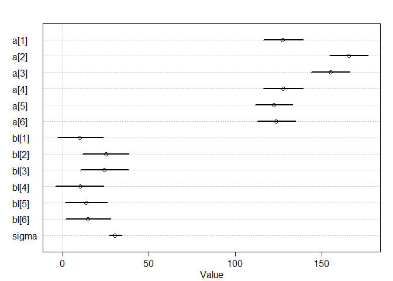<!-- -->


#### b) include flat without pooling


```r
modle_fixed <- ulam(
  alist(
    stem_length ~ dnorm(mu, sigma),
    mu <- a[genotype] + bI[genotype]*treatment_s + bF[flat_factor],
    a[genotype] ~ dnorm(140, 10),
    bI[genotype] ~ dnorm(0, 10),
    bF[flat_factor] ~ dnorm(0, 10),
    sigma ~ dexp(1)
  ), data=newphyE_list , chains=4 , cores=4 , log_lik=TRUE)

precis( modle_fixed, depth=2 )
```

```
##              mean       sd        5.5%      94.5%    n_eff      Rhat
## a[1]   125.424083 6.400423 115.2207478 135.726426 2500.145 0.9994287
## a[2]   171.858848 6.205785 161.5441443 181.350319 2386.895 0.9990727
## a[3]   160.274746 6.487395 149.8269457 170.539507 3013.749 0.9986766
## a[4]   127.249097 6.225734 117.6021696 137.524285 3537.387 0.9985258
## a[5]   123.410426 5.832039 113.8675976 132.662807 2144.502 1.0003295
## a[6]   119.922427 6.117991 110.0339805 129.941272 2132.046 0.9995070
## bI[1]    7.186973 7.719080  -4.8469202  19.193281 2937.541 0.9987216
## bI[2]   21.767481 7.777267   9.3930534  33.907143 3511.024 0.9996147
## bI[3]   24.168959 7.882835  11.1942212  36.921178 2884.708 0.9988500
## bI[4]    7.658857 7.636654  -3.9896634  20.043419 3042.408 0.9988611
## bI[5]    8.279087 6.891462  -2.8424910  19.025484 2346.578 1.0001455
## bI[6]   11.271955 7.033173  -0.2513843  22.537316 1950.177 1.0002370
## bF[1]    1.303365 6.487209  -9.0816732  11.164208 3525.031 0.9989676
## bF[2]    8.631159 6.543772  -1.6249662  18.674041 2796.234 0.9989067
## bF[3]   19.901569 6.871135   8.2875519  30.699799 3031.853 0.9993795
## bF[4]   24.096648 6.933087  13.1076699  35.165717 3180.060 0.9985112
## bF[5]   19.835301 6.431607   9.3559382  29.734446 2788.838 0.9984797
## bF[6]    6.183632 6.617724  -4.5083600  16.634588 2341.383 0.9997400
## bF[7]  -18.269723 6.377589 -28.3883294  -7.648774 3553.584 0.9994808
## bF[8]  -16.640388 6.881989 -27.8220548  -5.855432 2800.084 0.9987552
## bF[9]  -13.992648 6.863397 -24.5939580  -2.977807 3555.915 0.9998953
## bF[10]  -8.185005 6.909999 -19.0531592   2.784851 3552.324 0.9986550
## bF[11]  -6.639058 7.179063 -18.0133960   5.031868 3625.384 0.9992965
## bF[12] -29.321818 7.093871 -40.2620666 -17.895576 2788.268 0.9987336
## sigma   22.122953 1.932261  19.1911534  25.332988 1802.258 1.0000319
```

```r
plot( precis(modle_fixed,depth=2) )
```

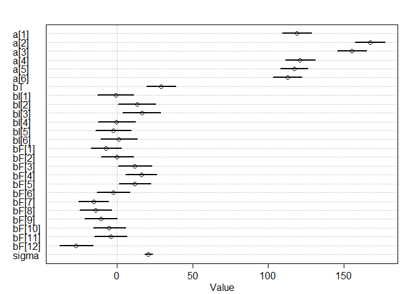<!-- -->


#### c) use a hierarchical model that allows partial pooling across flats


```r
modle_multilevel <- ulam(
  alist(
    stem_length ~ dnorm(mu, sigma),
    mu <- a[genotype] + bI[genotype]*treatment_s + bF[flat_factor],
    a[genotype] ~ dnorm(a_bar, sigma_a),
    bI[genotype] ~ dnorm(0, 10),
    bF[flat_factor] ~ dnorm(0, sigma_f),
    a_bar ~ dnorm( 140 , 10 ),
    sigma_a ~ dexp(1),
    sigma_f ~ dexp(1),
    sigma ~ dexp(1)
  ), data=newphyE_list , chains=4 , cores=4 , log_lik=TRUE)

precis( modle_multilevel, depth=2 )
```

```
##               mean       sd         5.5%       94.5%     n_eff      Rhat
## a[1]    122.293263 7.819117 109.79663118 134.9055451  858.5510 1.0007774
## a[2]    181.444261 8.500521 168.09396080 194.5432886  932.9048 1.0022742
## a[3]    166.711480 7.856994 154.56446929 179.2958649  872.8985 1.0028426
## a[4]    125.854192 7.738120 113.75054890 138.7016873  817.7012 1.0014879
## a[5]    123.176782 7.262927 111.75741741 134.7965761  838.5581 0.9991424
## a[6]    115.651121 7.541156 103.22864074 127.7618446  899.0879 1.0008054
## bI[1]     4.286994 7.858266  -8.35757191  16.7948992 1523.9008 0.9993211
## bI[2]    11.701033 8.125583  -0.96900406  24.9957062 2044.3002 1.0008594
## bI[3]    17.524347 7.680262   4.94264188  29.3197379 1830.2403 0.9990643
## bI[4]     3.805194 8.200961  -9.95874008  16.5281307 1641.2627 1.0003333
## bI[5]     2.725183 7.407493  -9.32019052  14.4822489 1589.8937 0.9990350
## bI[6]     8.201578 7.652826  -3.94721176  20.9164041 1455.2078 0.9998813
## bF[1]     5.791634 8.199854  -7.48540996  19.5381356  939.3686 1.0001366
## bF[2]    16.333282 8.175348   3.69873832  29.8918582 1249.5998 1.0005314
## bF[3]    31.528637 8.315501  18.34763799  44.8752199  893.0672 1.0003928
## bF[4]    36.847408 8.469528  23.20571841  50.7133199 1214.7276 0.9995625
## bF[5]    30.823827 8.582145  16.55377980  44.2518007 1067.7725 1.0000132
## bF[6]    12.770136 8.092600  -0.03055793  25.9008201 1114.4011 1.0001198
## bF[7]   -25.412960 7.935524 -38.43333263 -12.4576428  975.0509 1.0004760
## bF[8]   -25.225078 8.206764 -38.27301568 -12.0034273 1082.3007 1.0032576
## bF[9]   -19.375136 8.221796 -32.25126395  -6.4096571 1127.5611 1.0031600
## bF[10]  -13.479948 8.550621 -26.82263912   0.6023562 1230.7658 1.0010517
## bF[11]  -12.498183 9.038630 -26.90352195   1.7759686 1331.8582 0.9989231
## bF[12]  -42.094571 8.707524 -56.72374026 -28.3190886 1051.5913 1.0010530
## a_bar   139.600395 6.245591 129.50619444 149.4281206  982.0366 1.0001856
## sigma_a  14.820671 2.457981  11.03650822  19.0759984 1783.4712 0.9998653
## sigma_f  17.371436 2.585297  13.58119768  21.7231879 1396.8028 0.9994730
## sigma    19.637688 1.506401  17.40322498  22.1943477 1824.0363 1.0013732
```

```r
plot(precis( modle_multilevel, depth=2 ))
```

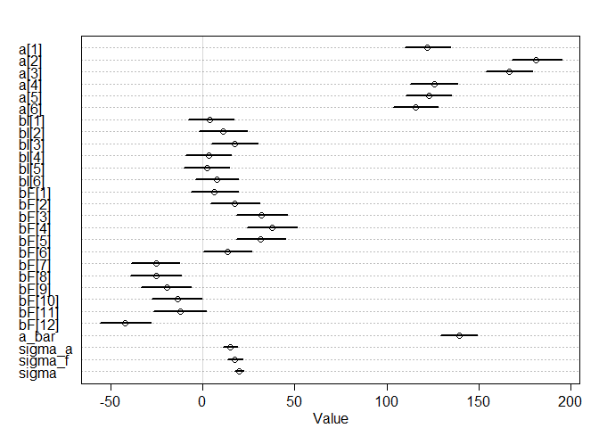<!-- -->


### Q3) Compare the models, which is preferred?


```r
compare(modle_base, modle_fixed, modle_multilevel)
```

```
##                      WAIC       SE    dWAIC      dSE     pWAIC       weight
## modle_multilevel 814.3361 15.15640  0.00000       NA 19.471228 9.999183e-01
## modle_fixed      833.1617 14.04433 18.82568  6.19475 16.012832 8.166215e-05
## modle_base       887.3475 14.01887 73.01142 14.33514  8.023722 1.398735e-16
```

```r
plot(compare(modle_base, modle_fixed, modle_multilevel))
```

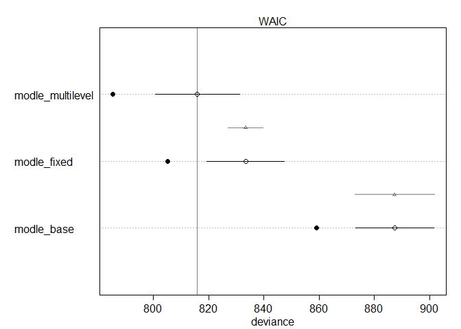<!-- -->

### Q5) Reparameterize the model to help with divergent transitions (even if there aren't any)

```r
modle_multilevel_reparameterize <- ulam(
  alist(
    stem_length ~ dnorm(mu, sigma),
    mu <- a_bar + z[genotype]*sigma_a + bI[genotype]*treatment_s + x[flat_factor]*sigma_f,
    z[genotype] ~ dnorm(0, 10),
    bI[genotype] ~ dnorm(0, 10),
    x[flat_factor] ~ dnorm(0, 10),
    a_bar ~ dnorm( 140 , 10 ),
    sigma_a ~ dexp(1),
    sigma_f ~ dexp(1),
    sigma ~ dexp(1)
  ), data=newphyE_list , chains=4 , cores=4 , log_lik=TRUE)

precis( modle_multilevel_reparameterize, depth=2 )
```

```
##                mean        sd        5.5%       94.5%     n_eff      Rhat
## z[1]     -7.3556553 4.2379304 -14.5384129  -0.9222465  891.8111 1.0015180
## z[2]     17.8673023 5.4329150   9.9184720  26.9282052 1213.7598 0.9993049
## z[3]     11.3785704 4.6571005   4.5655906  19.3305281 1056.0071 0.9996143
## z[4]     -5.7033317 3.9984059 -12.3727294   0.4109760  819.2635 1.0036600
## z[5]     -6.2501714 4.0132141 -13.1711986  -0.3153726  801.1713 1.0017484
## z[6]     -9.9561050 4.3847495 -17.6061804  -3.6693982  743.4855 1.0025608
## bI[1]     1.4342339 8.0978236 -11.4036814  14.5837232 2328.8775 0.9989928
## bI[2]     2.9898982 7.9485923  -9.3783040  16.2816839 1762.4550 0.9994507
## bI[3]    11.4665548 7.7340421  -1.4946501  23.4952414 2109.5570 1.0007976
## bI[4]     0.5349608 7.6004952 -11.5504084  12.6531100 2080.5028 1.0000661
## bI[5]    -2.2057037 7.4061682 -13.9402373   9.7986677 1723.9777 1.0003654
## bI[6]     4.8253137 7.3641113  -6.9469751  16.8074268 1725.5914 0.9987328
## x[1]      3.4342148 3.4665769  -2.0965773   8.9849942  861.0469 1.0021554
## x[2]      7.3912060 3.5030970   2.0380139  13.0965876  842.2717 1.0045754
## x[3]     12.9764007 4.0045675   6.9274539  19.7593318  843.1206 1.0024018
## x[4]     14.5540723 4.0936695   8.2914268  21.2534856  741.4493 1.0009287
## x[5]     12.6594275 3.8322382   6.8207129  19.0475674  797.4043 1.0008846
## x[6]      6.1048730 3.4987330   0.6810286  11.7270826  878.3177 1.0000226
## x[7]     -9.5542360 3.7978770 -15.8559722  -3.8116893  899.4978 1.0009377
## x[8]     -9.9053756 3.9295078 -16.3519859  -3.9205434 1028.5435 1.0029049
## x[9]     -7.1798438 3.7140003 -13.1858839  -1.2869686  896.3009 1.0020844
## x[10]    -5.7376126 3.5125559 -11.5188315  -0.4957138  884.6586 0.9995433
## x[11]    -5.5267189 3.8897172 -11.8630020   0.6324812 1005.9206 1.0014558
## x[12]   -15.9115461 4.2936308 -22.9685615  -9.3128884  751.5410 1.0026231
## a_bar   140.3698814 8.4218398 127.1331696 153.8065131  816.4225 1.0035114
## sigma_a   2.8731294 0.7626931   1.8947821   4.2197646  986.5478 0.9990065
## sigma_f   3.1205723 0.6453184   2.2762782   4.2638029  617.6842 1.0042455
## sigma    19.0610151 1.4079086  16.8323779  21.3730677 2101.9787 0.9998296
```


```r
compare(modle_base, modle_fixed, modle_multilevel,modle_multilevel_reparameterize)
```

```
##                                     WAIC       SE     dWAIC       dSE     pWAIC
## modle_multilevel_reparameterize 811.1779 15.69767  0.000000        NA 21.150462
## modle_multilevel                814.3361 15.15640  3.158124  3.645556 19.471228
## modle_fixed                     833.1617 14.04433 21.983801  9.369571 16.012832
## modle_base                      887.3475 14.01887 76.169548 16.685590  8.023722
##                                       weight
## modle_multilevel_reparameterize 8.290601e-01
## modle_multilevel                1.709260e-01
## modle_fixed                     1.395932e-05
## modle_base                      2.390996e-17
```

```r
plot(compare(modle_base, modle_fixed, modle_multilevel,modle_multilevel_reparameterize))
```

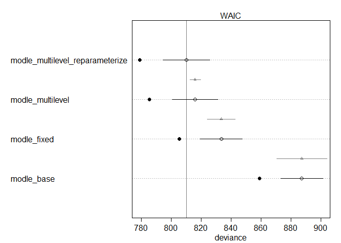<!-- -->

### Q4) Using the hierarchical model, make posterior predictions
#### a) for average cluster


```r
## R code 13.32
post <- extract.samples(modle_multilevel_reparameterize)
str(post)
```

```
## List of 7
##  $ z      : num [1:2000, 1:6] -0.923 -6.266 -10.008 -2.284 -15.068 ...
##  $ bI     : num [1:2000, 1:6] -16.59 -1.98 10.22 5.04 5.4 ...
##  $ x      : num [1:2000, 1:12] 4.57 0.52 1.35 1.14 7.4 ...
##  $ a_bar  : num [1:2000(1d)] 139 144 149 122 144 ...
##  $ sigma_a: num [1:2000(1d)] 4.77 2.57 1.97 4.29 2.62 ...
##  $ sigma_f: num [1:2000(1d)] 2.81 2.59 2.85 2.34 4.33 ...
##  $ sigma  : num [1:2000(1d)] 19 20.6 17.8 18.4 21.9 ...
##  - attr(*, "source")= chr "ulam posterior: 2000 samples from modle_multilevel_reparameterize"
```

```r
as.factor(newphyE_S_flat2$genotype)
```

```
##  [1] phyB1/B2   phyB1/B2   phyB1/B2   phyB1/B2   phyB1/B2   phyB1/B2  
##  [7] phyB1/B2   phyB1/B2   phyB1/B2   phyB1/B2   phyB1/B2   phyB1/B2  
## [13] phyEami3   phyEami3   phyEami3   phyEami3   phyEami3   phyEami3  
## [19] phyEami3   phyEami3   phyEami3   phyEami3   phyEami3   phyEami3  
## [25] phyEami3   phyEami3   phyEami3   phyEami3   phyEami3   phyEami3  
## [31] phyEami3   phyEami3   phyEami3   phyEami7   phyEami7   phyEami7  
## [37] phyEami7   phyEami7   phyEami7   phyEami7   phyEami7   phyEami7  
## [43] phyEami7   phyEami7   phyEami7   phyEami7   phyEami7   phyEami7  
## [49] phyEami7   phyEami7   phyEami7   phyEami7   phyB1      phyB1     
## [55] phyB1      phyB1      phyB1      phyB1      phyB1      phyB1     
## [61] phyB1      phyB1      phyB1      phyB1      phyB2      phyB2     
## [67] phyB2      phyB2      phyB2      phyB2      phyB2      phyB2     
## [73] phyB2      phyB2      phyB2      phyB2      Moneymaker Moneymaker
## [79] Moneymaker Moneymaker Moneymaker Moneymaker Moneymaker Moneymaker
## [85] Moneymaker Moneymaker Moneymaker Moneymaker
## Levels: Moneymaker phyB1 phyB1/B2 phyB2 phyEami3 phyEami7
```

```r
#Shade condiction
## R code 13.36
p_link_abar_shade <- function( genotype , treatment_s=1) {
    stem_length_shade <- with( post, a_bar + z[,genotype]*sigma_a + bI[,genotype]*treatment_s )
    return( stem_length_shade )
}

## R code 13.37
p_raw_shade <- sapply( 1:6 , function(i) p_link_abar_shade( i ) )
p_mu_shade <- apply( p_raw_shade , 2 , mean )
p_ci_shade <- apply( p_raw_shade , 2 , PI )

plot( NULL , xlab="genotype" , ylab="stem_length_shade" ,
    ylim=c(50,250) , xaxt="n" , xlim=c(1,6) )
axis( 1 , at=1:6 , labels=c("Moneymaker", "phyB1", "phyB1/B2", "phyB2", "phyEami3", "phyEami7") )
lines( 1:6 , p_mu_shade )
shade( p_ci_shade , 1:6 )
```

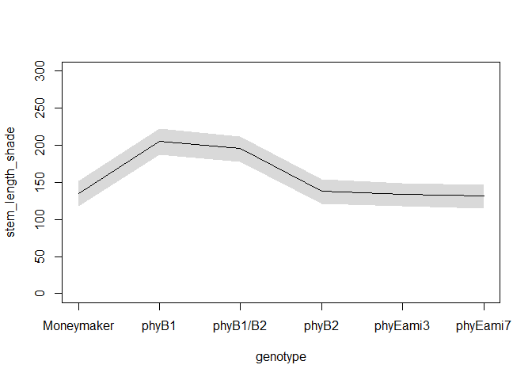<!-- -->

```r
#light condiction
## R code 13.36
p_link_abar_light <- function( genotype , treatment_s=0) {
    stem_length_light <- with( post, a_bar + z[,genotype]*sigma_a + bI[,genotype]*treatment_s )
    return( stem_length_light )
}

## R code 13.37
p_raw_light <- sapply( 1:6 , function(i) p_link_abar_light( i ) )
p_mu_light <- apply( p_raw_light , 2 , mean )
p_ci_light <- apply( p_raw_light , 2 , PI )

plot( NULL , xlab="genotype" , ylab="stem_length_light" ,
    ylim=c(50,250) , xaxt="n" , xlim=c(1,6) )
axis( 1 , at=1:6 , labels=c("Moneymaker", "phyB1", "phyB1/B2", "phyB2", "phyEami3", "phyEami7") )
lines( 1:6 , p_mu_light )
shade( p_ci_light , 1:6 )
```

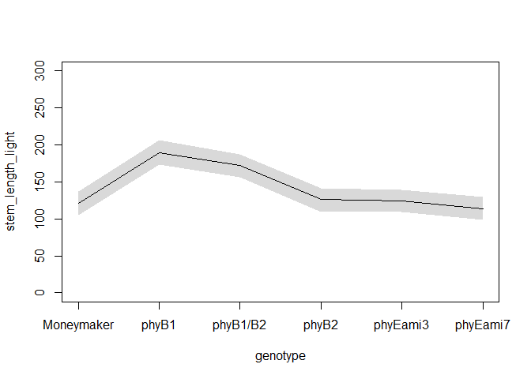<!-- -->

```r
plot( NULL , xlab="genotype" , ylab="stem_length" ,
    ylim=c(50,250) , xaxt="n" , xlim=c(1,6) )
axis( 1 , at=1:6 , labels=c("Moneymaker", "phyB1", "phyB1/B2", "phyB2", "phyEami3", "phyEami7") )
lines( 1:6 , p_mu_light ,col=col.alpha("red",1))
shade( p_ci_light , 1:6 )
lines( 1:6 , p_mu_shade ,col=col.alpha("blue",1))
shade( p_ci_shade , 1:6 )
```

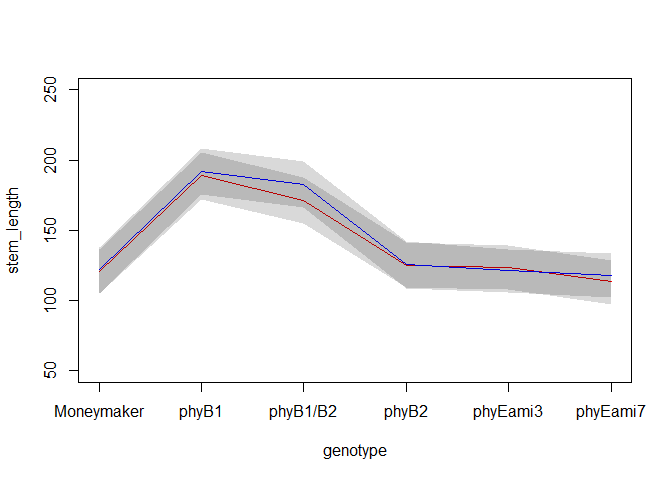<!-- -->


#### b) for same clusters

```r
as.factor(newphyE_S_flat2$flat2)
```

```
##  [1] shade_1 shade_1 shade_2 shade_3 shade_3 shade_5 sun_1   sun_1   sun_2  
## [10] sun_3   sun_3   sun_5   shade_1 shade_2 shade_5 shade_5 shade_6 shade_6
## [19] sun_1   sun_2   sun_5   sun_5   sun_6   sun_6   shade_1 shade_1 shade_4
## [28] shade_5 shade_5 shade_6 sun_1   sun_1   sun_6   shade_2 shade_2 shade_3
## [37] shade_4 shade_5 shade_6 sun_2   sun_4   sun_6   shade_1 shade_2 shade_3
## [46] shade_3 shade_4 shade_6 sun_1   sun_3   sun_3   sun_4   shade_2 shade_4
## [55] shade_4 shade_4 shade_5 shade_6 sun_2   sun_4   sun_4   sun_4   sun_5  
## [64] sun_6   shade_1 shade_3 shade_4 shade_5 shade_6 shade_6 sun_1   sun_3  
## [73] sun_4   sun_5   sun_6   sun_6   shade_1 shade_2 shade_2 shade_3 shade_3
## [82] shade_4 sun_1   sun_2   sun_2   sun_3   sun_3   sun_4  
## 12 Levels: shade_1 shade_2 shade_3 shade_4 shade_5 shade_6 sun_1 ... sun_6
```

```r
######1
#Shade condiction
## R code 13.36
p_link_abar_shade1 <- function( genotype , treatment_s=1, flat_factor=1) {
    stem_length_shade <- with( post, a_bar + z[,genotype]*sigma_a + bI[,genotype]*treatment_s + x[flat_factor]*sigma_f )
    return( stem_length_shade )
}

## R code 13.37
p_raw_shade1 <- sapply( 1:6 , function(i) p_link_abar_shade1( i ) )
p_mu_shade1 <- apply( p_raw_shade1 , 2 , mean )
p_ci_shade1 <- apply( p_raw_shade1 , 2 , PI )


#light condiction
## R code 13.36
p_link_abar_light7 <- function( genotype , treatment_s=0, flat_factor=7) {
    stem_length_light <- with( post, a_bar + z[,genotype]*sigma_a + bI[,genotype]*treatment_s + x[flat_factor]*sigma_f )
    return( stem_length_light )
}

## R code 13.37
p_raw_light7 <- sapply( 1:6 , function(i) p_link_abar_light7( i ) )
p_mu_light7 <- apply( p_raw_light7 , 2 , mean )
p_ci_light7 <- apply( p_raw_light7 , 2 , PI )


######2

#Shade condiction
## R code 13.36
p_link_abar_shade2 <- function( genotype , treatment_s=1, flat_factor=2) {
    stem_length_shade <- with( post, a_bar + z[,genotype]*sigma_a + bI[,genotype]*treatment_s + x[flat_factor]*sigma_f )
    return( stem_length_shade )
}

## R code 13.37
p_raw_shade2 <- sapply( 1:6 , function(i) p_link_abar_shade2( i ) )
p_mu_shade2 <- apply( p_raw_shade2 , 2 , mean )
p_ci_shade2 <- apply( p_raw_shade2 , 2 , PI )


#light condiction
## R code 13.36
p_link_abar_light8 <- function( genotype , treatment_s=0, flat_factor=8) {
    stem_length_light <- with( post, a_bar + z[,genotype]*sigma_a + bI[,genotype]*treatment_s + x[flat_factor]*sigma_f)
    return( stem_length_light )
}

## R code 13.37
p_raw_light8 <- sapply( 1:6 , function(i) p_link_abar_light8( i ) )
p_mu_light8 <- apply( p_raw_light8 , 2 , mean )
p_ci_light8 <- apply( p_raw_light8 , 2 , PI )

plot( NULL , main= "sun_2", xlab="genotype" , ylab="stem_length_light" ,
    ylim=c(50,250) , xaxt="n" , xlim=c(1,6) )
axis( 1 , at=1:6 , labels=c("Moneymaker", "phyB1", "phyB1/B2", "phyB2", "phyEami3", "phyEami7") )

lines( 1:6 , p_mu_shade1 ,col=col.alpha("black",1))
shade( p_ci_shade1 , 1:6 )
lines( 1:6 , p_mu_light7 ,col=col.alpha("red",1))
shade( p_ci_light7 , 1:6 )
lines( 1:6 , p_mu_shade2 ,col=col.alpha("blue",1))
shade( p_ci_shade2 , 1:6 )
lines( 1:6 , p_mu_light8 ,col=col.alpha("orange",1))
shade( p_ci_light8 , 1:6 )
```

<!-- -->

#### c) showing the "marginal" from cluster

```r
## R code 13.38
###shade
a_sim <- with( post , rnorm( length(post$a_bar) , a_bar , 10*sigma_a ) )
p_link_asim_shade <- function( genotype , treatment_s=1) {
    stem_length_shade <- with( post , a_sim + z[,genotype]*sigma_a + bI[,genotype]*treatment_s )
    return( stem_length_shade )
}
p_raw_asim_shade <- sapply( 1:6 , function(i) p_link_asim_shade( i ) )
p_mu_asim_shade <- apply( p_raw_asim_shade , 2 , mean )
p_ci_asim_shade <- apply( p_raw_asim_shade , 2 , PI )


###light
p_link_asim_light <- function( genotype , treatment_s=0) {
    stem_length_light <- with( post , a_sim + z[,genotype]*sigma_a + bI[,genotype]*treatment_s )
    return( stem_length_light )
}
p_raw_asim_light <- sapply( 1:6 , function(i) p_link_asim_light( i ) )
p_mu_asim_light <- apply( p_raw_asim_light , 2 , mean )
p_ci_asim_light <- apply( p_raw_asim_light , 2 , PI )


plot( NULL , main= "shade_marginal", xlab="genotype" , ylab="stem_length_shade" ,
    ylim=c(50,250) , xaxt="n" , xlim=c(1,6) )
axis( 1 , at=1:6 , labels=c("Moneymaker", "phyB1", "phyB1/B2", "phyB2", "phyEami3", "phyEami7") )
lines( 1:6 , p_mu_asim_shade , col=col.alpha("blue",0.3) , lwd=2)
shade( p_ci_asim_shade , 1:6 )

lines( 1:6 , p_mu_asim_light , col=col.alpha("red",0.3) , lwd=2)
shade( p_ci_asim_light , 1:6 )
```

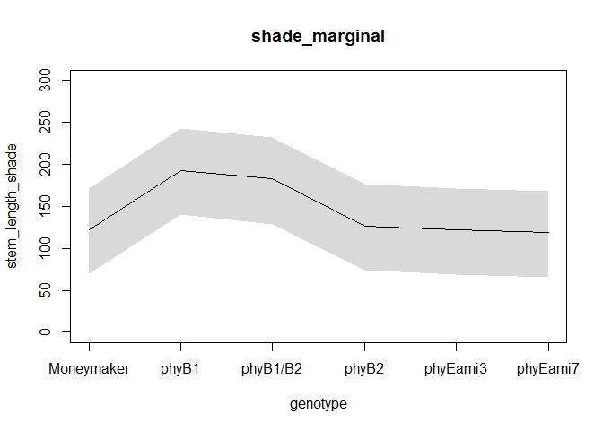<!-- -->


#### d) showing new clusters.

```r
## R code 13.39
###shade
plot( NULL , main= "new_clusters_shade", xlab="treatment" , ylab="stem_length_shade" ,
    ylim=c(0,300) , xaxt="n" , xlim=c(1,6) )
axis( 1 , at=1:6 , labels=c("Moneymaker", "phyB1", "phyB1/B2", "phyB2", "phyEami3", "phyEami7") )
for ( i in 1:100 ) lines( 1:6 , p_raw_asim_shade[i,] , col=col.alpha("blue",0.25) , lwd=2 )
###sun
for ( i in 1:100 ) lines( 1:6 , p_raw_asim_light[i,] , col=col.alpha("red",0.25) , lwd=2 )
```

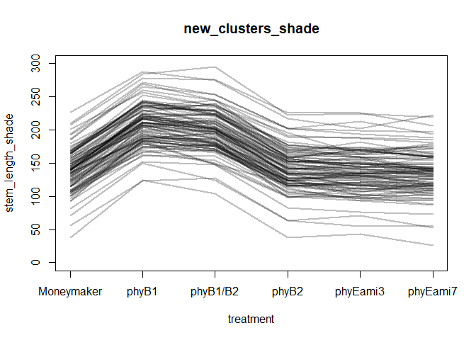<!-- -->


### Q6--optional)
#### a) Which genotypes differ from MoneyMaker in Sun conditions?

```r
#light condiction
## R code 13.36
p_link_abar_light <- function( genotype , treatment_s=0) {
    stem_length_light <- with( post, a_bar + z[,genotype]*sigma_a + bI[,genotype]*treatment_s )
    return( stem_length_light )
}

## R code 13.37
p_raw_light <- sapply( 1:6 , function(i) p_link_abar_light( i ) )
p_mu_light <- apply( p_raw_light , 2 , mean )
p_ci_light <- apply( p_raw_light , 2 , PI )

plot( NULL , xlab="genotype" , ylab="stem_length_light" ,
    ylim=c(50,250) , xaxt="n" , xlim=c(1,6) )
axis( 1 , at=1:6 , labels=c("Moneymaker", "phyB1", "phyB1/B2", "phyB2", "phyEami3", "phyEami7") )
lines( 1:6 , p_mu_light )
shade( p_ci_light , 1:6 )
```

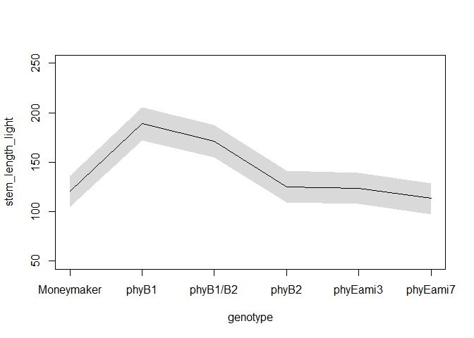<!-- -->

#### b) Which genotypes differ from MoneyMaker in Shade conditions?

```r
#Shade condiction
## R code 13.36
p_link_abar_shade <- function( genotype , treatment_s=1) {
    stem_length_shade <- with( post, a_bar + z[,genotype]*sigma_a + bI[,genotype]*treatment_s )
    return( stem_length_shade )
}

## R code 13.37
p_raw_shade <- sapply( 1:6 , function(i) p_link_abar_shade( i ) )
p_mu_shade <- apply( p_raw_shade , 2 , mean )
p_ci_shade <- apply( p_raw_shade , 2 , PI )

plot( NULL , xlab="genotype" , ylab="stem_length_shade" ,
    ylim=c(50,250) , xaxt="n" , xlim=c(1,6) )
axis( 1 , at=1:6 , labels=c("Moneymaker", "phyB1", "phyB1/B2", "phyB2", "phyEami3", "phyEami7") )
lines( 1:6 , p_mu_shade )
shade( p_ci_shade , 1:6 )
```

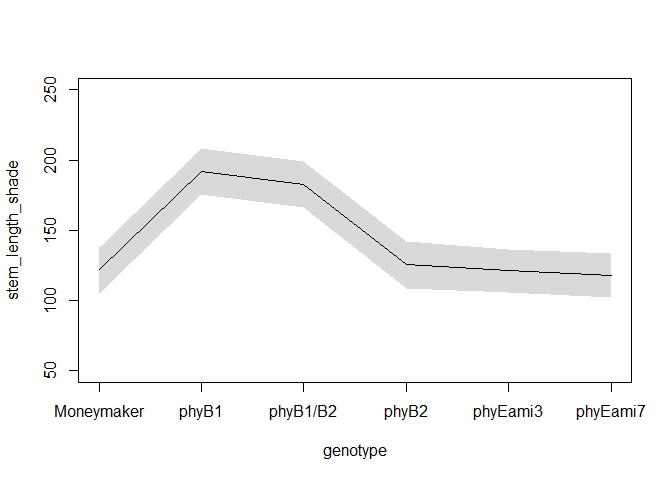<!-- -->

#### c) Which genotypes differ from MoneyMaker in their response to shade (difference in sun vs shade)?

```r
plot( NULL , xlab="genotype" , ylab="stem_length" ,
    ylim=c(50,250) , xaxt="n" , xlim=c(1,6) )
axis( 1 , at=1:6 , labels=c("Moneymaker", "phyB1", "phyB1/B2", "phyB2", "phyEami3", "phyEami7") )
lines( 1:6 , p_mu_light ,col=col.alpha("red",1))
shade( p_ci_light , 1:6 )
lines( 1:6 , p_mu_shade ,col=col.alpha("blue",1))
shade( p_ci_shade , 1:6 )
```

<!-- -->

