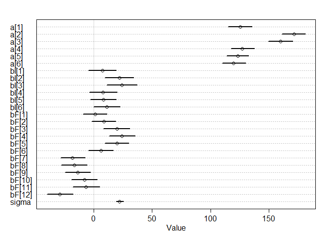
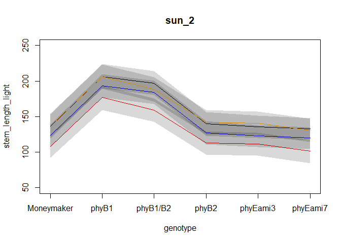
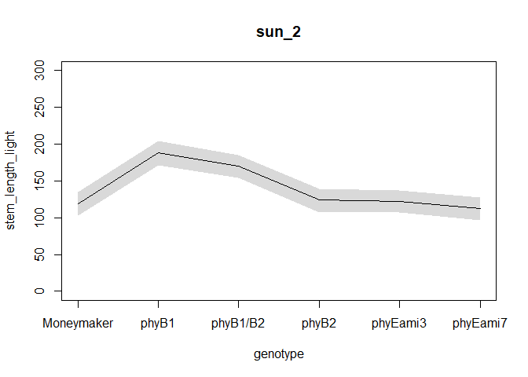
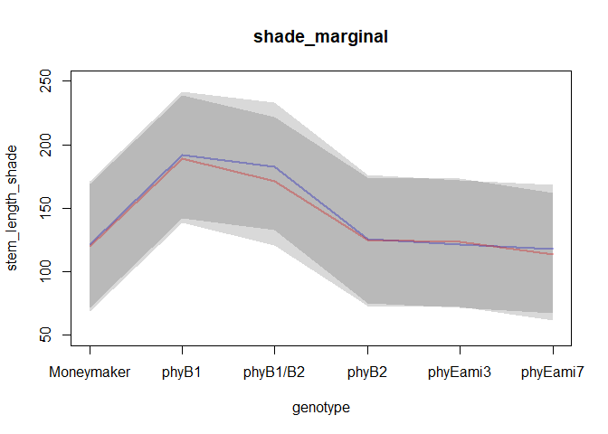
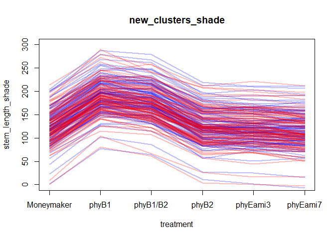

This csv has measurements of tomato internodes and petioles from wildtype (Moneymaker) and various phytochrome mutant lines.  Measurements were made at 3 time points, 21, 28, and 35 days after germination under two treatments, simulated sun and simulated shade.

for today let's focus on day 35.  Also let's focus on total stem length.  So: first


```r
phyE <- read.csv("figure4phyE.csv")
head(phyE)
```

```
##   genotype treatment flat day   epi  int1  int2  int3  pet1  pet2  pet3  pet4
## 1 phyB1/B2     shade    1  21 24.03  3.18  0.00  0.00 14.11  4.88  0.00  0.00
## 2 phyB1/B2     shade    1  28 47.37 21.67 11.27  3.13 31.05 26.81 11.10  2.61
## 3 phyB1/B2     shade    1  35 58.83 40.60 72.29 52.70 42.15 49.60 49.58 30.49
## 4 phyB1/B2     shade    1  21 29.85  2.39  2.41  0.00 14.44 11.55  0.00  0.00
## 5 phyB1/B2     shade    1  28 59.69  3.36 25.52  6.62 35.10 29.15 20.05  9.39
## 6 phyB1/B2     shade    1  35 69.55  4.91 56.64 35.52 49.81 34.65 47.58 40.54
```

```r
summary(phyE)
```

```
##        genotype  treatment        flat            day          epi       
##  Moneymaker:36   shade:144   Min.   :1.000   Min.   :21   Min.   : 2.73  
##  phyB1     :36   sun  :120   1st Qu.:2.000   1st Qu.:21   1st Qu.:11.42  
##  phyB1/B2  :36               Median :3.000   Median :28   Median :24.59  
##  phyB2     :36               Mean   :3.455   Mean   :28   Mean   :28.00  
##  phyEami3  :63               3rd Qu.:5.000   3rd Qu.:35   3rd Qu.:37.48  
##  phyEami7  :57               Max.   :6.000   Max.   :35   Max.   :87.74  
##       int1             int2             int3             pet1      
##  Min.   : 0.240   Min.   :  0.00   Min.   : 0.000   Min.   : 6.23  
##  1st Qu.: 2.748   1st Qu.:  0.00   1st Qu.: 0.000   1st Qu.:15.19  
##  Median :14.635   Median :  7.58   Median : 2.755   Median :38.78  
##  Mean   :18.643   Mean   : 16.03   Mean   : 9.289   Mean   :37.97  
##  3rd Qu.:30.532   3rd Qu.: 25.41   3rd Qu.:15.880   3rd Qu.:52.47  
##  Max.   :71.270   Max.   :104.74   Max.   :56.700   Max.   :91.87  
##       pet2             pet3            pet4       
##  Min.   : 0.000   Min.   : 0.00   Min.   : 0.000  
##  1st Qu.: 5.577   1st Qu.: 0.00   1st Qu.: 0.000  
##  Median :28.250   Median :13.19   Median : 3.455  
##  Mean   :32.788   Mean   :24.59   Mean   :13.569  
##  3rd Qu.:53.197   3rd Qu.:48.82   3rd Qu.:27.302  
##  Max.   :96.230   Max.   :98.57   Max.   :72.120
```

```r
str(phyE)
```

```
## 'data.frame':	264 obs. of  12 variables:
##  $ genotype : Factor w/ 6 levels "Moneymaker","phyB1",..: 3 3 3 3 3 3 3 3 3 3 ...
##  $ treatment: Factor w/ 2 levels "shade","sun": 1 1 1 1 1 1 1 1 1 1 ...
##  $ flat     : int  1 1 1 1 1 1 2 2 2 3 ...
##  $ day      : int  21 28 35 21 28 35 21 28 35 21 ...
##  $ epi      : num  24 47.4 58.8 29.9 59.7 ...
##  $ int1     : num  3.18 21.67 40.6 2.39 3.36 ...
##  $ int2     : num  0 11.27 72.29 2.41 25.52 ...
##  $ int3     : num  0 3.13 52.7 0 6.62 ...
##  $ pet1     : num  14.1 31.1 42.1 14.4 35.1 ...
##  $ pet2     : num  4.88 26.81 49.6 11.55 29.15 ...
##  $ pet3     : num  0 11.1 49.6 0 20.1 ...
##  $ pet4     : num  0 2.61 30.49 0 9.39 ...
```

### Q1)

#### a) subset the data for day 35


```r
newphyE <- subset(phyE, day == 35)
head(newphyE)
```

```
##    genotype treatment flat day   epi  int1   int2  int3  pet1  pet2  pet3  pet4
## 3  phyB1/B2     shade    1  35 58.83 40.60  72.29 52.70 42.15 49.60 49.58 30.49
## 6  phyB1/B2     shade    1  35 69.55  4.91  56.64 35.52 49.81 34.65 47.58 40.54
## 9  phyB1/B2     shade    2  35 70.22 62.61  59.66 31.25 46.28 56.79 47.93 28.40
## 12 phyB1/B2     shade    3  35 54.60 38.64  67.62 35.19 39.11 66.57 68.85 53.21
## 15 phyB1/B2     shade    3  35 58.16 55.31 104.74 39.97 44.85 65.33 60.64 43.54
## 18 phyB1/B2     shade    5  35 59.88 58.67  74.77 33.33 36.40 39.28 50.71 33.98
```

```r
summary(newphyE)
```

```
##        genotype  treatment       flat            day          epi       
##  Moneymaker:12   shade:48   Min.   :1.000   Min.   :35   Min.   :10.94  
##  phyB1     :12   sun  :40   1st Qu.:2.000   1st Qu.:35   1st Qu.:29.08  
##  phyB1/B2  :12              Median :3.000   Median :35   Median :37.36  
##  phyB2     :12              Mean   :3.455   Mean   :35   Mean   :41.40  
##  phyEami3  :21              3rd Qu.:5.000   3rd Qu.:35   3rd Qu.:50.62  
##  phyEami7  :19              Max.   :6.000   Max.   :35   Max.   :87.74  
##       int1            int2             int3            pet1      
##  Min.   : 3.02   Min.   : 10.75   Min.   : 8.79   Min.   :32.52  
##  1st Qu.:28.01   1st Qu.: 23.95   1st Qu.:15.98   1st Qu.:51.14  
##  Median :35.12   Median : 36.20   Median :24.72   Median :60.62  
##  Mean   :36.50   Mean   : 38.50   Mean   :24.85   Mean   :60.26  
##  3rd Qu.:45.85   3rd Qu.: 48.99   3rd Qu.:31.67   3rd Qu.:68.91  
##  Max.   :71.27   Max.   :104.74   Max.   :56.70   Max.   :91.87  
##       pet2            pet3            pet4      
##  Min.   : 0.00   Min.   :18.52   Min.   :10.83  
##  1st Qu.:53.29   1st Qu.:49.33   1st Qu.:27.41  
##  Median :65.34   Median :58.30   Median :34.99  
##  Mean   :65.52   Mean   :60.12   Mean   :36.29  
##  3rd Qu.:79.04   3rd Qu.:71.24   3rd Qu.:43.87  
##  Max.   :96.23   Max.   :98.57   Max.   :72.12
```

```r
str(newphyE)
```

```
## 'data.frame':	88 obs. of  12 variables:
##  $ genotype : Factor w/ 6 levels "Moneymaker","phyB1",..: 3 3 3 3 3 3 3 3 3 3 ...
##  $ treatment: Factor w/ 2 levels "shade","sun": 1 1 1 1 1 1 2 2 2 2 ...
##  $ flat     : int  1 1 2 3 3 5 1 1 2 3 ...
##  $ day      : int  35 35 35 35 35 35 35 35 35 35 ...
##  $ epi      : num  58.8 69.5 70.2 54.6 58.2 ...
##  $ int1     : num  40.6 4.91 62.61 38.64 55.31 ...
##  $ int2     : num  72.3 56.6 59.7 67.6 104.7 ...
##  $ int3     : num  52.7 35.5 31.2 35.2 40 ...
##  $ pet1     : num  42.1 49.8 46.3 39.1 44.9 ...
##  $ pet2     : num  49.6 34.6 56.8 66.6 65.3 ...
##  $ pet3     : num  49.6 47.6 47.9 68.8 60.6 ...
##  $ pet4     : num  30.5 40.5 28.4 53.2 43.5 ...
```

#### b) create a new column "stem_length" that is the sum of epi, int1, int2, and int3


```r
library(tidyverse)
```

```
## -- Attaching packages --------------------------------------------------------------------------------------------------------------------------------------- tidyverse 1.3.0 --
```

```
## √ ggplot2 3.2.1     √ purrr   0.3.3
## √ tibble  2.1.3     √ dplyr   0.8.3
## √ tidyr   1.0.0     √ stringr 1.4.0
## √ readr   1.3.1     √ forcats 0.4.0
```

```
## -- Conflicts ------------------------------------------------------------------------------------------------------------------------------------------ tidyverse_conflicts() --
## x dplyr::filter() masks stats::filter()
## x dplyr::lag()    masks stats::lag()
```

```r
newphyE_S <- newphyE %>% mutate(stem_length = rowSums(.[5:8]))
head(newphyE_S)
```

```
##   genotype treatment flat day   epi  int1   int2  int3  pet1  pet2  pet3  pet4
## 1 phyB1/B2     shade    1  35 58.83 40.60  72.29 52.70 42.15 49.60 49.58 30.49
## 2 phyB1/B2     shade    1  35 69.55  4.91  56.64 35.52 49.81 34.65 47.58 40.54
## 3 phyB1/B2     shade    2  35 70.22 62.61  59.66 31.25 46.28 56.79 47.93 28.40
## 4 phyB1/B2     shade    3  35 54.60 38.64  67.62 35.19 39.11 66.57 68.85 53.21
## 5 phyB1/B2     shade    3  35 58.16 55.31 104.74 39.97 44.85 65.33 60.64 43.54
## 6 phyB1/B2     shade    5  35 59.88 58.67  74.77 33.33 36.40 39.28 50.71 33.98
##   stem_length
## 1      224.42
## 2      166.62
## 3      223.74
## 4      196.05
## 5      258.18
## 6      226.65
```

```r
summary(newphyE_S)
```

```
##        genotype  treatment       flat            day          epi       
##  Moneymaker:12   shade:48   Min.   :1.000   Min.   :35   Min.   :10.94  
##  phyB1     :12   sun  :40   1st Qu.:2.000   1st Qu.:35   1st Qu.:29.08  
##  phyB1/B2  :12              Median :3.000   Median :35   Median :37.36  
##  phyB2     :12              Mean   :3.455   Mean   :35   Mean   :41.40  
##  phyEami3  :21              3rd Qu.:5.000   3rd Qu.:35   3rd Qu.:50.62  
##  phyEami7  :19              Max.   :6.000   Max.   :35   Max.   :87.74  
##       int1            int2             int3            pet1      
##  Min.   : 3.02   Min.   : 10.75   Min.   : 8.79   Min.   :32.52  
##  1st Qu.:28.01   1st Qu.: 23.95   1st Qu.:15.98   1st Qu.:51.14  
##  Median :35.12   Median : 36.20   Median :24.72   Median :60.62  
##  Mean   :36.50   Mean   : 38.50   Mean   :24.85   Mean   :60.26  
##  3rd Qu.:45.85   3rd Qu.: 48.99   3rd Qu.:31.67   3rd Qu.:68.91  
##  Max.   :71.27   Max.   :104.74   Max.   :56.70   Max.   :91.87  
##       pet2            pet3            pet4        stem_length    
##  Min.   : 0.00   Min.   :18.52   Min.   :10.83   Min.   : 51.71  
##  1st Qu.:53.29   1st Qu.:49.33   1st Qu.:27.41   1st Qu.: 96.17  
##  Median :65.34   Median :58.30   Median :34.99   Median :146.36  
##  Mean   :65.52   Mean   :60.12   Mean   :36.29   Mean   :141.24  
##  3rd Qu.:79.04   3rd Qu.:71.24   3rd Qu.:43.87   3rd Qu.:168.32  
##  Max.   :96.23   Max.   :98.57   Max.   :72.12   Max.   :264.39
```

```r
str(newphyE_S)
```

```
## 'data.frame':	88 obs. of  13 variables:
##  $ genotype   : Factor w/ 6 levels "Moneymaker","phyB1",..: 3 3 3 3 3 3 3 3 3 3 ...
##  $ treatment  : Factor w/ 2 levels "shade","sun": 1 1 1 1 1 1 2 2 2 2 ...
##  $ flat       : int  1 1 2 3 3 5 1 1 2 3 ...
##  $ day        : int  35 35 35 35 35 35 35 35 35 35 ...
##  $ epi        : num  58.8 69.5 70.2 54.6 58.2 ...
##  $ int1       : num  40.6 4.91 62.61 38.64 55.31 ...
##  $ int2       : num  72.3 56.6 59.7 67.6 104.7 ...
##  $ int3       : num  52.7 35.5 31.2 35.2 40 ...
##  $ pet1       : num  42.1 49.8 46.3 39.1 44.9 ...
##  $ pet2       : num  49.6 34.6 56.8 66.6 65.3 ...
##  $ pet3       : num  49.6 47.6 47.9 68.8 60.6 ...
##  $ pet4       : num  30.5 40.5 28.4 53.2 43.5 ...
##  $ stem_length: Named num  224 167 224 196 258 ...
##   ..- attr(*, "names")= chr  "3" "6" "9" "12" ...
```


#### c) although flats are listed as 1-6, flats in sun and shade are separate. Create a new column "flat2" that corrects for this.


```r
newphyE_S_flat2 <- newphyE_S %>% unite("flat2", c("treatment", "flat"), remove = FALSE)
head(newphyE_S_flat2)
```

```
##   genotype   flat2 treatment flat day   epi  int1   int2  int3  pet1  pet2
## 1 phyB1/B2 shade_1     shade    1  35 58.83 40.60  72.29 52.70 42.15 49.60
## 2 phyB1/B2 shade_1     shade    1  35 69.55  4.91  56.64 35.52 49.81 34.65
## 3 phyB1/B2 shade_2     shade    2  35 70.22 62.61  59.66 31.25 46.28 56.79
## 4 phyB1/B2 shade_3     shade    3  35 54.60 38.64  67.62 35.19 39.11 66.57
## 5 phyB1/B2 shade_3     shade    3  35 58.16 55.31 104.74 39.97 44.85 65.33
## 6 phyB1/B2 shade_5     shade    5  35 59.88 58.67  74.77 33.33 36.40 39.28
##    pet3  pet4 stem_length
## 1 49.58 30.49      224.42
## 2 47.58 40.54      166.62
## 3 47.93 28.40      223.74
## 4 68.85 53.21      196.05
## 5 60.64 43.54      258.18
## 6 50.71 33.98      226.65
```

```r
summary(newphyE_S_flat2)
```

```
##        genotype     flat2           treatment       flat            day    
##  Moneymaker:12   Length:88          shade:48   Min.   :1.000   Min.   :35  
##  phyB1     :12   Class :character   sun  :40   1st Qu.:2.000   1st Qu.:35  
##  phyB1/B2  :12   Mode  :character              Median :3.000   Median :35  
##  phyB2     :12                                 Mean   :3.455   Mean   :35  
##  phyEami3  :21                                 3rd Qu.:5.000   3rd Qu.:35  
##  phyEami7  :19                                 Max.   :6.000   Max.   :35  
##       epi             int1            int2             int3      
##  Min.   :10.94   Min.   : 3.02   Min.   : 10.75   Min.   : 8.79  
##  1st Qu.:29.08   1st Qu.:28.01   1st Qu.: 23.95   1st Qu.:15.98  
##  Median :37.36   Median :35.12   Median : 36.20   Median :24.72  
##  Mean   :41.40   Mean   :36.50   Mean   : 38.50   Mean   :24.85  
##  3rd Qu.:50.62   3rd Qu.:45.85   3rd Qu.: 48.99   3rd Qu.:31.67  
##  Max.   :87.74   Max.   :71.27   Max.   :104.74   Max.   :56.70  
##       pet1            pet2            pet3            pet4      
##  Min.   :32.52   Min.   : 0.00   Min.   :18.52   Min.   :10.83  
##  1st Qu.:51.14   1st Qu.:53.29   1st Qu.:49.33   1st Qu.:27.41  
##  Median :60.62   Median :65.34   Median :58.30   Median :34.99  
##  Mean   :60.26   Mean   :65.52   Mean   :60.12   Mean   :36.29  
##  3rd Qu.:68.91   3rd Qu.:79.04   3rd Qu.:71.24   3rd Qu.:43.87  
##  Max.   :91.87   Max.   :96.23   Max.   :98.57   Max.   :72.12  
##   stem_length    
##  Min.   : 51.71  
##  1st Qu.: 96.17  
##  Median :146.36  
##  Mean   :141.24  
##  3rd Qu.:168.32  
##  Max.   :264.39
```

```r
str(newphyE_S_flat2)
```

```
## 'data.frame':	88 obs. of  14 variables:
##  $ genotype   : Factor w/ 6 levels "Moneymaker","phyB1",..: 3 3 3 3 3 3 3 3 3 3 ...
##  $ flat2      : chr  "shade_1" "shade_1" "shade_2" "shade_3" ...
##  $ treatment  : Factor w/ 2 levels "shade","sun": 1 1 1 1 1 1 2 2 2 2 ...
##  $ flat       : int  1 1 2 3 3 5 1 1 2 3 ...
##  $ day        : int  35 35 35 35 35 35 35 35 35 35 ...
##  $ epi        : num  58.8 69.5 70.2 54.6 58.2 ...
##  $ int1       : num  40.6 4.91 62.61 38.64 55.31 ...
##  $ int2       : num  72.3 56.6 59.7 67.6 104.7 ...
##  $ int3       : num  52.7 35.5 31.2 35.2 40 ...
##  $ pet1       : num  42.1 49.8 46.3 39.1 44.9 ...
##  $ pet2       : num  49.6 34.6 56.8 66.6 65.3 ...
##  $ pet3       : num  49.6 47.6 47.9 68.8 60.6 ...
##  $ pet4       : num  30.5 40.5 28.4 53.2 43.5 ...
##  $ stem_length: Named num  224 167 224 196 258 ...
##   ..- attr(*, "names")= chr  "3" "6" "9" "12" ...
```


#### Ultimately you want to know if any of the mutants have a different length from Moneymaker, in sun or in shade, or if the response to shade differs.


```r
library(rethinking)
```

```
## Loading required package: rstan
```

```
## Loading required package: StanHeaders
```

```
## rstan (Version 2.19.2, GitRev: 2e1f913d3ca3)
```

```
## For execution on a local, multicore CPU with excess RAM we recommend calling
## options(mc.cores = parallel::detectCores()).
## To avoid recompilation of unchanged Stan programs, we recommend calling
## rstan_options(auto_write = TRUE)
```

```
## For improved execution time, we recommend calling
## Sys.setenv(LOCAL_CPPFLAGS = '-march=native')
## although this causes Stan to throw an error on a few processors.
```

```
## 
## Attaching package: 'rstan'
```

```
## The following object is masked from 'package:tidyr':
## 
##     extract
```

```
## Loading required package: parallel
```

```
## Loading required package: dagitty
```

```
## rethinking (Version 1.93)
```

```
## 
## Attaching package: 'rethinking'
```

```
## The following object is masked from 'package:purrr':
## 
##     map
```

```
## The following object is masked from 'package:stats':
## 
##     rstudent
```

```r
newphyE_list <- list(
  genotype = as.integer(newphyE_S_flat2$genotype),
  treatment_s = as.integer(newphyE_S_flat2$treatment=="shade"),
  flat_factor = as.integer(as.factor(newphyE_S_flat2$flat2)),
  stem_length = newphyE_S_flat2$stem_length
)

head(newphyE_list)
```

```
## $genotype
##  [1] 3 3 3 3 3 3 3 3 3 3 3 3 5 5 5 5 5 5 5 5 5 5 5 5 5 5 5 5 5 5 5 5 5 6 6 6 6 6
## [39] 6 6 6 6 6 6 6 6 6 6 6 6 6 6 2 2 2 2 2 2 2 2 2 2 2 2 4 4 4 4 4 4 4 4 4 4 4 4
## [77] 1 1 1 1 1 1 1 1 1 1 1 1
## 
## $treatment_s
##  [1] 1 1 1 1 1 1 0 0 0 0 0 0 1 1 1 1 1 1 0 0 0 0 0 0 1 1 1 1 1 1 0 0 0 1 1 1 1 1
## [39] 1 0 0 0 1 1 1 1 1 1 0 0 0 0 1 1 1 1 1 1 0 0 0 0 0 0 1 1 1 1 1 1 0 0 0 0 0 0
## [77] 1 1 1 1 1 1 0 0 0 0 0 0
## 
## $flat_factor
##  [1]  1  1  2  3  3  5  7  7  8  9  9 11  1  2  5  5  6  6  7  8 11 11 12 12  1
## [26]  1  4  5  5  6  7  7 12  2  2  3  4  5  6  8 10 12  1  2  3  3  4  6  7  9
## [51]  9 10  2  4  4  4  5  6  8 10 10 10 11 12  1  3  4  5  6  6  7  9 10 11 12
## [76] 12  1  2  2  3  3  4  7  8  8  9  9 10
## 
## $stem_length
##      3      6      9     12     15     18     21     24     27     30     33 
## 224.42 166.62 223.74 196.05 258.18 226.65 113.30 147.57  96.18 159.95 166.98 
##     36     39     42     45     48     51     54     57     60     63     66 
## 172.89  87.43 145.75 190.81 149.81 166.10 175.33  84.03  84.03 100.18 117.38 
##     69     72     75     78     81     84     87     90     93     96     99 
##  74.19  92.12 128.97 108.65 172.52 162.98 148.48 117.70  98.14  94.51  71.72 
##    102    105    108    111    114    117    120    123    126    129    132 
## 134.57 110.30 163.71 173.64 125.55 146.97  87.37  92.29  51.71 143.75 163.07 
##    135    138    141    144    147    150    153    156    159    162    165 
## 166.23 148.02 147.45 172.36  90.35  86.28  77.33  91.59 215.01 217.62 264.39 
##    168    171    174    177    180    183    186    189    192    195    198 
## 254.22 222.57 200.79 190.93 156.71 173.01 200.15 153.91 127.99 158.61 190.66 
##    201    204    207    210    213    216    219    222    225    228    231 
## 157.54 197.49 120.22  99.41 108.67 102.93 101.29  97.56  64.59  85.01 163.40 
##    234    237    240    243    246    249    252    255    258    261    264 
## 151.09 138.83 158.88 137.04 166.08  92.17  92.26  96.14  92.84  88.03  95.55
```

```r
summary(newphyE_list)
```

```
##             Length Class  Mode   
## genotype    88     -none- numeric
## treatment_s 88     -none- numeric
## flat_factor 88     -none- numeric
## stem_length 88     -none- numeric
```

```r
str(newphyE_list)
```

```
## List of 4
##  $ genotype   : int [1:88] 3 3 3 3 3 3 3 3 3 3 ...
##  $ treatment_s: int [1:88] 1 1 1 1 1 1 0 0 0 0 ...
##  $ flat_factor: int [1:88] 1 1 2 3 3 5 7 7 8 9 ...
##  $ stem_length: Named num [1:88] 224 167 224 196 258 ...
##   ..- attr(*, "names")= chr [1:88] "3" "6" "9" "12" ...
```


### Q2) Fit 3 models, all of which include genotype and treatment
#### a) don't include flat.  Determine whether genotype, treatment, and their interaction are important predictors of stem_length


```r
modle_base <- ulam(
  alist(
    stem_length ~ dnorm(mu, sigma),
    mu <- a[genotype] + bI[genotype]*treatment_s,
    a[genotype] ~ dnorm(140, 10),
    bI[genotype] ~ dnorm(0, 10),
    sigma ~ dexp(1)
  ), data=newphyE_list , chains=4 , cores=4 , log_lik=TRUE)

precis( modle_base, depth=2 )
```

```
##            mean       sd        5.5%     94.5%    n_eff      Rhat
## a[1]  127.19258 6.805311 116.0345473 137.92153 2357.874 0.9989985
## a[2]  165.68833 6.952068 154.6024926 176.42349 2037.507 0.9998184
## a[3]  155.55376 6.853318 144.5847745 166.38296 2147.826 0.9991701
## a[4]  127.78747 7.104271 116.7368532 139.37241 2180.825 0.9993174
## a[5]  122.41915 6.370343 112.3199027 132.72749 2169.398 0.9990296
## a[6]  123.42346 6.944448 112.3790452 134.63008 2219.040 0.9990324
## bI[1]  10.19705 8.218968  -2.4343716  23.82108 1863.679 1.0027969
## bI[2]  24.88885 8.547175  11.2245799  38.40114 2286.967 0.9985281
## bI[3]  24.02534 8.971477   9.9671368  38.24680 2335.670 1.0001128
## bI[4]  10.57971 8.069931  -2.1721844  23.65476 2273.474 1.0005290
## bI[5]  13.61139 7.698982   0.9906526  25.51463 2151.284 0.9996815
## bI[6]  14.91416 7.948275   2.3042031  27.61576 2213.533 1.0003480
## sigma  30.23245 2.296610  26.7307778  34.06754 1820.505 0.9986176
```

```r
plot( precis(modle_base,depth=2) )
```

<!-- -->


#### b) include flat without pooling


```r
modle_fixed <- ulam(
  alist(
    stem_length ~ dnorm(mu, sigma),
    mu <- a[genotype] + bI[genotype]*treatment_s + bF[flat_factor],
    a[genotype] ~ dnorm(140, 10),
    bI[genotype] ~ dnorm(0, 10),
    bF[flat_factor] ~ dnorm(0, 10),
    sigma ~ dexp(1)
  ), data=newphyE_list , chains=4 , cores=4 , log_lik=TRUE)

precis( modle_fixed, depth=2 )
```

```
##              mean       sd        5.5%      94.5%    n_eff      Rhat
## a[1]   125.269068 6.196232 115.3248532 135.309965 2670.485 1.0000052
## a[2]   171.772624 6.453668 161.3381220 181.816853 3114.631 0.9990427
## a[3]   160.233783 6.336153 150.2823890 170.161359 2991.773 0.9991468
## a[4]   127.543508 6.307512 117.2781025 137.689469 3133.769 0.9994007
## a[5]   123.538679 5.814941 114.5652837 132.942211 2825.772 1.0006060
## a[6]   119.896805 6.055963 110.3907493 129.557932 2168.646 1.0000082
## bI[1]    7.466105 7.616430  -4.8383919  19.806192 3040.145 1.0001213
## bI[2]   21.706885 7.824555   9.1109902  34.495119 3159.609 0.9992949
## bI[3]   24.095777 7.649684  11.9448563  36.614449 3401.209 0.9998295
## bI[4]    7.497677 7.994574  -5.4358186  19.628006 3184.616 0.9984602
## bI[5]    8.208382 7.112147  -3.2590980  19.584223 3337.197 0.9994919
## bI[6]   11.099846 7.110845  -0.2603277  22.366621 2393.348 0.9998986
## bF[1]    1.494948 6.737110  -9.4406593  12.413478 3522.485 0.9983627
## bF[2]    8.893187 6.531172  -1.7437044  19.184501 3226.431 0.9995556
## bF[3]   19.977018 6.873645   9.1151134  30.747034 3377.695 0.9990499
## bF[4]   24.047930 6.835577  13.2061328  34.511110 2962.552 0.9987590
## bF[5]   19.791185 6.836952   8.9522708  30.914767 3176.942 0.9995736
## bF[6]    5.995048 6.817274  -5.1499516  16.722266 3301.112 0.9999335
## bF[7]  -18.486260 6.588065 -28.9141756  -7.532379 3943.704 0.9994328
## bF[8]  -16.536912 6.856152 -27.6101550  -5.338536 3485.932 0.9986036
## bF[9]  -13.741688 6.873414 -24.4810569  -2.496933 3229.594 0.9987456
## bF[10]  -8.202465 6.910471 -19.3350466   2.710995 2917.106 0.9992164
## bF[11]  -6.622824 7.203380 -18.2546035   5.211516 4325.705 0.9983583
## bF[12] -29.535310 7.107992 -40.5061075 -17.594398 3392.831 0.9983081
## sigma   22.125090 1.927761  19.1436216  25.244923 2383.245 0.9992114
```

```r
plot( precis(modle_fixed,depth=2) )
```

<!-- -->


#### c) use a hierarchical model that allows partial pooling across flats


```r
modle_multilevel <- ulam(
  alist(
    stem_length ~ dnorm(mu, sigma),
    mu <- a[genotype] + bI[genotype]*treatment_s + bF[flat_factor],
    a[genotype] ~ dnorm(a_bar, sigma_a),
    bI[genotype] ~ dnorm(0, 10),
    bF[flat_factor] ~ dnorm(0, sigma_f),
    a_bar ~ dnorm( 140 , 10 ),
    sigma_a ~ dexp(1),
    sigma_f ~ dexp(1),
    sigma ~ dexp(1)
  ), data=newphyE_list , chains=4 , cores=4 , log_lik=TRUE)

precis( modle_multilevel, depth=2 )
```

```
##               mean       sd        5.5%       94.5%     n_eff      Rhat
## a[1]    122.126369 7.942354 109.7822879 134.5938519  726.4920 0.9994420
## a[2]    181.250708 8.423256 168.0241954 194.9852926  896.3903 0.9987625
## a[3]    166.430254 7.905208 153.9186090 179.4026660  916.2403 1.0013886
## a[4]    125.849076 8.106653 112.7595599 138.5298439  877.9170 0.9999081
## a[5]    123.165898 7.512897 110.5920182 135.0612467  704.0973 1.0013568
## a[6]    115.738122 7.550705 103.5152289 127.8015051  683.9125 1.0002212
## bI[1]     4.103177 7.680315  -7.8110950  16.7853608 1523.0027 1.0009044
## bI[2]    11.114679 8.164941  -2.0502713  24.1625868 1257.8246 1.0003293
## bI[3]    17.393299 7.873933   4.6962035  30.1777000 1451.5658 1.0010914
## bI[4]     3.278271 7.772987  -9.1082993  15.5509550 1478.5283 0.9997674
## bI[5]     2.289738 7.670520  -9.9826417  14.7101991 1127.7498 1.0025115
## bI[6]     7.517089 7.349607  -4.0809073  19.2650457 1194.1554 1.0015318
## bF[1]     6.544538 8.178572  -6.1021528  19.5996608 1045.7691 1.0023499
## bF[2]    17.206153 8.287990   4.3672137  30.7708636  877.8950 1.0040732
## bF[3]    32.187703 8.704391  18.4477326  46.0371753  953.8189 1.0014091
## bF[4]    37.688099 8.636168  24.1917123  51.2074247  870.9957 1.0040696
## bF[5]    31.508029 8.340344  18.2424107  45.0198652  900.8185 1.0028635
## bF[6]    13.457527 8.366152   0.2922694  26.7507221  915.7421 1.0047102
## bF[7]   -25.331105 8.333825 -38.8019734 -12.3620430  970.3028 1.0005640
## bF[8]   -25.041479 8.555286 -39.1240540 -11.5973434  992.0943 1.0012534
## bF[9]   -19.382150 8.659856 -33.2440506  -6.0930213  950.3398 0.9998750
## bF[10]  -13.733624 8.562675 -27.7961708  -0.5361512  909.9323 1.0002261
## bF[11]  -12.322484 8.953803 -26.7213030   2.0750093 1148.9027 1.0011409
## bF[12]  -42.138072 8.733174 -55.7063076 -27.9456986  928.9250 1.0002478
## a_bar   139.489795 6.255607 129.3601237 149.3523671  965.7822 1.0001361
## sigma_a  14.791760 2.439386  11.2512551  18.7338281 1679.5383 0.9988766
## sigma_f  17.601541 2.557282  13.7098843  21.9063556 1205.1499 1.0013787
## sigma    19.621703 1.562538  17.2901666  22.2015833 1783.7221 0.9990044
```

```r
plot(precis( modle_multilevel, depth=2 ))
```

<!-- -->


### Q3) Compare the models, which is preferred?


```r
compare(modle_base, modle_fixed, modle_multilevel)
```

```
##                      WAIC       SE    dWAIC       dSE     pWAIC       weight
## modle_multilevel 815.8888 15.30812  0.00000        NA 20.254649 9.998399e-01
## modle_fixed      833.3682 14.08985 17.47946  6.264442 16.129745 1.600713e-04
## modle_base       887.3203 14.09824 71.43150 14.491383  7.948071 3.081609e-16
```

```r
plot(compare(modle_base, modle_fixed, modle_multilevel))
```

<!-- -->

### Q5) Reparameterize the model to help with divergent transitions (even if there aren't any)

```r
modle_multilevel_reparameterize <- ulam(
  alist(
    stem_length ~ dnorm(mu, sigma),
    mu <- a_bar + z[genotype]*sigma_a + bI[genotype]*treatment_s + x[flat_factor]*sigma_f,
    z[genotype] ~ dnorm(0, 10),
    bI[genotype] ~ dnorm(0, 10),
    x[flat_factor] ~ dnorm(0, 10),
    a_bar ~ dnorm( 140 , 10 ),
    sigma_a ~ dexp(1),
    sigma_f ~ dexp(1),
    sigma ~ dexp(1)
  ), data=newphyE_list , chains=4 , cores=4 , log_lik=TRUE)

precis( modle_multilevel_reparameterize, depth=2 )
```

```
##                mean        sd        5.5%         94.5%     n_eff      Rhat
## z[1]     -6.9812477 4.0370885 -13.6398055  -0.815820482  826.0474 1.0016178
## z[2]     18.1821460 5.5048460   9.9459924  27.663129630 1018.3972 1.0045506
## z[3]     11.6555018 4.6070514   4.9226358  19.569587862  937.2121 1.0024044
## z[4]     -5.1645633 3.9851467 -11.7667850   0.932992875  836.2831 1.0027912
## z[5]     -5.8635374 3.8376282 -12.1269509   0.067201586  884.0938 1.0019300
## z[6]     -9.5294274 4.3713298 -16.9330979  -3.033000392  651.1121 1.0041463
## bI[1]     1.8418389 8.1247468 -11.4278880  14.706100281 2061.7782 1.0017824
## bI[2]     2.9346107 8.0273038 -10.0816680  15.744641164 2218.6042 1.0016693
## bI[3]    11.3023947 8.1108314  -2.0840418  23.675493267 2587.5390 0.9994798
## bI[4]     0.5427196 7.7788495 -12.0299713  13.481341089 2015.7609 1.0013868
## bI[5]    -2.0467079 7.7018121 -14.0842413  10.396908032 1930.8433 0.9999947
## bI[6]     4.9896092 7.4823544  -6.6275935  17.001327712 1700.9608 1.0010061
## x[1]      3.1794937 3.3293266  -1.9264091   8.683649246  961.5580 1.0000446
## x[2]      7.2105123 3.4600265   1.7509620  12.796666203  942.9387 1.0008082
## x[3]     12.8394851 3.8326349   6.9374902  19.219601800  971.4788 0.9993373
## x[4]     14.5093854 3.9944409   8.3384517  21.143396843  982.4723 0.9988770
## x[5]     12.4345684 3.8859151   6.5908897  18.715183888 1004.7785 0.9985508
## x[6]      5.8921271 3.4714178   0.4992699  11.610218843  966.2377 1.0002798
## x[7]     -9.8305843 3.7473130 -15.9793049  -3.981698042  708.3359 1.0007389
## x[8]    -10.0767038 3.8603471 -16.5979289  -4.191247812  744.7345 0.9991510
## x[9]     -7.4412785 3.6984767 -13.8091617  -1.857759751  782.3898 0.9999077
## x[10]    -6.0645191 3.6686363 -12.1064053  -0.361674611  714.8316 1.0009712
## x[11]    -5.8256800 3.8168784 -12.0171788   0.002173695  825.0711 1.0009532
## x[12]   -16.3042065 4.4336031 -23.6485406  -9.568842940  705.2386 1.0015415
## a_bar   139.9739595 8.2950730 126.6589980 152.923488393 1020.0297 1.0015672
## sigma_a   2.9065016 0.7904567   1.8962910   4.259755257  666.8358 1.0078541
## sigma_f   3.0914339 0.6252411   2.2180554   4.188538227  721.0623 0.9995105
## sigma    19.0298300 1.3547382  17.0041764  21.273853931 1740.9978 1.0012914
```


```r
compare(modle_base, modle_fixed, modle_multilevel,modle_multilevel_reparameterize)
```

```
##                                     WAIC       SE     dWAIC       dSE     pWAIC
## modle_multilevel_reparameterize 810.1520 15.70644  0.000000        NA 20.741903
## modle_multilevel                815.8888 15.30812  5.736754  3.548921 20.254649
## modle_fixed                     833.3682 14.08985 23.216216  9.353367 16.129745
## modle_base                      887.3203 14.09824 77.168253 16.725884  7.948071
##                                       weight
## modle_multilevel_reparameterize 9.462527e-01
## modle_multilevel                5.373867e-02
## modle_fixed                     8.603398e-06
## modle_base                      1.656281e-17
```

```r
plot(compare(modle_base, modle_fixed, modle_multilevel,modle_multilevel_reparameterize))
```

<!-- -->

### Q4) Using the hierarchical model, make posterior predictions
#### a) for average cluster


```r
## R code 13.32
post <- extract.samples(modle_multilevel_reparameterize)
str(post)
```

```
## List of 7
##  $ z      : num [1:2000, 1:6] -11.4 -5.86 -14.27 -4.74 -9.35 ...
##  $ bI     : num [1:2000, 1:6] 4.73 5.9 8.67 -2.17 -3.86 ...
##  $ x      : num [1:2000, 1:12] 10.483 6.043 10.323 0.528 3.327 ...
##  $ a_bar  : num [1:2000(1d)] 141 140 137 154 144 ...
##  $ sigma_a: num [1:2000(1d)] 2.17 3.53 2.71 5.07 1.67 ...
##  $ sigma_f: num [1:2000(1d)] 2.92 2.95 2.82 3.26 3.5 ...
##  $ sigma  : num [1:2000(1d)] 18 18.5 20.4 18.1 21.6 ...
##  - attr(*, "source")= chr "ulam posterior: 2000 samples from modle_multilevel_reparameterize"
```

```r
as.factor(newphyE_S_flat2$genotype)
```

```
##  [1] phyB1/B2   phyB1/B2   phyB1/B2   phyB1/B2   phyB1/B2   phyB1/B2  
##  [7] phyB1/B2   phyB1/B2   phyB1/B2   phyB1/B2   phyB1/B2   phyB1/B2  
## [13] phyEami3   phyEami3   phyEami3   phyEami3   phyEami3   phyEami3  
## [19] phyEami3   phyEami3   phyEami3   phyEami3   phyEami3   phyEami3  
## [25] phyEami3   phyEami3   phyEami3   phyEami3   phyEami3   phyEami3  
## [31] phyEami3   phyEami3   phyEami3   phyEami7   phyEami7   phyEami7  
## [37] phyEami7   phyEami7   phyEami7   phyEami7   phyEami7   phyEami7  
## [43] phyEami7   phyEami7   phyEami7   phyEami7   phyEami7   phyEami7  
## [49] phyEami7   phyEami7   phyEami7   phyEami7   phyB1      phyB1     
## [55] phyB1      phyB1      phyB1      phyB1      phyB1      phyB1     
## [61] phyB1      phyB1      phyB1      phyB1      phyB2      phyB2     
## [67] phyB2      phyB2      phyB2      phyB2      phyB2      phyB2     
## [73] phyB2      phyB2      phyB2      phyB2      Moneymaker Moneymaker
## [79] Moneymaker Moneymaker Moneymaker Moneymaker Moneymaker Moneymaker
## [85] Moneymaker Moneymaker Moneymaker Moneymaker
## Levels: Moneymaker phyB1 phyB1/B2 phyB2 phyEami3 phyEami7
```

```r
#Shade condiction
## R code 13.36
p_link_abar_shade <- function( genotype , treatment_s=1) {
    stem_length_shade <- with( post, a_bar + z[,genotype]*sigma_a + bI[,genotype]*treatment_s )
    return( stem_length_shade )
}

## R code 13.37
p_raw_shade <- sapply( 1:6 , function(i) p_link_abar_shade( i ) )
p_mu_shade <- apply( p_raw_shade , 2 , mean )
p_ci_shade <- apply( p_raw_shade , 2 , PI )

plot( NULL , xlab="genotype" , ylab="stem_length_shade" ,
    ylim=c(0,300) , xaxt="n" , xlim=c(1,6) )
axis( 1 , at=1:6 , labels=c("Moneymaker", "phyB1", "phyB1/B2", "phyB2", "phyEami3", "phyEami7") )
lines( 1:6 , p_mu_shade )
shade( p_ci_shade , 1:6 )
```

<!-- -->

```r
#light condiction
## R code 13.36
p_link_abar_light <- function( genotype , treatment_s=0) {
    stem_length_light <- with( post, a_bar + z[,genotype]*sigma_a + bI[,genotype]*treatment_s )
    return( stem_length_light )
}

## R code 13.37
p_raw_light <- sapply( 1:6 , function(i) p_link_abar_light( i ) )
p_mu_light <- apply( p_raw_light , 2 , mean )
p_ci_light <- apply( p_raw_light , 2 , PI )

plot( NULL , xlab="genotype" , ylab="stem_length_light" ,
    ylim=c(0,300) , xaxt="n" , xlim=c(1,6) )
axis( 1 , at=1:6 , labels=c("Moneymaker", "phyB1", "phyB1/B2", "phyB2", "phyEami3", "phyEami7") )
lines( 1:6 , p_mu_light )
shade( p_ci_light , 1:6 )
```

<!-- -->


#### b) for same clusters

```r
as.factor(newphyE_S_flat2$flat2)
```

```
##  [1] shade_1 shade_1 shade_2 shade_3 shade_3 shade_5 sun_1   sun_1   sun_2  
## [10] sun_3   sun_3   sun_5   shade_1 shade_2 shade_5 shade_5 shade_6 shade_6
## [19] sun_1   sun_2   sun_5   sun_5   sun_6   sun_6   shade_1 shade_1 shade_4
## [28] shade_5 shade_5 shade_6 sun_1   sun_1   sun_6   shade_2 shade_2 shade_3
## [37] shade_4 shade_5 shade_6 sun_2   sun_4   sun_6   shade_1 shade_2 shade_3
## [46] shade_3 shade_4 shade_6 sun_1   sun_3   sun_3   sun_4   shade_2 shade_4
## [55] shade_4 shade_4 shade_5 shade_6 sun_2   sun_4   sun_4   sun_4   sun_5  
## [64] sun_6   shade_1 shade_3 shade_4 shade_5 shade_6 shade_6 sun_1   sun_3  
## [73] sun_4   sun_5   sun_6   sun_6   shade_1 shade_2 shade_2 shade_3 shade_3
## [82] shade_4 sun_1   sun_2   sun_2   sun_3   sun_3   sun_4  
## 12 Levels: shade_1 shade_2 shade_3 shade_4 shade_5 shade_6 sun_1 ... sun_6
```

```r
#Shade condiction
## R code 13.36
p_link_abar_shade <- function( genotype , treatment_s=1, flat_factor=1) {
    stem_length_shade <- with( post, a_bar + z[,genotype]*sigma_a + bI[,genotype]*treatment_s + x[flat_factor]*sigma_f )
    return( stem_length_shade )
}

## R code 13.37
p_raw_shade <- sapply( 1:6 , function(i) p_link_abar_shade( i ) )
p_mu_shade <- apply( p_raw_shade , 2 , mean )
p_ci_shade <- apply( p_raw_shade , 2 , PI )

plot( NULL , main= "shade_1", xlab="genotype" , ylab="stem_length_shade" ,
    ylim=c(0,300) , xaxt="n" , xlim=c(1,6) )
axis( 1 , at=1:6 , labels=c("Moneymaker", "phyB1", "phyB1/B2", "phyB2", "phyEami3", "phyEami7") )
lines( 1:6 , p_mu_shade )
shade( p_ci_shade , 1:6 )
```

<!-- -->

```r
#light condiction
## R code 13.36
p_link_abar_light <- function( genotype , treatment_s=0, flat_factor=7) {
    stem_length_light <- with( post, a_bar + z[,genotype]*sigma_a + bI[,genotype]*treatment_s + x[flat_factor]*sigma_f )
    return( stem_length_light )
}

## R code 13.37
p_raw_light <- sapply( 1:6 , function(i) p_link_abar_light( i ) )
p_mu_light <- apply( p_raw_light , 2 , mean )
p_ci_light <- apply( p_raw_light , 2 , PI )

plot( NULL , main= "sun_1", xlab="genotype" , ylab="stem_length_light" ,
    ylim=c(0,300) , xaxt="n" , xlim=c(1,6) )
axis( 1 , at=1:6 , labels=c("Moneymaker", "phyB1", "phyB1/B2", "phyB2", "phyEami3", "phyEami7") )
lines( 1:6 , p_mu_light )
shade( p_ci_light , 1:6 )
```

<!-- -->

```r
######2

#Shade condiction
## R code 13.36
p_link_abar_shade <- function( genotype , treatment_s=1, flat_factor=2) {
    stem_length_shade <- with( post, a_bar + z[,genotype]*sigma_a + bI[,genotype]*treatment_s + x[flat_factor]*sigma_f )
    return( stem_length_shade )
}

## R code 13.37
p_raw_shade <- sapply( 1:6 , function(i) p_link_abar_shade( i ) )
p_mu_shade <- apply( p_raw_shade , 2 , mean )
p_ci_shade <- apply( p_raw_shade , 2 , PI )

plot( NULL , main= "shade_2", xlab="genotype" , ylab="stem_length_shade" ,
    ylim=c(0,300) , xaxt="n" , xlim=c(1,6) )
axis( 1 , at=1:6 , labels=c("Moneymaker", "phyB1", "phyB1/B2", "phyB2", "phyEami3", "phyEami7") )
lines( 1:6 , p_mu_shade )
shade( p_ci_shade , 1:6 )
```

<!-- -->

```r
#light condiction
## R code 13.36
p_link_abar_light <- function( genotype , treatment_s=0, flat_factor=8) {
    stem_length_light <- with( post, a_bar + z[,genotype]*sigma_a + bI[,genotype]*treatment_s + x[flat_factor]*sigma_f)
    return( stem_length_light )
}

## R code 13.37
p_raw_light <- sapply( 1:6 , function(i) p_link_abar_light( i ) )
p_mu_light <- apply( p_raw_light , 2 , mean )
p_ci_light <- apply( p_raw_light , 2 , PI )

plot( NULL , main= "sun_2", xlab="genotype" , ylab="stem_length_light" ,
    ylim=c(0,300) , xaxt="n" , xlim=c(1,6) )
axis( 1 , at=1:6 , labels=c("Moneymaker", "phyB1", "phyB1/B2", "phyB2", "phyEami3", "phyEami7") )
lines( 1:6 , p_mu_light )
shade( p_ci_light , 1:6 )
```

<!-- -->

#### c) showing the "marginal" from cluster

```r
## R code 13.38
###shade
a_sim <- with( post , rnorm( length(post$a_bar) , a_bar , 10*sigma_a ) )
p_link_asim_shade <- function( genotype , treatment_s=1) {
    stem_length_shade <- with( post , a_sim + z[,genotype]*sigma_a + bI[,genotype]*treatment_s )
    return( stem_length_shade )
}
p_raw_asim_shade <- sapply( 1:6 , function(i) p_link_asim_shade( i ) )
p_mu_asim_shade <- apply( p_raw_asim_shade , 2 , mean )
p_ci_asim_shade <- apply( p_raw_asim_shade , 2 , PI )

plot( NULL , main= "shade_marginal", xlab="genotype" , ylab="stem_length_shade" ,
    ylim=c(0,300) , xaxt="n" , xlim=c(1,6) )
axis( 1 , at=1:6 , labels=c("Moneymaker", "phyB1", "phyB1/B2", "phyB2", "phyEami3", "phyEami7") )
lines( 1:6 , p_mu_asim_shade )
shade( p_ci_asim_shade , 1:6 )
```

<!-- -->

```r
###light
p_link_asim_light <- function( genotype , treatment_s=0) {
    stem_length_light <- with( post , a_sim + z[,genotype]*sigma_a + bI[,genotype]*treatment_s )
    return( stem_length_light )
}
p_raw_asim_light <- sapply( 1:6 , function(i) p_link_asim_light( i ) )
p_mu_asim_light <- apply( p_raw_asim_light , 2 , mean )
p_ci_asim_light <- apply( p_raw_asim_light , 2 , PI )

plot( NULL , main= "sun_marginal", xlab="genotype" , ylab="stem_length_light" ,
    ylim=c(0,300) , xaxt="n" , xlim=c(1,6) )
axis( 1 , at=1:6 , labels=c("Moneymaker", "phyB1", "phyB1/B2", "phyB2", "phyEami3", "phyEami7") )
lines( 1:6 , p_mu_asim_light )
shade( p_ci_asim_light , 1:6 )
```

<!-- -->


#### d) showing new clusters.

```r
## R code 13.39
###shade
plot( NULL , main= "new_clusters_shade", xlab="treatment" , ylab="stem_length_shade" ,
    ylim=c(0,300) , xaxt="n" , xlim=c(1,6) )
axis( 1 , at=1:6 , labels=c("Moneymaker", "phyB1", "phyB1/B2", "phyB2", "phyEami3", "phyEami7") )
for ( i in 1:100 ) lines( 1:6 , p_raw_asim_shade[i,] , col=col.alpha("black",0.25) , lwd=2 )
```

<!-- -->

```r
###sun
plot( NULL , main= "new_clusters_sun", xlab="treatment" , ylab="stem_length_light" ,
    ylim=c(0,300) , xaxt="n" , xlim=c(1,6) )
axis( 1 , at=1:6 , labels=c("Moneymaker", "phyB1", "phyB1/B2", "phyB2", "phyEami3", "phyEami7") )
for ( i in 1:100 ) lines( 1:6 , p_raw_asim_light[i,] , col=col.alpha("black",0.25) , lwd=2 )
```

<!-- -->


### Q6--optional)
#### a) Which genotypes differ from MoneyMaker in Sun conditions?


#### b) Which genotypes differ from MoneyMaker in Shade conditions?


#### c) Which genotypes differ from MoneyMaker in their response to shade (difference in sun vs shade)?


