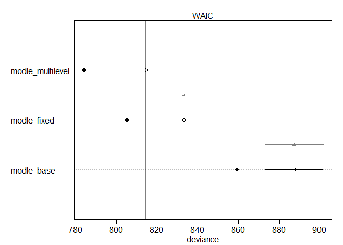
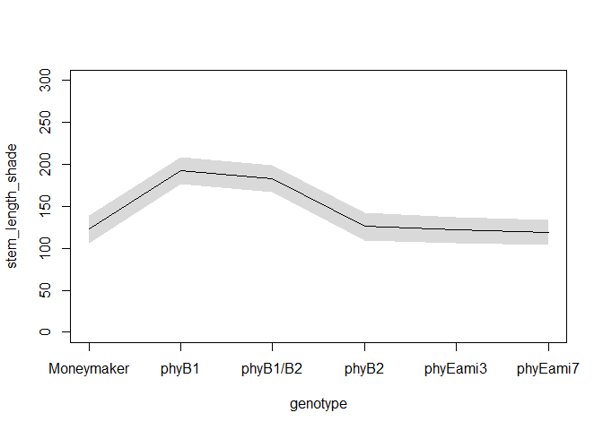

This csv has measurements of tomato internodes and petioles from wildtype (Moneymaker) and various phytochrome mutant lines.  Measurements were made at 3 time points, 21, 28, and 35 days after germination under two treatments, simulated sun and simulated shade.

for today let's focus on day 35.  Also let's focus on total stem length.  So: first


```r
phyE <- read.csv("figure4phyE.csv")
head(phyE)
```

```
##   genotype treatment flat day   epi  int1  int2  int3  pet1  pet2  pet3  pet4
## 1 phyB1/B2     shade    1  21 24.03  3.18  0.00  0.00 14.11  4.88  0.00  0.00
## 2 phyB1/B2     shade    1  28 47.37 21.67 11.27  3.13 31.05 26.81 11.10  2.61
## 3 phyB1/B2     shade    1  35 58.83 40.60 72.29 52.70 42.15 49.60 49.58 30.49
## 4 phyB1/B2     shade    1  21 29.85  2.39  2.41  0.00 14.44 11.55  0.00  0.00
## 5 phyB1/B2     shade    1  28 59.69  3.36 25.52  6.62 35.10 29.15 20.05  9.39
## 6 phyB1/B2     shade    1  35 69.55  4.91 56.64 35.52 49.81 34.65 47.58 40.54
```

```r
summary(phyE)
```

```
##        genotype  treatment        flat            day          epi       
##  Moneymaker:36   shade:144   Min.   :1.000   Min.   :21   Min.   : 2.73  
##  phyB1     :36   sun  :120   1st Qu.:2.000   1st Qu.:21   1st Qu.:11.42  
##  phyB1/B2  :36               Median :3.000   Median :28   Median :24.59  
##  phyB2     :36               Mean   :3.455   Mean   :28   Mean   :28.00  
##  phyEami3  :63               3rd Qu.:5.000   3rd Qu.:35   3rd Qu.:37.48  
##  phyEami7  :57               Max.   :6.000   Max.   :35   Max.   :87.74  
##       int1             int2             int3             pet1      
##  Min.   : 0.240   Min.   :  0.00   Min.   : 0.000   Min.   : 6.23  
##  1st Qu.: 2.748   1st Qu.:  0.00   1st Qu.: 0.000   1st Qu.:15.19  
##  Median :14.635   Median :  7.58   Median : 2.755   Median :38.78  
##  Mean   :18.643   Mean   : 16.03   Mean   : 9.289   Mean   :37.97  
##  3rd Qu.:30.532   3rd Qu.: 25.41   3rd Qu.:15.880   3rd Qu.:52.47  
##  Max.   :71.270   Max.   :104.74   Max.   :56.700   Max.   :91.87  
##       pet2             pet3            pet4       
##  Min.   : 0.000   Min.   : 0.00   Min.   : 0.000  
##  1st Qu.: 5.577   1st Qu.: 0.00   1st Qu.: 0.000  
##  Median :28.250   Median :13.19   Median : 3.455  
##  Mean   :32.788   Mean   :24.59   Mean   :13.569  
##  3rd Qu.:53.197   3rd Qu.:48.82   3rd Qu.:27.302  
##  Max.   :96.230   Max.   :98.57   Max.   :72.120
```

```r
str(phyE)
```

```
## 'data.frame':	264 obs. of  12 variables:
##  $ genotype : Factor w/ 6 levels "Moneymaker","phyB1",..: 3 3 3 3 3 3 3 3 3 3 ...
##  $ treatment: Factor w/ 2 levels "shade","sun": 1 1 1 1 1 1 1 1 1 1 ...
##  $ flat     : int  1 1 1 1 1 1 2 2 2 3 ...
##  $ day      : int  21 28 35 21 28 35 21 28 35 21 ...
##  $ epi      : num  24 47.4 58.8 29.9 59.7 ...
##  $ int1     : num  3.18 21.67 40.6 2.39 3.36 ...
##  $ int2     : num  0 11.27 72.29 2.41 25.52 ...
##  $ int3     : num  0 3.13 52.7 0 6.62 ...
##  $ pet1     : num  14.1 31.1 42.1 14.4 35.1 ...
##  $ pet2     : num  4.88 26.81 49.6 11.55 29.15 ...
##  $ pet3     : num  0 11.1 49.6 0 20.1 ...
##  $ pet4     : num  0 2.61 30.49 0 9.39 ...
```

### Q1)

#### a) subset the data for day 35


```r
newphyE <- subset(phyE, day == 35)
head(newphyE)
```

```
##    genotype treatment flat day   epi  int1   int2  int3  pet1  pet2  pet3  pet4
## 3  phyB1/B2     shade    1  35 58.83 40.60  72.29 52.70 42.15 49.60 49.58 30.49
## 6  phyB1/B2     shade    1  35 69.55  4.91  56.64 35.52 49.81 34.65 47.58 40.54
## 9  phyB1/B2     shade    2  35 70.22 62.61  59.66 31.25 46.28 56.79 47.93 28.40
## 12 phyB1/B2     shade    3  35 54.60 38.64  67.62 35.19 39.11 66.57 68.85 53.21
## 15 phyB1/B2     shade    3  35 58.16 55.31 104.74 39.97 44.85 65.33 60.64 43.54
## 18 phyB1/B2     shade    5  35 59.88 58.67  74.77 33.33 36.40 39.28 50.71 33.98
```

```r
summary(newphyE)
```

```
##        genotype  treatment       flat            day          epi       
##  Moneymaker:12   shade:48   Min.   :1.000   Min.   :35   Min.   :10.94  
##  phyB1     :12   sun  :40   1st Qu.:2.000   1st Qu.:35   1st Qu.:29.08  
##  phyB1/B2  :12              Median :3.000   Median :35   Median :37.36  
##  phyB2     :12              Mean   :3.455   Mean   :35   Mean   :41.40  
##  phyEami3  :21              3rd Qu.:5.000   3rd Qu.:35   3rd Qu.:50.62  
##  phyEami7  :19              Max.   :6.000   Max.   :35   Max.   :87.74  
##       int1            int2             int3            pet1      
##  Min.   : 3.02   Min.   : 10.75   Min.   : 8.79   Min.   :32.52  
##  1st Qu.:28.01   1st Qu.: 23.95   1st Qu.:15.98   1st Qu.:51.14  
##  Median :35.12   Median : 36.20   Median :24.72   Median :60.62  
##  Mean   :36.50   Mean   : 38.50   Mean   :24.85   Mean   :60.26  
##  3rd Qu.:45.85   3rd Qu.: 48.99   3rd Qu.:31.67   3rd Qu.:68.91  
##  Max.   :71.27   Max.   :104.74   Max.   :56.70   Max.   :91.87  
##       pet2            pet3            pet4      
##  Min.   : 0.00   Min.   :18.52   Min.   :10.83  
##  1st Qu.:53.29   1st Qu.:49.33   1st Qu.:27.41  
##  Median :65.34   Median :58.30   Median :34.99  
##  Mean   :65.52   Mean   :60.12   Mean   :36.29  
##  3rd Qu.:79.04   3rd Qu.:71.24   3rd Qu.:43.87  
##  Max.   :96.23   Max.   :98.57   Max.   :72.12
```

```r
str(newphyE)
```

```
## 'data.frame':	88 obs. of  12 variables:
##  $ genotype : Factor w/ 6 levels "Moneymaker","phyB1",..: 3 3 3 3 3 3 3 3 3 3 ...
##  $ treatment: Factor w/ 2 levels "shade","sun": 1 1 1 1 1 1 2 2 2 2 ...
##  $ flat     : int  1 1 2 3 3 5 1 1 2 3 ...
##  $ day      : int  35 35 35 35 35 35 35 35 35 35 ...
##  $ epi      : num  58.8 69.5 70.2 54.6 58.2 ...
##  $ int1     : num  40.6 4.91 62.61 38.64 55.31 ...
##  $ int2     : num  72.3 56.6 59.7 67.6 104.7 ...
##  $ int3     : num  52.7 35.5 31.2 35.2 40 ...
##  $ pet1     : num  42.1 49.8 46.3 39.1 44.9 ...
##  $ pet2     : num  49.6 34.6 56.8 66.6 65.3 ...
##  $ pet3     : num  49.6 47.6 47.9 68.8 60.6 ...
##  $ pet4     : num  30.5 40.5 28.4 53.2 43.5 ...
```

#### b) create a new column "stem_length" that is the sum of epi, int1, int2, and int3


```r
library(tidyverse)
```

```
## -- Attaching packages ---------------------------------------------------------------------------- tidyverse 1.3.0 --
```

```
## √ ggplot2 3.2.1     √ purrr   0.3.3
## √ tibble  2.1.3     √ dplyr   0.8.3
## √ tidyr   1.0.0     √ stringr 1.4.0
## √ readr   1.3.1     √ forcats 0.4.0
```

```
## -- Conflicts ------------------------------------------------------------------------------- tidyverse_conflicts() --
## x dplyr::filter() masks stats::filter()
## x dplyr::lag()    masks stats::lag()
```

```r
newphyE_S <- newphyE %>% mutate(stem_length = rowSums(.[5:8]))
head(newphyE_S)
```

```
##   genotype treatment flat day   epi  int1   int2  int3  pet1  pet2  pet3  pet4
## 1 phyB1/B2     shade    1  35 58.83 40.60  72.29 52.70 42.15 49.60 49.58 30.49
## 2 phyB1/B2     shade    1  35 69.55  4.91  56.64 35.52 49.81 34.65 47.58 40.54
## 3 phyB1/B2     shade    2  35 70.22 62.61  59.66 31.25 46.28 56.79 47.93 28.40
## 4 phyB1/B2     shade    3  35 54.60 38.64  67.62 35.19 39.11 66.57 68.85 53.21
## 5 phyB1/B2     shade    3  35 58.16 55.31 104.74 39.97 44.85 65.33 60.64 43.54
## 6 phyB1/B2     shade    5  35 59.88 58.67  74.77 33.33 36.40 39.28 50.71 33.98
##   stem_length
## 1      224.42
## 2      166.62
## 3      223.74
## 4      196.05
## 5      258.18
## 6      226.65
```

```r
summary(newphyE_S)
```

```
##        genotype  treatment       flat            day          epi       
##  Moneymaker:12   shade:48   Min.   :1.000   Min.   :35   Min.   :10.94  
##  phyB1     :12   sun  :40   1st Qu.:2.000   1st Qu.:35   1st Qu.:29.08  
##  phyB1/B2  :12              Median :3.000   Median :35   Median :37.36  
##  phyB2     :12              Mean   :3.455   Mean   :35   Mean   :41.40  
##  phyEami3  :21              3rd Qu.:5.000   3rd Qu.:35   3rd Qu.:50.62  
##  phyEami7  :19              Max.   :6.000   Max.   :35   Max.   :87.74  
##       int1            int2             int3            pet1      
##  Min.   : 3.02   Min.   : 10.75   Min.   : 8.79   Min.   :32.52  
##  1st Qu.:28.01   1st Qu.: 23.95   1st Qu.:15.98   1st Qu.:51.14  
##  Median :35.12   Median : 36.20   Median :24.72   Median :60.62  
##  Mean   :36.50   Mean   : 38.50   Mean   :24.85   Mean   :60.26  
##  3rd Qu.:45.85   3rd Qu.: 48.99   3rd Qu.:31.67   3rd Qu.:68.91  
##  Max.   :71.27   Max.   :104.74   Max.   :56.70   Max.   :91.87  
##       pet2            pet3            pet4        stem_length    
##  Min.   : 0.00   Min.   :18.52   Min.   :10.83   Min.   : 51.71  
##  1st Qu.:53.29   1st Qu.:49.33   1st Qu.:27.41   1st Qu.: 96.17  
##  Median :65.34   Median :58.30   Median :34.99   Median :146.36  
##  Mean   :65.52   Mean   :60.12   Mean   :36.29   Mean   :141.24  
##  3rd Qu.:79.04   3rd Qu.:71.24   3rd Qu.:43.87   3rd Qu.:168.32  
##  Max.   :96.23   Max.   :98.57   Max.   :72.12   Max.   :264.39
```

```r
str(newphyE_S)
```

```
## 'data.frame':	88 obs. of  13 variables:
##  $ genotype   : Factor w/ 6 levels "Moneymaker","phyB1",..: 3 3 3 3 3 3 3 3 3 3 ...
##  $ treatment  : Factor w/ 2 levels "shade","sun": 1 1 1 1 1 1 2 2 2 2 ...
##  $ flat       : int  1 1 2 3 3 5 1 1 2 3 ...
##  $ day        : int  35 35 35 35 35 35 35 35 35 35 ...
##  $ epi        : num  58.8 69.5 70.2 54.6 58.2 ...
##  $ int1       : num  40.6 4.91 62.61 38.64 55.31 ...
##  $ int2       : num  72.3 56.6 59.7 67.6 104.7 ...
##  $ int3       : num  52.7 35.5 31.2 35.2 40 ...
##  $ pet1       : num  42.1 49.8 46.3 39.1 44.9 ...
##  $ pet2       : num  49.6 34.6 56.8 66.6 65.3 ...
##  $ pet3       : num  49.6 47.6 47.9 68.8 60.6 ...
##  $ pet4       : num  30.5 40.5 28.4 53.2 43.5 ...
##  $ stem_length: Named num  224 167 224 196 258 ...
##   ..- attr(*, "names")= chr  "3" "6" "9" "12" ...
```


#### c) although flats are listed as 1-6, flats in sun and shade are separate. Create a new column "flat2" that corrects for this.


```r
newphyE_S_flat2 <- newphyE_S %>% unite("flat2", c("treatment", "flat"), remove = FALSE)
head(newphyE_S_flat2)
```

```
##   genotype   flat2 treatment flat day   epi  int1   int2  int3  pet1  pet2
## 1 phyB1/B2 shade_1     shade    1  35 58.83 40.60  72.29 52.70 42.15 49.60
## 2 phyB1/B2 shade_1     shade    1  35 69.55  4.91  56.64 35.52 49.81 34.65
## 3 phyB1/B2 shade_2     shade    2  35 70.22 62.61  59.66 31.25 46.28 56.79
## 4 phyB1/B2 shade_3     shade    3  35 54.60 38.64  67.62 35.19 39.11 66.57
## 5 phyB1/B2 shade_3     shade    3  35 58.16 55.31 104.74 39.97 44.85 65.33
## 6 phyB1/B2 shade_5     shade    5  35 59.88 58.67  74.77 33.33 36.40 39.28
##    pet3  pet4 stem_length
## 1 49.58 30.49      224.42
## 2 47.58 40.54      166.62
## 3 47.93 28.40      223.74
## 4 68.85 53.21      196.05
## 5 60.64 43.54      258.18
## 6 50.71 33.98      226.65
```

```r
summary(newphyE_S_flat2)
```

```
##        genotype     flat2           treatment       flat            day    
##  Moneymaker:12   Length:88          shade:48   Min.   :1.000   Min.   :35  
##  phyB1     :12   Class :character   sun  :40   1st Qu.:2.000   1st Qu.:35  
##  phyB1/B2  :12   Mode  :character              Median :3.000   Median :35  
##  phyB2     :12                                 Mean   :3.455   Mean   :35  
##  phyEami3  :21                                 3rd Qu.:5.000   3rd Qu.:35  
##  phyEami7  :19                                 Max.   :6.000   Max.   :35  
##       epi             int1            int2             int3      
##  Min.   :10.94   Min.   : 3.02   Min.   : 10.75   Min.   : 8.79  
##  1st Qu.:29.08   1st Qu.:28.01   1st Qu.: 23.95   1st Qu.:15.98  
##  Median :37.36   Median :35.12   Median : 36.20   Median :24.72  
##  Mean   :41.40   Mean   :36.50   Mean   : 38.50   Mean   :24.85  
##  3rd Qu.:50.62   3rd Qu.:45.85   3rd Qu.: 48.99   3rd Qu.:31.67  
##  Max.   :87.74   Max.   :71.27   Max.   :104.74   Max.   :56.70  
##       pet1            pet2            pet3            pet4      
##  Min.   :32.52   Min.   : 0.00   Min.   :18.52   Min.   :10.83  
##  1st Qu.:51.14   1st Qu.:53.29   1st Qu.:49.33   1st Qu.:27.41  
##  Median :60.62   Median :65.34   Median :58.30   Median :34.99  
##  Mean   :60.26   Mean   :65.52   Mean   :60.12   Mean   :36.29  
##  3rd Qu.:68.91   3rd Qu.:79.04   3rd Qu.:71.24   3rd Qu.:43.87  
##  Max.   :91.87   Max.   :96.23   Max.   :98.57   Max.   :72.12  
##   stem_length    
##  Min.   : 51.71  
##  1st Qu.: 96.17  
##  Median :146.36  
##  Mean   :141.24  
##  3rd Qu.:168.32  
##  Max.   :264.39
```

```r
str(newphyE_S_flat2)
```

```
## 'data.frame':	88 obs. of  14 variables:
##  $ genotype   : Factor w/ 6 levels "Moneymaker","phyB1",..: 3 3 3 3 3 3 3 3 3 3 ...
##  $ flat2      : chr  "shade_1" "shade_1" "shade_2" "shade_3" ...
##  $ treatment  : Factor w/ 2 levels "shade","sun": 1 1 1 1 1 1 2 2 2 2 ...
##  $ flat       : int  1 1 2 3 3 5 1 1 2 3 ...
##  $ day        : int  35 35 35 35 35 35 35 35 35 35 ...
##  $ epi        : num  58.8 69.5 70.2 54.6 58.2 ...
##  $ int1       : num  40.6 4.91 62.61 38.64 55.31 ...
##  $ int2       : num  72.3 56.6 59.7 67.6 104.7 ...
##  $ int3       : num  52.7 35.5 31.2 35.2 40 ...
##  $ pet1       : num  42.1 49.8 46.3 39.1 44.9 ...
##  $ pet2       : num  49.6 34.6 56.8 66.6 65.3 ...
##  $ pet3       : num  49.6 47.6 47.9 68.8 60.6 ...
##  $ pet4       : num  30.5 40.5 28.4 53.2 43.5 ...
##  $ stem_length: Named num  224 167 224 196 258 ...
##   ..- attr(*, "names")= chr  "3" "6" "9" "12" ...
```


#### Ultimately you want to know if any of the mutants have a different length from Moneymaker, in sun or in shade, or if the response to shade differs.


```r
library(rethinking)
```

```
## Loading required package: rstan
```

```
## Loading required package: StanHeaders
```

```
## rstan (Version 2.19.2, GitRev: 2e1f913d3ca3)
```

```
## For execution on a local, multicore CPU with excess RAM we recommend calling
## options(mc.cores = parallel::detectCores()).
## To avoid recompilation of unchanged Stan programs, we recommend calling
## rstan_options(auto_write = TRUE)
```

```
## For improved execution time, we recommend calling
## Sys.setenv(LOCAL_CPPFLAGS = '-march=native')
## although this causes Stan to throw an error on a few processors.
```

```
## 
## Attaching package: 'rstan'
```

```
## The following object is masked from 'package:tidyr':
## 
##     extract
```

```
## Loading required package: parallel
```

```
## Loading required package: dagitty
```

```
## rethinking (Version 1.93)
```

```
## 
## Attaching package: 'rethinking'
```

```
## The following object is masked from 'package:purrr':
## 
##     map
```

```
## The following object is masked from 'package:stats':
## 
##     rstudent
```

```r
newphyE_list <- list(
  genotype = as.integer(newphyE_S_flat2$genotype),
  treatment_s = as.integer(newphyE_S_flat2$treatment=="shade"),
  flat_factor = as.integer(as.factor(newphyE_S_flat2$flat2)),
  stem_length = newphyE_S_flat2$stem_length
)

head(newphyE_list)
```

```
## $genotype
##  [1] 3 3 3 3 3 3 3 3 3 3 3 3 5 5 5 5 5 5 5 5 5 5 5 5 5 5 5 5 5 5 5 5 5 6 6 6 6 6
## [39] 6 6 6 6 6 6 6 6 6 6 6 6 6 6 2 2 2 2 2 2 2 2 2 2 2 2 4 4 4 4 4 4 4 4 4 4 4 4
## [77] 1 1 1 1 1 1 1 1 1 1 1 1
## 
## $treatment_s
##  [1] 1 1 1 1 1 1 0 0 0 0 0 0 1 1 1 1 1 1 0 0 0 0 0 0 1 1 1 1 1 1 0 0 0 1 1 1 1 1
## [39] 1 0 0 0 1 1 1 1 1 1 0 0 0 0 1 1 1 1 1 1 0 0 0 0 0 0 1 1 1 1 1 1 0 0 0 0 0 0
## [77] 1 1 1 1 1 1 0 0 0 0 0 0
## 
## $flat_factor
##  [1]  1  1  2  3  3  5  7  7  8  9  9 11  1  2  5  5  6  6  7  8 11 11 12 12  1
## [26]  1  4  5  5  6  7  7 12  2  2  3  4  5  6  8 10 12  1  2  3  3  4  6  7  9
## [51]  9 10  2  4  4  4  5  6  8 10 10 10 11 12  1  3  4  5  6  6  7  9 10 11 12
## [76] 12  1  2  2  3  3  4  7  8  8  9  9 10
## 
## $stem_length
##      3      6      9     12     15     18     21     24     27     30     33 
## 224.42 166.62 223.74 196.05 258.18 226.65 113.30 147.57  96.18 159.95 166.98 
##     36     39     42     45     48     51     54     57     60     63     66 
## 172.89  87.43 145.75 190.81 149.81 166.10 175.33  84.03  84.03 100.18 117.38 
##     69     72     75     78     81     84     87     90     93     96     99 
##  74.19  92.12 128.97 108.65 172.52 162.98 148.48 117.70  98.14  94.51  71.72 
##    102    105    108    111    114    117    120    123    126    129    132 
## 134.57 110.30 163.71 173.64 125.55 146.97  87.37  92.29  51.71 143.75 163.07 
##    135    138    141    144    147    150    153    156    159    162    165 
## 166.23 148.02 147.45 172.36  90.35  86.28  77.33  91.59 215.01 217.62 264.39 
##    168    171    174    177    180    183    186    189    192    195    198 
## 254.22 222.57 200.79 190.93 156.71 173.01 200.15 153.91 127.99 158.61 190.66 
##    201    204    207    210    213    216    219    222    225    228    231 
## 157.54 197.49 120.22  99.41 108.67 102.93 101.29  97.56  64.59  85.01 163.40 
##    234    237    240    243    246    249    252    255    258    261    264 
## 151.09 138.83 158.88 137.04 166.08  92.17  92.26  96.14  92.84  88.03  95.55
```

```r
summary(newphyE_list)
```

```
##             Length Class  Mode   
## genotype    88     -none- numeric
## treatment_s 88     -none- numeric
## flat_factor 88     -none- numeric
## stem_length 88     -none- numeric
```

```r
str(newphyE_list)
```

```
## List of 4
##  $ genotype   : int [1:88] 3 3 3 3 3 3 3 3 3 3 ...
##  $ treatment_s: int [1:88] 1 1 1 1 1 1 0 0 0 0 ...
##  $ flat_factor: int [1:88] 1 1 2 3 3 5 7 7 8 9 ...
##  $ stem_length: Named num [1:88] 224 167 224 196 258 ...
##   ..- attr(*, "names")= chr [1:88] "3" "6" "9" "12" ...
```


### Q2) Fit 3 models, all of which include genotype and treatment
#### a) don't include flat.  Determine whether genotype, treatment, and their interaction are important predictors of stem_length


```r
modle_base <- ulam(
  alist(
    stem_length ~ dnorm(mu, sigma),
    mu <- a[genotype] + bT*treatment_s + bI[genotype]*treatment_s,
    a[genotype] ~ dnorm(140, 10),
    bT ~ dnorm(0, 10),
    bI[genotype] ~ dnorm(0, 10),
    sigma ~ dexp(1)
  ), data=newphyE_list , chains=4 , cores=4 , log_lik=TRUE)

precis( modle_base, depth=2 )
```

```
##              mean       sd       5.5%     94.5%    n_eff      Rhat
## a[1]  116.4069660 6.639853 105.502594 126.71660 2524.614 0.9995745
## a[2]  161.5787110 6.342290 151.494151 171.95486 2446.038 0.9998987
## a[3]  149.1183898 6.573126 138.658711 159.97352 2544.700 0.9990448
## a[4]  116.9928462 6.396552 107.020246 127.48345 2337.683 1.0003440
## a[5]  110.3254032 5.913940 101.247609 120.02835 2318.445 1.0005285
## a[6]  110.1056216 6.483512  99.681738 120.35517 2374.646 0.9996822
## bT     35.4491648 5.558580  26.643798  44.41268 1587.346 1.0003633
## bI[1]   0.3323602 7.921222 -12.541888  12.65428 2499.620 0.9986510
## bI[2]  16.0758510 7.952584   3.315654  28.23364 2841.813 0.9984909
## bI[3]  15.4816910 7.985146   2.338875  28.42505 2271.437 0.9989089
## bI[4]   0.9503199 8.081999 -12.183428  14.45270 2607.124 0.9992676
## bI[5]   0.4143278 7.394827 -11.474476  11.91815 2130.308 0.9993277
## bI[6]   2.6749159 7.637907 -10.265644  14.55062 2156.033 0.9995012
## sigma  24.4284923 1.921170  21.452949  27.60035 2101.277 1.0015640
```

```r
plot( precis(modle_base,depth=2) )
```

<!-- -->


#### b) include flat without pooling


```r
modle_fixed <- ulam(
  alist(
    stem_length ~ dnorm(mu, sigma),
    mu <- a[genotype] + bT*treatment_s + bI[genotype]*treatment_s + bF[flat_factor],
    a[genotype] ~ dnorm(140, 10),
    bT ~ dnorm(0, 10),
    bI[genotype] ~ dnorm(0, 10),
    bF[flat_factor] ~ dnorm(0, 10),
    sigma ~ dexp(1)
  ), data=newphyE_list , chains=4 , cores=4 , log_lik=TRUE)

precis( modle_fixed, depth=2 )
```

```
##                mean       sd        5.5%       94.5%    n_eff      Rhat
## a[1]   118.79372380 6.285282 109.1240757 128.7820059 2038.953 0.9992588
## a[2]   167.41944729 6.195522 157.3547139 177.1749268 1719.169 0.9987928
## a[3]   155.18525778 6.114211 145.4608243 165.0027567 2012.919 0.9990840
## a[4]   121.00234764 6.163438 111.3846239 130.9116614 2128.203 0.9993331
## a[5]   117.18887143 5.752591 108.0600715 126.1912442 1910.540 0.9984881
## a[6]   112.68400352 5.969422 103.1028044 122.1503586 1811.939 0.9990435
## bT      29.26819330 6.036618  19.4595977  38.7958920 1113.833 0.9999056
## bI[1]   -0.78425630 7.530629 -12.8187845  11.0883737 2471.504 0.9991555
## bI[2]   13.21548457 7.708916   0.8627848  25.6510799 1977.353 1.0000156
## bI[3]   16.43995688 8.008868   3.5974763  28.8528115 2521.916 0.9993978
## bI[4]   -0.51782943 7.734830 -12.7013664  12.0328977 2089.746 0.9998163
## bI[5]   -2.21628736 7.418565 -14.0987024   9.4540020 1960.665 0.9997333
## bI[6]    1.33847237 7.443250 -10.7636682  13.4183949 1751.728 1.0004476
## bF[1]   -7.41769411 6.445760 -17.4999612   2.9295548 1987.238 0.9996069
## bF[2]    0.06480242 6.632190 -10.6078200  10.7535848 2441.063 0.9986402
## bF[3]   11.74557575 6.820449   0.7305298  23.0616680 2914.134 0.9991742
## bF[4]   16.08773393 6.500097   5.7524776  26.3704860 2028.911 1.0012367
## bF[5]   11.77906629 6.641729   1.3449807  22.1911703 2450.171 0.9997157
## bF[6]   -2.44113327 6.730848 -13.2432148   8.3212455 2302.444 0.9999446
## bF[7]  -15.20635876 6.183406 -25.2697487  -5.6509836 2071.624 0.9997837
## bF[8]  -14.02391073 6.566567 -24.4476363  -3.4219222 2897.368 0.9986487
## bF[9]  -10.56242183 6.565259 -21.2294576   0.1343564 2398.180 0.9993397
## bF[10]  -5.05850556 6.806184 -15.7989011   5.7976800 2430.099 0.9982397
## bF[11]  -3.96169904 6.818572 -15.1361128   6.6719216 2526.592 0.9992674
## bF[12] -27.16900652 6.869203 -38.1788611 -15.9054937 2240.488 0.9989049
## sigma   20.58615736 1.584228  18.1826912  23.3092596 1958.869 0.9989532
```

```r
plot( precis(modle_fixed,depth=2) )
```

<!-- -->


#### c) use a hierarchical model that allows partial pooling across flats


```r
modle_multilevel <- ulam(
  alist(
    stem_length ~ dnorm(mu, sigma),
    mu <- a[genotype] + bT*treatment_s + bI[genotype]*treatment_s + bF[flat_factor],
    a[genotype] ~ dnorm(a_bar, sigma_a),
    bT ~ dnorm(0, 10),
    bI[genotype] ~ dnorm(0, 10),
    bF[flat_factor] ~ dnorm(0, sigma_f),
    a_bar ~ dnorm( 140 , 10 ),
    sigma_a ~ dexp(1),
    sigma_f ~ dexp(1),
    sigma ~ dexp(1)
  ), data=newphyE_list , chains=4 , cores=4 , log_lik=TRUE)
```

```
## Warning: There were 36 divergent transitions after warmup. Increasing adapt_delta above 0.95 may help. See
## http://mc-stan.org/misc/warnings.html#divergent-transitions-after-warmup
```

```
## Warning: Examine the pairs() plot to diagnose sampling problems
```

```
## Warning: The largest R-hat is 1.05, indicating chains have not mixed.
## Running the chains for more iterations may help. See
## http://mc-stan.org/misc/warnings.html#r-hat
```

```
## Warning: Bulk Effective Samples Size (ESS) is too low, indicating posterior means and medians may be unreliable.
## Running the chains for more iterations may help. See
## http://mc-stan.org/misc/warnings.html#bulk-ess
```

```
## Warning: Tail Effective Samples Size (ESS) is too low, indicating posterior variances and tail quantiles may be unreliable.
## Running the chains for more iterations may help. See
## http://mc-stan.org/misc/warnings.html#tail-ess
```

```r
precis( modle_multilevel, depth=2 )
```

```
##                mean       sd        5.5%       94.5%      n_eff      Rhat
## a[1]    104.3719561 7.177021  92.7256856 115.9428245  697.09872 1.0055922
## a[2]    165.1349554 7.415572 153.0962067 176.4225316  317.75289 1.0222648
## a[3]    148.2659290 7.372734 136.2574707 159.9175948  446.20331 1.0064919
## a[4]    105.9864776 7.518774  94.5622658 118.6668667  614.00498 1.0030269
## a[5]    101.4566660 6.903965  90.6804887 112.9651457  309.90190 1.0042927
## a[6]     97.3028360 6.966898  86.3793711 108.5380665  651.73009 1.0059777
## bT       40.7596282 6.412456  30.1235599  50.7394150  286.03099 1.0038858
## bI[1]     3.1107103 8.051160 -10.8086093  15.7547347  750.01410 1.0022433
## bI[2]    10.7133085 7.973899  -2.0428628  23.4822792  808.42415 1.0096359
## bI[3]    15.2340757 7.685600   3.0354303  28.0065608 1095.74027 1.0031708
## bI[4]     3.0178913 7.668928  -8.9239757  15.2260514  997.29339 1.0025022
## bI[5]     2.0251908 7.183132  -9.9676246  13.0609458  619.22917 1.0058412
## bI[6]     6.7737222 7.081485  -4.8646066  17.9918272  998.67705 1.0010331
## bF[1]    -3.7741909 5.197809 -13.1538849   1.8840041  200.50768 1.0061143
## bF[2]    -0.0802196 4.340714  -6.9788585   7.2165246 1651.70209 1.0015608
## bF[3]     5.7576175 6.760212  -1.3224397  18.3508173  123.38494 1.0177630
## bF[4]     7.3412689 7.975933  -0.8430524  22.6947473  111.63228 1.0222938
## bF[5]     5.6039198 6.722744  -1.2279191  18.2502832  138.79552 1.0206956
## bF[6]    -1.1862308 4.670799  -9.3972718   5.8000904 1231.11348 1.0004280
## bF[7]    -3.6349490 5.519843 -14.0895327   2.3583336  174.40681 1.0124839
## bF[8]    -3.7007227 5.553724 -14.1499465   2.5682307  206.22405 1.0138344
## bF[9]    -1.6090164 4.811284 -10.3581533   4.7868047  741.82157 1.0009580
## bF[10]    0.1418844 4.522770  -7.1495638   7.4457516 1594.44485 0.9997531
## bF[11]    0.5446895 4.677860  -6.7957845   7.9710773 1438.51811 1.0015202
## bF[12]   -9.5252026 9.603397 -27.6331233   0.6724003   91.53122 1.0251765
## a_bar   126.1648841 6.315737 116.0872155 136.5572530  744.16772 1.0034211
## sigma_a  15.5704385 2.505529  11.8978223  19.6816636  503.25445 1.0057895
## sigma_f   5.0584653 3.510956   0.6002501  10.8496902   63.30793 1.0380677
## sigma    20.6776864 1.734160  17.9972139  23.5361171  225.05795 1.0107687
```

```r
plot(precis( modle_multilevel, depth=2 ))
```

<!-- -->


### Q3) Compare the models, which is preferred?


```r
compare(modle_base, modle_fixed, modle_multilevel)
```

```
##                      WAIC       SE      dWAIC      dSE     pWAIC       weight
## modle_fixed      819.8805 14.50319  0.0000000       NA 16.380717 5.581540e-01
## modle_multilevel 820.3478 16.14999  0.4673537 4.970659 16.107894 4.418445e-01
## modle_base       845.5620 14.82808 25.6815170 7.858044  9.296847 1.479393e-06
```

```r
plot(compare(modle_base, modle_fixed, modle_multilevel))
```

<!-- -->

### Q5) Reparameterize the model to help with divergent transitions (even if there aren't any)

```r
modle_multilevel_reparameterize <- ulam(
  alist(
    stem_length ~ dnorm(mu, sigma),
    mu <- a_bar + z[genotype]*sigma_a + bT*treatment_s + bI[genotype]*treatment_s + x[flat_factor]*sigma_f,
    z[genotype] ~ dnorm(0, 10),
    bT ~ dnorm(0, 10),
    bI[genotype] ~ dnorm(0, 10),
    x[flat_factor] ~ dnorm(0, 10),
    a_bar ~ dnorm( 140 , 10 ),
    sigma_a ~ dexp(1),
    sigma_f ~ dexp(1),
    sigma ~ dexp(1)
  ), data=newphyE_list , chains=4 , cores=4 , log_lik=TRUE)
```

```
## Warning: Bulk Effective Samples Size (ESS) is too low, indicating posterior means and medians may be unreliable.
## Running the chains for more iterations may help. See
## http://mc-stan.org/misc/warnings.html#bulk-ess
```

```r
precis( modle_multilevel_reparameterize, depth=2 )
```

```
##               mean         sd       5.5%       94.5%     n_eff      Rhat
## z[1]     -8.500682  4.0086850 -15.015858  -2.1816952  807.2712 1.0013513
## z[2]     16.034307  5.3332410   8.205325  25.0696487  897.7625 1.0021559
## z[3]      9.656539  4.5667234   2.924056  17.3358380  910.4020 1.0045324
## z[4]     -6.940367  3.9278038 -13.463732  -0.8623052  883.6513 1.0014725
## z[5]     -7.674736  3.9665816 -13.917344  -1.7685783  793.3259 1.0008336
## z[6]    -11.140886  4.2133817 -18.488377  -4.8223571  858.8938 1.0009631
## bT       20.762917 10.0349638   4.649063  36.5461198  819.9551 1.0030478
## bI[1]     1.867150  8.1183519 -11.251780  14.7257811 2286.9376 0.9994138
## bI[2]     3.154745  7.9007944  -9.030434  15.8127431 2047.9352 0.9981972
## bI[3]    11.344541  8.1577128  -1.620691  24.5985105 2135.2843 1.0015305
## bI[4]     0.820316  7.8299854 -11.528702  13.6177412 2288.8251 0.9997928
## bI[5]    -1.239420  7.9473391 -13.957448  11.3733265 1981.2173 0.9990866
## bI[6]     5.745398  7.7011044  -6.504775  18.3237848 1986.6468 1.0001176
## x[1]     -1.158568  4.9104774  -9.294828   6.1094768  727.6831 1.0038564
## x[2]      4.133712  4.7200991  -3.575034  11.3805123  956.4963 1.0015064
## x[3]     11.841710  4.7861630   4.439240  19.5312491 1074.2251 0.9993845
## x[4]     14.082333  4.9481057   6.400911  22.3926590 1186.3502 1.0005499
## x[5]     11.388132  4.6788327   4.108300  19.2495331 1147.6249 0.9996339
## x[6]      2.352909  4.6376145  -5.320705   9.4276715 1089.6499 1.0008512
## x[7]     -9.136052  4.5772460 -16.495465  -1.6180158 1167.9819 1.0003784
## x[8]     -9.581905  4.8325364 -17.198810  -2.0226584 1262.9055 0.9997827
## x[9]     -6.083991  4.6462709 -13.517423   1.4110668  981.6376 0.9990006
## x[10]    -4.082609  4.5573098 -11.035741   3.5430306 1124.7077 0.9991429
## x[11]    -3.701911  5.1043161 -11.271893   4.8181343 1245.8482 1.0001587
## x[12]   -17.681268  5.1382481 -25.960748  -9.6497730 1042.8243 1.0021927
## a_bar   136.562559  7.9649366 123.824933 148.9355750 1198.6204 1.0049125
## sigma_a   2.992640  0.8185951   1.942390   4.4463552  851.8340 1.0034411
## sigma_f   2.204318  0.6337831   1.285386   3.3006456  534.3408 1.0068528
## sigma    19.043261  1.3815562  16.973965  21.3978967 1684.5191 1.0011054
```


```r
compare(modle_base, modle_fixed, modle_multilevel,modle_multilevel_reparameterize)
```

```
##                                     WAIC       SE     dWAIC       dSE     pWAIC
## modle_multilevel_reparameterize 809.9538 15.77680  0.000000        NA 20.365414
## modle_fixed                     819.8805 14.50319  9.926722  6.601648 16.380717
## modle_multilevel                820.3478 16.14999 10.394075  7.692515 16.107894
## modle_base                      845.5620 14.82808 35.608239 12.587663  9.296847
##                                       weight
## modle_multilevel_reparameterize 9.876325e-01
## modle_fixed                     6.902957e-03
## modle_multilevel                5.464502e-03
## modle_base                      1.829636e-08
```

```r
plot(compare(modle_base, modle_fixed, modle_multilevel,modle_multilevel_reparameterize))
```

<!-- -->

### Q4) Using the hierarchical model, make posterior predictions
#### a) for average cluster


```r
## R code 13.32
post <- extract.samples(modle_multilevel_reparameterize)
str(post)
```

```
## List of 8
##  $ z      : num [1:2000, 1:6] -15.01 -8.99 -9.61 -11.42 -11.27 ...
##  $ bT     : num [1:2000(1d)] 14.8 16.5 21.6 17.4 11.6 ...
##  $ bI     : num [1:2000, 1:6] -0.304 -3.125 -3.94 5.659 14.696 ...
##  $ x      : num [1:2000, 1:12] 3.135 2.977 -2.483 -2.995 -0.304 ...
##  $ a_bar  : num [1:2000(1d)] 150 145 144 142 127 ...
##  $ sigma_a: num [1:2000(1d)] 2.38 3.28 3.54 3.69 2.3 ...
##  $ sigma_f: num [1:2000(1d)] 1.74 2.74 2.32 2.14 2.97 ...
##  $ sigma  : num [1:2000(1d)] 17.5 19.8 18.9 17.8 16.6 ...
##  - attr(*, "source")= chr "ulam posterior: 2000 samples from modle_multilevel_reparameterize"
```

```r
as.factor(newphyE_S_flat2$genotype)
```

```
##  [1] phyB1/B2   phyB1/B2   phyB1/B2   phyB1/B2   phyB1/B2   phyB1/B2  
##  [7] phyB1/B2   phyB1/B2   phyB1/B2   phyB1/B2   phyB1/B2   phyB1/B2  
## [13] phyEami3   phyEami3   phyEami3   phyEami3   phyEami3   phyEami3  
## [19] phyEami3   phyEami3   phyEami3   phyEami3   phyEami3   phyEami3  
## [25] phyEami3   phyEami3   phyEami3   phyEami3   phyEami3   phyEami3  
## [31] phyEami3   phyEami3   phyEami3   phyEami7   phyEami7   phyEami7  
## [37] phyEami7   phyEami7   phyEami7   phyEami7   phyEami7   phyEami7  
## [43] phyEami7   phyEami7   phyEami7   phyEami7   phyEami7   phyEami7  
## [49] phyEami7   phyEami7   phyEami7   phyEami7   phyB1      phyB1     
## [55] phyB1      phyB1      phyB1      phyB1      phyB1      phyB1     
## [61] phyB1      phyB1      phyB1      phyB1      phyB2      phyB2     
## [67] phyB2      phyB2      phyB2      phyB2      phyB2      phyB2     
## [73] phyB2      phyB2      phyB2      phyB2      Moneymaker Moneymaker
## [79] Moneymaker Moneymaker Moneymaker Moneymaker Moneymaker Moneymaker
## [85] Moneymaker Moneymaker Moneymaker Moneymaker
## Levels: Moneymaker phyB1 phyB1/B2 phyB2 phyEami3 phyEami7
```

```r
#Shade condiction
## R code 13.36
p_link_abar_shade <- function( genotype , treatment_s=1) {
    stem_length_shade <- with( post, a_bar + z[,genotype]*sigma_a + bT*treatment_s + bI[,genotype]*treatment_s )
    return( stem_length_shade )
}

## R code 13.37
p_raw_shade <- sapply( 1:6 , function(i) p_link_abar_shade( i ) )
p_mu_shade <- apply( p_raw_shade , 2 , mean )
p_ci_shade <- apply( p_raw_shade , 2 , PI )

plot( NULL , xlab="genotype" , ylab="stem_length_shade" ,
    ylim=c(0,300) , xaxt="n" , xlim=c(1,6) )
axis( 1 , at=1:6 , labels=c("Moneymaker", "phyB1", "phyB1/B2", "phyB2", "phyEami3", "phyEami7") )
lines( 1:6 , p_mu_shade )
shade( p_ci_shade , 1:6 )
```

<!-- -->

```r
#light condiction
## R code 13.36
p_link_abar_light <- function( genotype , treatment_s=0) {
    stem_length_light <- with( post, a_bar + z[,genotype]*sigma_a + bT*treatment_s + bI[,genotype]*treatment_s )
    return( stem_length_light )
}

## R code 13.37
p_raw_light <- sapply( 1:6 , function(i) p_link_abar_light( i ) )
p_mu_light <- apply( p_raw_light , 2 , mean )
p_ci_light <- apply( p_raw_light , 2 , PI )

plot( NULL , xlab="genotype" , ylab="stem_length_light" ,
    ylim=c(0,300) , xaxt="n" , xlim=c(1,6) )
axis( 1 , at=1:6 , labels=c("Moneymaker", "phyB1", "phyB1/B2", "phyB2", "phyEami3", "phyEami7") )
lines( 1:6 , p_mu_light )
shade( p_ci_light , 1:6 )
```

<!-- -->


#### b) for same clusters

```r
as.factor(newphyE_S_flat2$flat2)
```

```
##  [1] shade_1 shade_1 shade_2 shade_3 shade_3 shade_5 sun_1   sun_1   sun_2  
## [10] sun_3   sun_3   sun_5   shade_1 shade_2 shade_5 shade_5 shade_6 shade_6
## [19] sun_1   sun_2   sun_5   sun_5   sun_6   sun_6   shade_1 shade_1 shade_4
## [28] shade_5 shade_5 shade_6 sun_1   sun_1   sun_6   shade_2 shade_2 shade_3
## [37] shade_4 shade_5 shade_6 sun_2   sun_4   sun_6   shade_1 shade_2 shade_3
## [46] shade_3 shade_4 shade_6 sun_1   sun_3   sun_3   sun_4   shade_2 shade_4
## [55] shade_4 shade_4 shade_5 shade_6 sun_2   sun_4   sun_4   sun_4   sun_5  
## [64] sun_6   shade_1 shade_3 shade_4 shade_5 shade_6 shade_6 sun_1   sun_3  
## [73] sun_4   sun_5   sun_6   sun_6   shade_1 shade_2 shade_2 shade_3 shade_3
## [82] shade_4 sun_1   sun_2   sun_2   sun_3   sun_3   sun_4  
## 12 Levels: shade_1 shade_2 shade_3 shade_4 shade_5 shade_6 sun_1 ... sun_6
```

```r
#Shade condiction
## R code 13.36
p_link_abar_shade <- function( genotype , treatment_s=1, flat_factor=1) {
    stem_length_shade <- with( post, a_bar + z[,genotype]*sigma_a + bT*treatment_s + bI[,genotype]*treatment_s + x[flat_factor]*sigma_f )
    return( stem_length_shade )
}

## R code 13.37
p_raw_shade <- sapply( 1:6 , function(i) p_link_abar_shade( i ) )
p_mu_shade <- apply( p_raw_shade , 2 , mean )
p_ci_shade <- apply( p_raw_shade , 2 , PI )

plot( NULL , main= "shade_1", xlab="genotype" , ylab="stem_length_shade" ,
    ylim=c(0,300) , xaxt="n" , xlim=c(1,6) )
axis( 1 , at=1:6 , labels=c("Moneymaker", "phyB1", "phyB1/B2", "phyB2", "phyEami3", "phyEami7") )
lines( 1:6 , p_mu_shade )
shade( p_ci_shade , 1:6 )
```

<!-- -->

```r
#light condiction
## R code 13.36
p_link_abar_light <- function( genotype , treatment_s=0, flat_factor=7) {
    stem_length_light <- with( post, a_bar + z[,genotype]*sigma_a + bT*treatment_s + bI[,genotype]*treatment_s + x[flat_factor]*sigma_f )
    return( stem_length_light )
}

## R code 13.37
p_raw_light <- sapply( 1:6 , function(i) p_link_abar_light( i ) )
p_mu_light <- apply( p_raw_light , 2 , mean )
p_ci_light <- apply( p_raw_light , 2 , PI )

plot( NULL , main= "sun_1", xlab="genotype" , ylab="stem_length_light" ,
    ylim=c(0,300) , xaxt="n" , xlim=c(1,6) )
axis( 1 , at=1:6 , labels=c("Moneymaker", "phyB1", "phyB1/B2", "phyB2", "phyEami3", "phyEami7") )
lines( 1:6 , p_mu_light )
shade( p_ci_light , 1:6 )
```

<!-- -->

```r
######2

#Shade condiction
## R code 13.36
p_link_abar_shade <- function( genotype , treatment_s=1, flat_factor=2) {
    stem_length_shade <- with( post, a_bar + z[,genotype]*sigma_a + bT*treatment_s + bI[,genotype]*treatment_s + x[flat_factor]*sigma_f )
    return( stem_length_shade )
}

## R code 13.37
p_raw_shade <- sapply( 1:6 , function(i) p_link_abar_shade( i ) )
p_mu_shade <- apply( p_raw_shade , 2 , mean )
p_ci_shade <- apply( p_raw_shade , 2 , PI )

plot( NULL , main= "shade_2", xlab="genotype" , ylab="stem_length_shade" ,
    ylim=c(0,300) , xaxt="n" , xlim=c(1,6) )
axis( 1 , at=1:6 , labels=c("Moneymaker", "phyB1", "phyB1/B2", "phyB2", "phyEami3", "phyEami7") )
lines( 1:6 , p_mu_shade )
shade( p_ci_shade , 1:6 )
```

<!-- -->

```r
#light condiction
## R code 13.36
p_link_abar_light <- function( genotype , treatment_s=0, flat_factor=8) {
    stem_length_light <- with( post, a_bar + z[,genotype]*sigma_a + bT*treatment_s + bI[,genotype]*treatment_s + x[flat_factor]*sigma_f)
    return( stem_length_light )
}

## R code 13.37
p_raw_light <- sapply( 1:6 , function(i) p_link_abar_light( i ) )
p_mu_light <- apply( p_raw_light , 2 , mean )
p_ci_light <- apply( p_raw_light , 2 , PI )

plot( NULL , main= "sun_2", xlab="genotype" , ylab="stem_length_light" ,
    ylim=c(0,300) , xaxt="n" , xlim=c(1,6) )
axis( 1 , at=1:6 , labels=c("Moneymaker", "phyB1", "phyB1/B2", "phyB2", "phyEami3", "phyEami7") )
lines( 1:6 , p_mu_light )
shade( p_ci_light , 1:6 )
```

<!-- -->

#### c) showing the "marginal" from cluster

```r
## R code 13.38
###shade
a_sim <- with( post , rnorm( length(post$a_bar) , a_bar , 10*sigma_a ) )
p_link_asim_shade <- function( genotype , treatment_s=1) {
    stem_length_shade <- with( post , a_sim + z[,genotype]*sigma_a + bT*treatment_s + bI[,genotype]*treatment_s )
    return( stem_length_shade )
}
p_raw_asim_shade <- sapply( 1:6 , function(i) p_link_asim_shade( i ) )
p_mu_asim_shade <- apply( p_raw_asim_shade , 2 , mean )
p_ci_asim_shade <- apply( p_raw_asim_shade , 2 , PI )

plot( NULL , main= "shade_marginal", xlab="genotype" , ylab="stem_length_shade" ,
    ylim=c(0,300) , xaxt="n" , xlim=c(1,6) )
axis( 1 , at=1:6 , labels=c("Moneymaker", "phyB1", "phyB1/B2", "phyB2", "phyEami3", "phyEami7") )
lines( 1:6 , p_mu_asim_shade )
shade( p_ci_asim_shade , 1:6 )
```

<!-- -->

```r
###light
p_link_asim_light <- function( genotype , treatment_s=0) {
    stem_length_light <- with( post , a_sim + z[,genotype]*sigma_a + bT*treatment_s + bI[,genotype]*treatment_s )
    return( stem_length_light )
}
p_raw_asim_light <- sapply( 1:6 , function(i) p_link_asim_light( i ) )
p_mu_asim_light <- apply( p_raw_asim_light , 2 , mean )
p_ci_asim_light <- apply( p_raw_asim_light , 2 , PI )

plot( NULL , main= "sun_marginal", xlab="genotype" , ylab="stem_length_light" ,
    ylim=c(0,300) , xaxt="n" , xlim=c(1,6) )
axis( 1 , at=1:6 , labels=c("Moneymaker", "phyB1", "phyB1/B2", "phyB2", "phyEami3", "phyEami7") )
lines( 1:6 , p_mu_asim_light )
shade( p_ci_asim_light , 1:6 )
```

<!-- -->


#### d) showing new clusters.

```r
## R code 13.39
###shade
plot( NULL , main= "new_clusters_shade", xlab="treatment" , ylab="stem_length_shade" ,
    ylim=c(0,300) , xaxt="n" , xlim=c(1,6) )
axis( 1 , at=1:6 , labels=c("Moneymaker", "phyB1", "phyB1/B2", "phyB2", "phyEami3", "phyEami7") )
for ( i in 1:100 ) lines( 1:6 , p_raw_asim_shade[i,] , col=col.alpha("black",0.25) , lwd=2 )
```

<!-- -->

```r
###sun
plot( NULL , main= "new_clusters_sun", xlab="treatment" , ylab="stem_length_light" ,
    ylim=c(0,300) , xaxt="n" , xlim=c(1,6) )
axis( 1 , at=1:6 , labels=c("Moneymaker", "phyB1", "phyB1/B2", "phyB2", "phyEami3", "phyEami7") )
for ( i in 1:100 ) lines( 1:6 , p_raw_asim_light[i,] , col=col.alpha("black",0.25) , lwd=2 )
```

<!-- -->


### Q6--optional)
#### a) Which genotypes differ from MoneyMaker in Sun conditions?


#### b) Which genotypes differ from MoneyMaker in Shade conditions?


#### c) Which genotypes differ from MoneyMaker in their response to shade (difference in sun vs shade)?


