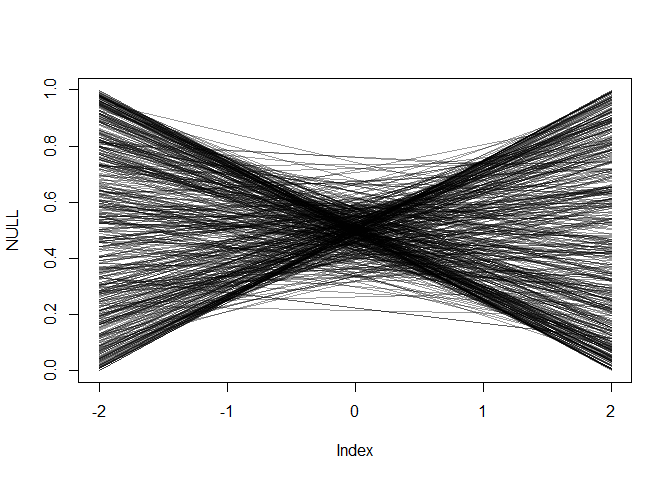
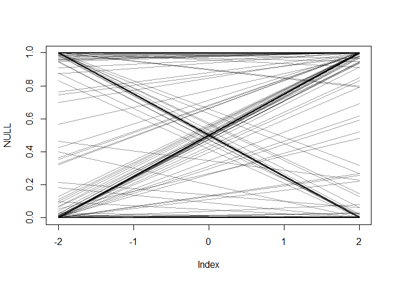
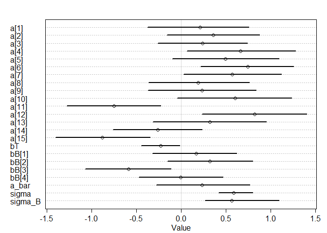

```r
library(rethinking)
```

```
## Loading required package: rstan
```

```
## Loading required package: StanHeaders
```

```
## Loading required package: ggplot2
```

```
## rstan (Version 2.19.2, GitRev: 2e1f913d3ca3)
```

```
## For execution on a local, multicore CPU with excess RAM we recommend calling
## options(mc.cores = parallel::detectCores()).
## To avoid recompilation of unchanged Stan programs, we recommend calling
## rstan_options(auto_write = TRUE)
```

```
## For improved execution time, we recommend calling
## Sys.setenv(LOCAL_CPPFLAGS = '-march=native')
## although this causes Stan to throw an error on a few processors.
```

```
## Loading required package: parallel
```

```
## Loading required package: dagitty
```

```
## rethinking (Version 1.93)
```

```
## 
## Attaching package: 'rethinking'
```

```
## The following object is masked from 'package:stats':
## 
##     rstudent
```


### 1. Fit a simple model with effects of temperature difference (temperature_diff_fall) on November germination (nov_germ). Temperature difference is already centered and scaled (i.e., negative values are the smallest temperature differences). Make sure to use the appropriate likelihood for the germination data (0 = no germ, 1  = germ).


```r
clarkia <- read.csv("clarkia_transplant_data.csv")
head(clarkia)
```

```
##   temperature_diff_fall blk nov_germ pop    dam   sire nov_size mar_surv
## 1             1.1878937   1        0  AY   AY29   AY44       NA        0
## 2             1.1878937   3        1  AY   AY35   AY29        5        1
## 3             1.6650067   3        0  BB   BB44   BB37       NA        0
## 4             1.9434353   3        1  BC   BC54   BC37        1        1
## 5            -1.4869126   3        1  AR   AR37   AR46        1        0
## 6             0.6972648   4        1  AD AD71.3 AD75.1        1        0
##   mar_size fruit_count total_est_seeds temperature_diff_annual
## 1       NA           0               0               1.0756389
## 2        2           0               0               1.0756389
## 3       NA           0               0               1.5792800
## 4        6           0               0               1.8116999
## 5       NA           0               0              -0.6419634
## 6       NA           0               0               0.6501248
##   precip_diff_spring first_fl_julian last_fl_julian
## 1           22.53600              NA             NA
## 2           22.53600              NA             NA
## 3           12.02783              NA             NA
## 4           13.35525              NA             NA
## 5           28.62542              NA             NA
## 6            6.50400              NA             NA
```

```r
summary(clarkia)
```

```
##  temperature_diff_fall      blk           nov_germ         pop      
##  Min.   :-1.5923       Min.   :1.000   Min.   :0.00   BE     : 240  
##  1st Qu.:-1.0963       1st Qu.:2.000   1st Qu.:0.00   AD     : 236  
##  Median : 0.3377       Median :3.000   Median :1.00   AS     : 236  
##  Mean   : 0.1945       Mean   :2.505   Mean   :0.54   BN     : 235  
##  3rd Qu.: 1.5434       3rd Qu.:4.000   3rd Qu.:1.00   AQ     : 234  
##  Max.   : 1.9434       Max.   :4.000   Max.   :1.00   BB     : 232  
##                                                       (Other):1837  
##       dam            sire         nov_size        mar_surv     
##  AC03   :  16   BB02   :  32   Min.   :1.000   Min.   :0.0000  
##  AC05   :  16   BG50   :  24   1st Qu.:3.000   1st Qu.:0.0000  
##  AC08   :  16   AC03   :  16   Median :3.000   Median :0.0000  
##  AC17   :  16   AC13   :  16   Mean   :3.176   Mean   :0.2961  
##  AC18   :  16   AC15   :  16   3rd Qu.:4.000   3rd Qu.:1.0000  
##  AC21   :  16   AC17   :  16   Max.   :5.000   Max.   :1.0000  
##  (Other):3154   (Other):3130   NA's   :2249    NA's   :582     
##     mar_size       fruit_count      total_est_seeds    temperature_diff_annual
##  Min.   : 2.000   Min.   : 0.0000   Min.   :   0.000   Min.   :-1.4734        
##  1st Qu.: 6.000   1st Qu.: 0.0000   1st Qu.:   0.000   1st Qu.:-0.5820        
##  Median : 6.000   Median : 0.0000   Median :   0.000   Median : 0.2413        
##  Mean   : 7.317   Mean   : 0.2734   Mean   :   9.064   Mean   : 0.2957        
##  3rd Qu.:10.000   3rd Qu.: 0.0000   3rd Qu.:   0.000   3rd Qu.: 1.2411        
##  Max.   :18.000   Max.   :60.0000   Max.   :1794.000   Max.   : 1.8117        
##  NA's   :2477     NA's   :631       NA's   :631                               
##  precip_diff_spring first_fl_julian last_fl_julian 
##  Min.   : 0.8207    Min.   :149.0   Min.   :155.0  
##  1st Qu.:12.0278    1st Qu.:154.0   1st Qu.:159.0  
##  Median :18.5797    Median :159.0   Median :163.0  
##  Mean   :17.6746    Mean   :159.5   Mean   :168.5  
##  3rd Qu.:23.0091    3rd Qu.:161.0   3rd Qu.:176.0  
##  Max.   :31.9469    Max.   :181.0   Max.   :216.0  
##                     NA's   :3010    NA's   :3010
```

```r
str(clarkia)
```

```
## 'data.frame':	3250 obs. of  15 variables:
##  $ temperature_diff_fall  : num  1.19 1.19 1.67 1.94 -1.49 ...
##  $ blk                    : int  1 3 3 3 3 4 3 4 1 1 ...
##  $ nov_germ               : int  0 1 0 1 1 1 1 1 1 1 ...
##  $ pop                    : Factor w/ 15 levels "AC","AD","AQ",..: 7 7 9 10 4 2 1 8 14 15 ...
##  $ dam                    : Factor w/ 210 levels "AC03","AC05",..: 94 98 129 139 53 21 7 109 182 201 ...
##  $ sire                   : Factor w/ 208 levels "AC03","AC05",..: 99 93 125 136 55 23 14 101 180 203 ...
##  $ nov_size               : int  NA 5 NA 1 1 1 5 NA 4 4 ...
##  $ mar_surv               : int  0 1 0 1 0 0 1 1 1 1 ...
##  $ mar_size               : int  NA 2 NA 6 NA NA 10 6 6 6 ...
##  $ fruit_count            : int  0 0 0 0 0 0 0 0 0 0 ...
##  $ total_est_seeds        : int  0 0 0 0 0 0 0 0 0 0 ...
##  $ temperature_diff_annual: num  1.076 1.076 1.579 1.812 -0.642 ...
##  $ precip_diff_spring     : num  22.5 22.5 12 13.4 28.6 ...
##  $ first_fl_julian        : int  NA NA NA NA NA NA NA NA 181 NA ...
##  $ last_fl_julian         : int  NA NA NA NA NA NA NA NA 181 NA ...
```


```r
dat_list <- list(
    temperature_diff_fall = clarkia$temperature_diff_fall,
    nov_germ = clarkia$nov_germ)

summary(dat_list)
```

```
##                       Length Class  Mode   
## temperature_diff_fall 3250   -none- numeric
## nov_germ              3250   -none- numeric
```

```r
str(dat_list)
```

```
## List of 2
##  $ temperature_diff_fall: num [1:3250] 1.19 1.19 1.67 1.94 -1.49 ...
##  $ nov_germ             : int [1:3250] 0 1 0 1 1 1 1 1 1 1 ...
```


```r
set.seed(1)
modle_base <- ulam(
    alist(
        nov_germ ~ dbinom( 1 , p ) ,
        logit(p) <- a + bT*temperature_diff_fall,
        a ~ dnorm( 0 , 0.5 ),
        bT ~ dnorm( 0 , 1 )
    ) , data=dat_list , chains=4 , cores=4 , log_lik=TRUE )

precis( modle_base, depth=2 )
```

```
##          mean         sd       5.5%      94.5%    n_eff      Rhat
## a   0.2032592 0.03527843  0.1464587  0.2594516 1506.832 1.0013438
## bT -0.2161787 0.02943936 -0.2621374 -0.1697862 1594.815 0.9997809
```

```r
plot( precis(modle_base,depth=2) )
```

<!-- -->


### 2. Simulate from your priors to see if you've chosen reasonable priors, adjust them if necessary.

#### These blocks were set up in the field, and had differences in soil depth, slope, and competitive environment. So maybe a model that includes block will describe the data better.


```r
#from R code 5.4
set.seed(1)
prior <- extract.prior( modle_base )
```

```
## 
## SAMPLING FOR MODEL 'da90a0b85a4c79f245afda2551f1adc9' NOW (CHAIN 1).
## Chain 1: 
## Chain 1: Gradient evaluation took 0 seconds
## Chain 1: 1000 transitions using 10 leapfrog steps per transition would take 0 seconds.
## Chain 1: Adjust your expectations accordingly!
## Chain 1: 
## Chain 1: 
## Chain 1: Iteration:    1 / 2000 [  0%]  (Warmup)
## Chain 1: Iteration:  200 / 2000 [ 10%]  (Warmup)
## Chain 1: Iteration:  400 / 2000 [ 20%]  (Warmup)
## Chain 1: Iteration:  600 / 2000 [ 30%]  (Warmup)
## Chain 1: Iteration:  800 / 2000 [ 40%]  (Warmup)
## Chain 1: Iteration: 1000 / 2000 [ 50%]  (Warmup)
## Chain 1: Iteration: 1001 / 2000 [ 50%]  (Sampling)
## Chain 1: Iteration: 1200 / 2000 [ 60%]  (Sampling)
## Chain 1: Iteration: 1400 / 2000 [ 70%]  (Sampling)
## Chain 1: Iteration: 1600 / 2000 [ 80%]  (Sampling)
## Chain 1: Iteration: 1800 / 2000 [ 90%]  (Sampling)
## Chain 1: Iteration: 2000 / 2000 [100%]  (Sampling)
## Chain 1: 
## Chain 1:  Elapsed Time: 2.696 seconds (Warm-up)
## Chain 1:                2.788 seconds (Sampling)
## Chain 1:                5.484 seconds (Total)
## Chain 1:
```

```r
str(prior)
```

```
## List of 2
##  $ a : num [1:1000(1d)] -0.4733 -0.7401 -0.4203 0.0867 1.0297 ...
##  $ bT: num [1:1000(1d)] 0.462 1.264 -1.046 -0.926 0.702 ...
##  - attr(*, "source")= chr "ulam prior: 1000 samples from fit"
```

```r
mu <- link( modle_base , post=prior , data=list( temperature_diff_fall=c(-2,2) ) )

plot( NULL , xlim=c(-2,2) , ylim=c(0,1) )
for ( i in 1:500 ) lines( c(-2,2) , mu[i,] , col=col.alpha("black",0.4) )
```

<!-- -->

#### Try a smaller prior


```r
set.seed(1)
modle_base_s <- ulam(
    alist(
        nov_germ ~ dbinom( 1 , p ) ,
        logit(p) <- a + bT*temperature_diff_fall,
        a ~ dnorm( 0 , 0.2 ),
        bT ~ dnorm( 0 , 0.5 )
    ) , data=dat_list , chains=4 , cores=4 , log_lik=TRUE )

precis( modle_base_s, depth=2 )
```

```
##          mean        sd       5.5%      94.5%    n_eff      Rhat
## a   0.1992770 0.0359537  0.1428361  0.2571375 1299.362 0.9998886
## bT -0.2135348 0.0300941 -0.2615507 -0.1661229 1188.556 1.0004099
```

```r
plot( precis(modle_base_s,depth=2) )
```

<!-- -->


```r
#from R code 5.4
set.seed(1)
prior <- extract.prior( modle_base_s )
```

```
## 
## SAMPLING FOR MODEL 'ec6b5ab37f26cf3df0888fa27c9f4c91' NOW (CHAIN 1).
## Chain 1: 
## Chain 1: Gradient evaluation took 0.001 seconds
## Chain 1: 1000 transitions using 10 leapfrog steps per transition would take 10 seconds.
## Chain 1: Adjust your expectations accordingly!
## Chain 1: 
## Chain 1: 
## Chain 1: Iteration:    1 / 2000 [  0%]  (Warmup)
## Chain 1: Iteration:  200 / 2000 [ 10%]  (Warmup)
## Chain 1: Iteration:  400 / 2000 [ 20%]  (Warmup)
## Chain 1: Iteration:  600 / 2000 [ 30%]  (Warmup)
## Chain 1: Iteration:  800 / 2000 [ 40%]  (Warmup)
## Chain 1: Iteration: 1000 / 2000 [ 50%]  (Warmup)
## Chain 1: Iteration: 1001 / 2000 [ 50%]  (Sampling)
## Chain 1: Iteration: 1200 / 2000 [ 60%]  (Sampling)
## Chain 1: Iteration: 1400 / 2000 [ 70%]  (Sampling)
## Chain 1: Iteration: 1600 / 2000 [ 80%]  (Sampling)
## Chain 1: Iteration: 1800 / 2000 [ 90%]  (Sampling)
## Chain 1: Iteration: 2000 / 2000 [100%]  (Sampling)
## Chain 1: 
## Chain 1:  Elapsed Time: 2.888 seconds (Warm-up)
## Chain 1:                2.552 seconds (Sampling)
## Chain 1:                5.44 seconds (Total)
## Chain 1:
```

```r
str(prior)
```

```
## List of 2
##  $ a : num [1:1000(1d)] 0.137 -0.573 -0.145 -0.273 0.085 ...
##  $ bT: num [1:1000(1d)] -0.0747 0.3319 0.7763 -0.2841 0.4869 ...
##  - attr(*, "source")= chr "ulam prior: 1000 samples from fit"
```

```r
mu <- link( modle_base_s , post=prior , data=list( temperature_diff_fall=c(-2,2) ) )

plot( NULL , xlim=c(-2,2) , ylim=c(0,1) )
for ( i in 1:500 ) lines( c(-2,2) , mu[i,] , col=col.alpha("black",0.4) )
```

<!-- -->

#### Try a larger prior


```r
set.seed(1)
modle_base_l <- ulam(
    alist(
        nov_germ ~ dbinom( 1 , p ) ,
        logit(p) <- a + bT*temperature_diff_fall,
        a ~ dnorm( 0 , 10 ),
        bT ~ dnorm( 0 , 20 )
    ) , data=dat_list , chains=4 , cores=4 , log_lik=TRUE )

precis( modle_base_l, depth=2 )
```

```
##          mean         sd       5.5%      94.5%     n_eff     Rhat
## a   0.2043821 0.03476612  0.1493003  0.2615614 1363.2987 1.001280
## bT -0.2147017 0.03028697 -0.2625627 -0.1664489  949.6129 1.004178
```

```r
plot( precis(modle_base_l,depth=2) )
```

<!-- -->


```r
#from R code 5.4
set.seed(1)
prior <- extract.prior( modle_base_l )
```

```
## 
## SAMPLING FOR MODEL '484b13bcefe3679bfe048af1af1e5237' NOW (CHAIN 1).
## Chain 1: 
## Chain 1: Gradient evaluation took 0 seconds
## Chain 1: 1000 transitions using 10 leapfrog steps per transition would take 0 seconds.
## Chain 1: Adjust your expectations accordingly!
## Chain 1: 
## Chain 1: 
## Chain 1: Iteration:    1 / 2000 [  0%]  (Warmup)
## Chain 1: Iteration:  200 / 2000 [ 10%]  (Warmup)
## Chain 1: Iteration:  400 / 2000 [ 20%]  (Warmup)
## Chain 1: Iteration:  600 / 2000 [ 30%]  (Warmup)
## Chain 1: Iteration:  800 / 2000 [ 40%]  (Warmup)
## Chain 1: Iteration: 1000 / 2000 [ 50%]  (Warmup)
## Chain 1: Iteration: 1001 / 2000 [ 50%]  (Sampling)
## Chain 1: Iteration: 1200 / 2000 [ 60%]  (Sampling)
## Chain 1: Iteration: 1400 / 2000 [ 70%]  (Sampling)
## Chain 1: Iteration: 1600 / 2000 [ 80%]  (Sampling)
## Chain 1: Iteration: 1800 / 2000 [ 90%]  (Sampling)
## Chain 1: Iteration: 2000 / 2000 [100%]  (Sampling)
## Chain 1: 
## Chain 1:  Elapsed Time: 2.402 seconds (Warm-up)
## Chain 1:                2.147 seconds (Sampling)
## Chain 1:                4.549 seconds (Total)
## Chain 1:
```

```r
str(prior)
```

```
## List of 2
##  $ a : num [1:1000(1d)] -9.96 -6.26 -3.95 -6.41 2.38 ...
##  $ bT: num [1:1000(1d)] -19.05226 -0.00849 16.67019 -33.87567 30.58286 ...
##  - attr(*, "source")= chr "ulam prior: 1000 samples from fit"
```

```r
mu <- link( modle_base_l , post=prior , data=list( temperature_diff_fall=c(-2,2) ) )

plot( NULL , xlim=c(-2,2) , ylim=c(0,1) )
for ( i in 1:500 ) lines( c(-2,2) , mu[i,] , col=col.alpha("black",0.4) )
```

<!-- -->


```r
compare(modle_base,modle_base_s,modle_base_l)
```

```
##                  WAIC       SE      dWAIC       dSE    pWAIC    weight
## modle_base   4436.268 16.79612 0.00000000        NA 1.908421 0.3475313
## modle_base_l 4436.334 16.75530 0.06612797 0.1288724 1.943219 0.3362284
## modle_base_s 4436.457 16.55182 0.18870431 0.2558791 1.991563 0.3162403
```


### 3. Fit a model that includes an effect of block (blk), with no pooling.


```r
dat_list_b <- list(
    temperature_diff_fall = clarkia$temperature_diff_fall,
    nov_germ = clarkia$nov_germ,
    blk = clarkia$blk)

summary(dat_list_b)
```

```
##                       Length Class  Mode   
## temperature_diff_fall 3250   -none- numeric
## nov_germ              3250   -none- numeric
## blk                   3250   -none- numeric
```

```r
str(dat_list_b)
```

```
## List of 3
##  $ temperature_diff_fall: num [1:3250] 1.19 1.19 1.67 1.94 -1.49 ...
##  $ nov_germ             : int [1:3250] 0 1 0 1 1 1 1 1 1 1 ...
##  $ blk                  : int [1:3250] 1 3 3 3 3 4 3 4 1 1 ...
```


```r
set.seed(1)
modle_fixed <- ulam(
    alist(
        nov_germ ~ dbinom( 1 , p ) ,
        logit(p) <- a[blk] + bT*temperature_diff_fall,
        a[blk] ~ dnorm( 0 , 0.5 ),
        bT ~ dnorm( 0 , 1 )
    ) , data=dat_list_b , chains=4 , cores=4 , log_lik=TRUE )

precis( modle_fixed, depth=2 )
```

```
##            mean         sd       5.5%      94.5%    n_eff      Rhat
## a[1]  0.3903892 0.07243658  0.2721905  0.5023191 2550.634 0.9995999
## a[2]  0.5335802 0.07185484  0.4195839  0.6507977 2454.281 0.9997325
## a[3] -0.3313671 0.07298269 -0.4445188 -0.2122284 2892.116 0.9993370
## a[4]  0.2276093 0.07363555  0.1160867  0.3451352 2140.511 0.9989032
## bT   -0.2203003 0.03007218 -0.2675465 -0.1724593 2564.982 0.9987347
```

```r
plot( precis(modle_fixed,depth=2) )
```

<!-- -->


### 4. Fit a model that includes block, and allows partial pooling.

#### The experiment included many individuals from each of the 15 populations. So, each individual is not an independent representative of a given temperature, but might be similar to other plants from that population for reasons besides temperature.


```r
set.seed(1)
modle_multilevel_blk <- ulam(
    alist(
        nov_germ ~ dbinom( 1 , p ) ,
        logit(p) <- a[blk] + bT*temperature_diff_fall,
        a[blk] ~ dnorm( a_bar , sigma ),
        bT ~ dnorm( 0 , 1 ),
        a_bar ~ dnorm( 0 , 1.5 ) ,
        sigma ~ dexp( 1 )
    ) , data=dat_list_b , chains=4 , cores=4 , log_lik=TRUE )

precis( modle_multilevel_blk, depth=2 )
```

```
##             mean         sd       5.5%      94.5%     n_eff     Rhat
## a[1]   0.3936300 0.07289809  0.2803510  0.5136173 2191.7845 1.000841
## a[2]   0.5349628 0.07268032  0.4176228  0.6539812 2034.5576 0.999748
## a[3]  -0.3186050 0.07504748 -0.4345409 -0.1972292 1895.9086 1.000333
## a[4]   0.2312161 0.07038670  0.1168744  0.3432660 2231.1431 0.999140
## bT    -0.2212609 0.02955190 -0.2690256 -0.1748523 1791.9971 1.000612
## a_bar  0.1995014 0.29131161 -0.2576912  0.6213552  988.5943 1.003119
## sigma  0.5357097 0.29408064  0.2452680  1.0951374  734.2709 1.001532
```

```r
plot( precis(modle_multilevel_blk,depth=2) )
```

<!-- -->


### 5. Build a model that accounts for this by including population (pop) and allowing partial pooling between populations A) without block, and B) with block included as in the model above. How does including population affect the temperature estimate?


```r
dat_list_b_p <- list(
    temperature_diff_fall = clarkia$temperature_diff_fall,
    nov_germ = clarkia$nov_germ,
    blk = clarkia$blk,
    pop = as.integer(clarkia$pop))

summary(dat_list_b_p)
```

```
##                       Length Class  Mode   
## temperature_diff_fall 3250   -none- numeric
## nov_germ              3250   -none- numeric
## blk                   3250   -none- numeric
## pop                   3250   -none- numeric
```

```r
str(dat_list_b_p)
```

```
## List of 4
##  $ temperature_diff_fall: num [1:3250] 1.19 1.19 1.67 1.94 -1.49 ...
##  $ nov_germ             : int [1:3250] 0 1 0 1 1 1 1 1 1 1 ...
##  $ blk                  : int [1:3250] 1 3 3 3 3 4 3 4 1 1 ...
##  $ pop                  : int [1:3250] 7 7 9 10 4 2 1 8 14 15 ...
```


```r
set.seed(1)
modle_multilevel_pop <- ulam(
    alist(
        nov_germ ~ dbinom( 1 , p ) ,
        logit(p) <- a[pop] + bT*temperature_diff_fall,
        a[pop] ~ dnorm( a_bar , sigma ),
        bT ~ dnorm( 0 , 1 ),
        a_bar ~ dnorm( 0 , 1.5 ) ,
        sigma ~ dexp( 1 )
    ) , data=dat_list_b_p , chains=4 , cores=4 , log_lik=TRUE )
```

```
## Warning: Bulk Effective Samples Size (ESS) is too low, indicating posterior means and medians may be unreliable.
## Running the chains for more iterations may help. See
## http://mc-stan.org/misc/warnings.html#bulk-ess
```

```
## Warning: Tail Effective Samples Size (ESS) is too low, indicating posterior variances and tail quantiles may be unreliable.
## Running the chains for more iterations may help. See
## http://mc-stan.org/misc/warnings.html#tail-ess
```

```r
precis( modle_multilevel_pop, depth=2 )
```

```
##             mean        sd         5.5%         94.5%     n_eff      Rhat
## a[1]   0.1741142 0.2208756 -0.164659811  0.5215655795  445.5434 1.0119409
## a[2]   0.3214168 0.1628953  0.063578409  0.5765934693  515.0795 1.0098538
## a[3]   0.2006117 0.1290569 -0.001854283  0.3992816960 1487.2161 0.9997964
## a[4]   0.6214809 0.2438831  0.250894663  1.0119337705  445.6811 1.0098852
## a[5]   0.4441395 0.2508992  0.066289205  0.8414311660  396.9889 1.0099578
## a[6]   0.6934211 0.1627790  0.442194679  0.9570240588  705.9718 1.0097225
## a[7]   0.5254513 0.2122410  0.187513426  0.8414867284  442.3035 1.0110223
## a[8]   0.1532448 0.1916055 -0.136082686  0.4647278989  465.3176 1.0095945
## a[9]   0.2016355 0.2578589 -0.215016098  0.5895474515  361.0873 1.0114462
## a[10]  0.5542834 0.2865601  0.091362377  0.9716077918  335.7878 1.0150141
## a[11] -0.7637929 0.1694460 -1.036982178 -0.4870233449 1065.4089 1.0016561
## a[12]  0.7721039 0.2449569  0.394329194  1.1416236854  375.7025 1.0156642
## a[13]  0.2856788 0.2649661 -0.139923765  0.6998901095  487.6740 1.0093163
## a[14] -0.2878160 0.1327606 -0.504601823 -0.0765005925 1329.8980 1.0038120
## a[15] -0.8865033 0.1686442 -1.166629855 -0.6316003797  680.2002 1.0041983
## bT    -0.2262088 0.1403660 -0.430620534  0.0002359093  298.2710 1.0167334
## a_bar  0.1960248 0.1626672 -0.062225019  0.4527751189 1233.8169 1.0034794
## sigma  0.5731447 0.1329294  0.407889379  0.7937584125  660.1643 1.0055846
```

```r
plot( precis(modle_multilevel_pop,depth=2) )
```

<!-- -->


```r
set.seed(1)
modle_multilevel_pop_blk <- ulam(
    alist(
        nov_germ ~ dbinom( 1 , p ) ,
        logit(p) <- a[pop] + bT*temperature_diff_fall + bB[blk],
        a[pop] ~ dnorm( a_bar , sigma ),
        bT ~ dnorm( 0 , 1 ),
        bB[blk] ~ dnorm( 0 , sigma_B ),
        a_bar ~ dnorm( 0 , 1.5 ) ,
        sigma ~ dexp( 1 ),
        sigma_B ~ dexp( 1 )
    ) , data=dat_list_b_p , chains=4 , cores=4 , log_lik=TRUE )
```

```
## Warning: Bulk Effective Samples Size (ESS) is too low, indicating posterior means and medians may be unreliable.
## Running the chains for more iterations may help. See
## http://mc-stan.org/misc/warnings.html#bulk-ess
```

```
## Warning: Tail Effective Samples Size (ESS) is too low, indicating posterior variances and tail quantiles may be unreliable.
## Running the chains for more iterations may help. See
## http://mc-stan.org/misc/warnings.html#tail-ess
```

```r
precis( modle_multilevel_pop_blk, depth=2 )
```

```
##                 mean        sd        5.5%       94.5%    n_eff     Rhat
## a[1]     0.210475581 0.3673574 -0.37603723  0.75551995 265.4654 1.008591
## a[2]     0.354652230 0.3411388 -0.15698085  0.87494485 241.1555 1.018143
## a[3]     0.234356362 0.3235493 -0.26506347  0.73653398 236.3704 1.014459
## a[4]     0.661219013 0.3901569  0.06334166  1.27574139 268.3524 1.008136
## a[5]     0.491594265 0.3875898 -0.10040213  1.09066390 272.1583 1.009108
## a[6]     0.743195437 0.3402429  0.21646138  1.25410106 256.1395 1.008854
## a[7]     0.569237714 0.3606815  0.02403771  1.11627455 234.0924 1.020351
## a[8]     0.185725190 0.3596925 -0.36539722  0.75775659 267.3032 1.009111
## a[9]     0.230734574 0.3874775 -0.37043015  0.83441196 245.3679 1.017339
## a[10]    0.601647581 0.4109965 -0.04557845  1.23156242 246.0755 1.018088
## a[11]   -0.754463706 0.3406344 -1.27858121 -0.23003278 252.3790 1.015347
## a[12]    0.820637624 0.3784347  0.23270636  1.39813288 238.2902 1.016854
## a[13]    0.320174893 0.4037492 -0.31690864  0.95015307 263.8157 1.016740
## a[14]   -0.265077112 0.3241233 -0.76401445  0.23192288 229.9163 1.015261
## a[15]   -0.881318062 0.3446691 -1.40457918 -0.35084814 240.6971 1.017090
## bT      -0.230145801 0.1366190 -0.44704381 -0.01702935 309.2995 1.008557
## bB[1]    0.164650571 0.3054146 -0.32535679  0.61692254 215.3172 1.016742
## bB[2]    0.320064704 0.3051522 -0.15367866  0.79786063 213.4563 1.017271
## bB[3]   -0.589291714 0.3094457 -1.07344780 -0.11852551 214.5745 1.016387
## bB[4]   -0.006978641 0.3035551 -0.47571767  0.46274042 214.8846 1.016391
## a_bar    0.233022805 0.3338507 -0.28156004  0.76534317 251.3970 1.014511
## sigma    0.583281276 0.1277554  0.41545081  0.79855322 827.7914 1.001973
## sigma_B  0.560997753 0.2908996  0.26509665  1.08935271 445.3415 1.003068
```

```r
plot( precis(modle_multilevel_pop_blk,depth=2) )
```

<!-- -->


### 6. Compare the five models you built using WAIC. Which fits best?


```r
compare(modle_base, modle_fixed, modle_multilevel_blk, modle_multilevel_pop, modle_multilevel_pop_blk)
```

```
##                              WAIC       SE     dWAIC      dSE     pWAIC
## modle_multilevel_pop_blk 4184.792 34.53849   0.00000       NA 17.244952
## modle_multilevel_pop     4270.972 30.09022  86.17941 18.49735 14.168831
## modle_multilevel_blk     4355.318 24.31704 170.52574 25.68401  4.996833
## modle_fixed              4355.357 24.36003 170.56515 25.69510  5.036424
## modle_base               4436.268 16.79612 251.47570 30.73949  1.908421
##                                weight
## modle_multilevel_pop_blk 1.000000e+00
## modle_multilevel_pop     1.933651e-19
## modle_multilevel_blk     9.349871e-38
## modle_fixed              9.167435e-38
## modle_base               2.470276e-55
```

> modle_multilevel_pop_blk fits best.

### 7. Plot effects of temperature difference for the average block, and also make a plot that includes the variability across blocks.


```r
post <- extract.samples(modle_multilevel_pop_blk)
str(post)
```

```
## List of 6
##  $ a      : num [1:2000, 1:15] 0.4639 0.4067 0.184 -0.0997 -0.4126 ...
##  $ bT     : num [1:2000(1d)] 0.0168 -0.1829 -0.0231 -0.3978 -0.7282 ...
##  $ bB     : num [1:2000, 1:4] -0.0685 0.255 0.3218 0.1989 0.3185 ...
##  $ a_bar  : num [1:2000(1d)] 0.265 0.014 -0.288 0.232 0.133 ...
##  $ sigma  : num [1:2000(1d)] 0.648 0.428 0.624 0.578 0.899 ...
##  $ sigma_B: num [1:2000(1d)] 0.362 0.216 0.241 0.284 0.69 ...
##  - attr(*, "source")= chr "ulam posterior: 2000 samples from modle_multilevel_pop_blk"
```

#### Posterior prediction for average cluster.


```r
## change from R code 13.36, temperature_diff_fall=1 
p_link_1 <- function( blk , temperature_diff_fall=1 ) {
    logodds <- with( post ,
        a_bar + bT*temperature_diff_fall + bB[blk] )
    return( inv_logit(logodds) )
}

## change from R code 13.37
p_raw_1 <- sapply( 1:4 , function(i) p_link_1( i ) )
p_mu_1 <- apply( p_raw_1 , 2 , mean )
p_ci_1 <- apply( p_raw_1 , 2 , PI )


## change from R code 13.36, temperature_diff_fall=0 
p_link_0 <- function( blk , temperature_diff_fall=0 ) {
    logodds <- with( post ,
        a_bar + bT*temperature_diff_fall + bB[blk] )
    return( inv_logit(logodds) )
}

## change from R code 13.37
p_raw_0 <- sapply( 1:4 , function(i) p_link_0( i ) )
p_mu_0 <- apply( p_raw_0 , 2 , mean )
p_ci_0 <- apply( p_raw_0 , 2 , PI )


## change from R code 13.36, temperature_diff_fall=-1 
p_link_n1 <- function( blk , temperature_diff_fall=-1 ) {
    logodds <- with( post ,
        a_bar + bT*temperature_diff_fall + bB[blk] )
    return( inv_logit(logodds) )
}

## change from R code 13.37
p_raw_n1 <- sapply( 1:4 , function(i) p_link_n1( i ) )
p_mu_n1 <- apply( p_raw_n1 , 2 , mean )
p_ci_n1 <- apply( p_raw_n1 , 2 , PI )

plot( NULL , xlab="block" , ylab="November germination" ,
    ylim=c(0,1) , xaxt="n" , xlim=c(1,4) )
axis( 1 , at=1:4 , labels=c("B1","B2","B3","B4") )
lines( 1:4 , p_mu_1 ,col=col.alpha("black",1))
shade( p_ci_1 , 1:4 )
lines( 1:4 , p_mu_0 ,col=col.alpha("red",1))
shade( p_ci_0 , 1:4 )
lines( 1:4 , p_mu_n1 ,col=col.alpha("blue",1))
shade( p_ci_n1 , 1:4 )
```

<!-- -->

#### Posterior prediction for new clusters.


```r
## change from R code 13.38, temperature_diff_fall=1
a_sim <- with( post , rnorm( length(post$a_bar) , a_bar , sigma ) )
p_link_asim_1 <- function( blk , temperature_diff_fall=1) {
    logodds <- with( post , a_sim + bT*temperature_diff_fall + bB[blk] )
    return( inv_logit(logodds) )
}
p_raw_asim_1 <- sapply( 1:4 , function(i) p_link_asim_1( i ) )

p_link_asim_0 <- function( blk , temperature_diff_fall=0) {
    logodds <- with( post , a_sim + bT*temperature_diff_fall + bB[blk] )
    return( inv_logit(logodds) )
}
p_raw_asim_0 <- sapply( 1:4 , function(i) p_link_asim_0( i ) )

p_link_asim_n1 <- function( blk , temperature_diff_fall=-1) {
    logodds <- with( post , a_sim + bT*temperature_diff_fall + bB[blk] )
    return( inv_logit(logodds) )
}
p_raw_asim_n1 <- sapply( 1:4 , function(i) p_link_asim_n1( i ) )

## R code 13.39
plot( NULL , xlab="block" , ylab="November germination" ,
    ylim=c(0,1) , xaxt="n" , xlim=c(1,4) )
axis( 1 , at=1:4 , labels=c("B1","B2","B3","B4") )
for ( i in 1:100 ) lines( 1:4 , p_raw_asim_1[i,] , col=col.alpha("black",0.3) , lwd=2 )
for ( i in 1:100 ) lines( 1:4 , p_raw_asim_0[i,] , col=col.alpha("red",0.3) , lwd=2 )
for ( i in 1:100 ) lines( 1:4 , p_raw_asim_n1[i,] , col=col.alpha("blue",0.3) , lwd=2 )
```

<!-- -->


